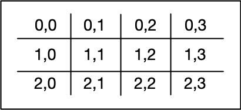
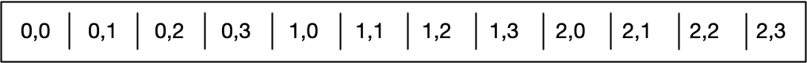

# Cache-friendly coding

In the code sample to the right, run the code and note the results. Then please modify the code slightly by interchanging the index `i` and `j` when accessing the variable `x` and take a close look at the resulting runtime performance compared to the original version.

<!--
%%ulab_page_divider
--><hr/>

Depending on the machine used for executing the two code versions, there will be a huge difference in execution time. In order to understand why this happens, let us revisit the memory layout we investigated with the gdb debugger at the beginning of this lesson: Even though we have created a two-dimensional array, it is stored in a one-dimensional succession of memory cells. In our minds, the array will (probably) look like this: 



In memory however, it is stored as a single line as follows: 



As can be seen, the rows of the two-dimensional matrix are copied one after the other. This format is called "row major" and is the default for both C and C++. Some other languages such as Fortran are "column major" and a memory-aware programmer should always know the memory layout of the language he or she is using. 

Note that even though the row major memory layout is used in C++, this doesn't mean that all C++ libraries have the same default; for example, the popular Eigen library used for matrix operations in C++ [defaults to column major](https://eigen.tuxfamily.org/dox/group__TopicStorageOrders.html).

<!--
%%ulab_page_divider
--><hr/>

As we have created an array of integers, the difference between two adjacent memory cells will be `sizeof(int)`, which is 4 bytes. Let us verify this by changing the size of the array to 4x4 and by plotting both the address and the index numbers to the console. Be sure to revert the array access back to `x[i][j] = i + j`. You can plot by uncommenting the printout line in the inner for loop:

```
0x6021e0: i=0, j=0
0x6021e4: i=0, j=1
0x6021e8: i=0, j=2
0x6021ec: i=0, j=3

0x6021f0: i=1, j=0
0x6021f4: i=1, j=1
0x6021f8: i=1, j=2
0x6021fc: i=1, j=3

0x602200: i=2, j=0
0x602204: i=2, j=1
0x602208: i=2, j=2
0x60220c: i=2, j=3

0x602210: i=3, j=0
0x602214: i=3, j=1
0x602218: i=3, j=2
0x60221c: i=3, j=3

Execution time: 83 microseconds
```

Clearly, the difference between two inner loop cycles is at 4 as predicted. 

<!--
%%ulab_page_divider
--><hr/>


When we interchange the indices `i` and `j` when accessing the array as
```cpp
            x[j][i] = i + j;
            std::cout << &x[j][i] << ": i=" << j << ", j=" << i << std::endl;
```

we get the following output: 

```
0x6021e0: i=0, j=0
0x6021f0: i=1, j=0
0x602200: i=2, j=0
0x602210: i=3, j=0

0x6021e4: i=0, j=1
0x6021f4: i=1, j=1
0x602204: i=2, j=1
0x602214: i=3, j=1

0x6021e8: i=0, j=2
0x6021f8: i=1, j=2
0x602208: i=2, j=2
0x602218: i=3, j=2

0x6021ec: i=0, j=3
0x6021fc: i=1, j=3
0x60220c: i=2, j=3
0x60221c: i=3, j=3

Execution time: 115 microseconds
```

As can be see, the difference between two rows is now 0x10, which is 16 in the decimal system. This means that with each access to the matrix, four memory cells are skipped and the principle of spatial locality is violated. As a result, the wrong data is loaded into the L1 cache, leading to cache misses and costly reload operations - hence the significantly increased execution time between the two code samples. The difference in execution time of both code samples shows that cache-aware programming can increase code performance significantly.
