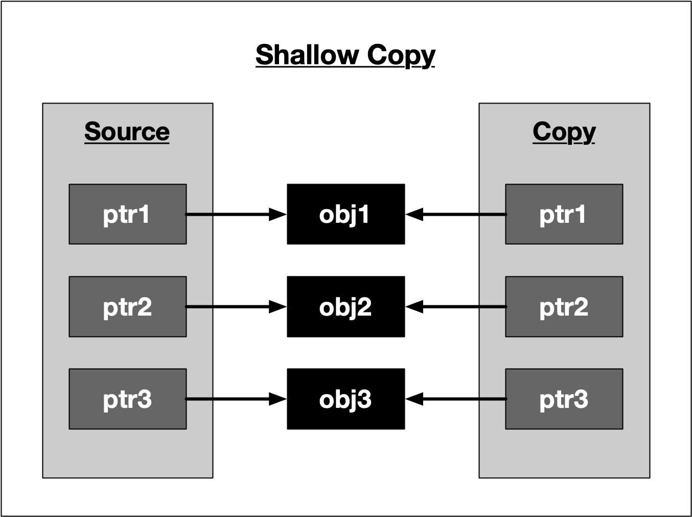
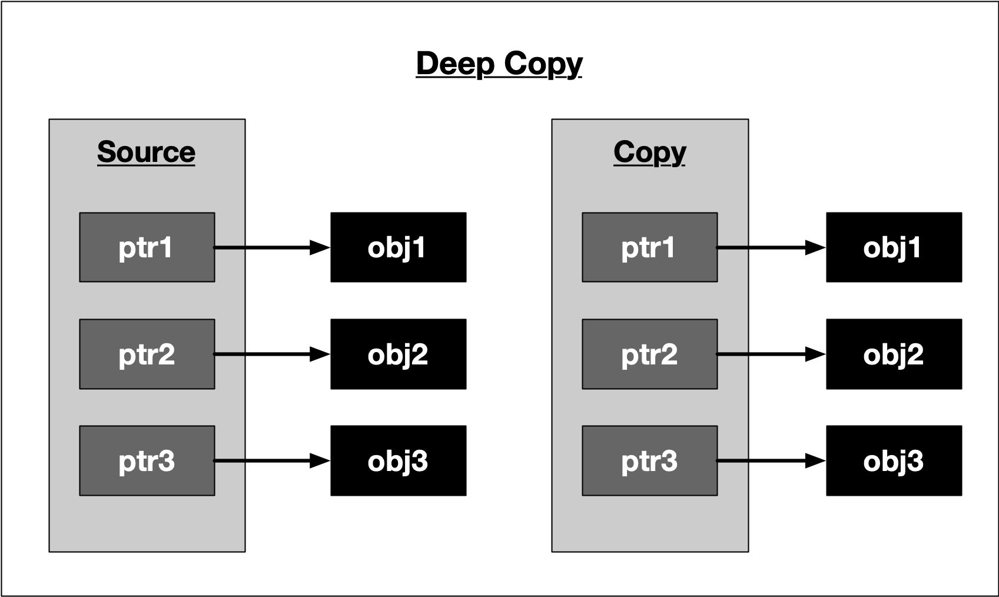

# Default copying
Resource management is one of the primary responsibilities of a C++ programmer. Among resources such as multi-threaded locks, files, network and database connections this also includes memory. The common denominator in all of these examples is that access to the resource is often managed through a handle such as a pointer. Also, after the resource has been used and is no longer, it must be released again so that it available for re-use by someone else.

In C++, a common way of safely accessing resources is by wrapping a manager class around the handle, which is initialized when the resource is acquired (in the class constructor) and released when it is deleted (in the class destructor). This concept is often referred to as _Resource Acquisition is Initialization (RAII)_, which we will discuss in greater depth in the next concept. One problem with this approach though is that copying the manager object will also copy the handle of the resource. This allows two objects access to the same resource - and this can mean trouble.

[Video](https://video.udacity-data.com/topher/2019/September/5d855b52_nd213-c03-l04-01.2-copy-semantics-sc/nd213-c03-l04-01.2-copy-semantics-sc_720p.mp4)

Consider the example on the right of managing access to a block of heap memory.

The class `MyClass` has a private member, which is a pointer to a heap-allocated integer. Allocation is performed in the constructor, deallocation is done in the destructor. This means that the memory block of size `sizeof(int)` is allocated when the objects `myClass1` and `myClass2` are created on the stack and deallocated when their scope is left, which happens at the end of the main. The difference between `myClass1` and `myClass2` is that the latter is instantiated using the copy constructor, which duplicates the members in myClass1 - including the pointer to the heap memory where` _myInt` resides.

The output of the program looks like the following:

```
Own address on the stack is 0x7ffeefbff670
Managing memory block on the heap at 0x100300060
Own address on the stack is 0x7ffeefbff658
Managing memory block on the heap at 0x100300060
copy_constructor_1(87582,0x1000a95c0) malloc: *** error for object 0x100300060: pointer being freed was not allocated
```
Note that in the workspace, the error will read:
```
*** Error in './a.out': double free or corruption (fasttop): 0x0000000001133c20 ***
```

From the output we can see that the stack address is different for `myClass1` and `myClass2` - as was expected. The address of the managed memory block on the heap however is identical. This means that when the first object goes out of scope, it releases the memory resource by calling `free` in its destructor. The second object does the same - which causes the program to crash as the pointer is now referencing an invalid area of memory, which has already been freed.

The default behavior of both copy constructor and assignment operator is to perform a _shallow copy_ as with the example above. The following figure illustrates the concept:



Fortunately, in C++, the copying process can be controlled by defining a tailored copy constructor as well as a copy assignment operator. The copying process must be closely linked to the respective resource release mechanism and is often referred to as _copy-ownership policy_. Tailoring the copy constructor according to your memory management policy is an important choice you often need to make when designing a class. In the following, we will closely examine several well-known copy-ownership policies.

# No copying policy
The simplest policy of all is to forbid copying and assigning class instances all together. This can be achieved by declaring, but not defining a private copy constructor and assignment operator (see `NoCopyClass1` below) or alternatively by making both public and assigning the `delete` operator (see `NoCopyClass2` below). The second choice is more explicit and makes it clearer to the programmer that copying has been actively forbidden. Let us have a look at a code example on the right that illustrates both cases.

On compiling, we get the following error messages:

```
error: calling a private constructor of class 'NoCopyClass1'
    NoCopyClass1 copy1(original1);
    NoCopyClass1 copy1b = original1;

error: call to deleted constructor of 'NoCopyClass2'
    NoCopyClass2 copy2(original2);
    NoCopyClass2 copy2b = original2;
```
Both cases effectively prevent the original object from being copied or assigned. In the C++11 standard library, there are some classes for multi-threaded synchronization which use the no copying policy.

# Exclusive ownership policy
This policy states that whenever a resource management object is copied, the resource handle is transferred from the source pointer to the destination pointer. In the process, the source pointer is set to `nullptr` to make ownership exclusive. At any time, the resource handle belongs only to a single object, which is responsible for its deletion when it is no longer needed.

The code example on the right illustrates the basic idea of exclusive ownership.

[Video](https://video.udacity-data.com/topher/2019/September/5d855b31_nd213-c03-l04-02.2-lvalues-and-rvalues-sc/nd213-c03-l04-02.2-lvalues-and-rvalues-sc_720p.mp4)

The class `MyClass` overwrites both the copy constructor as well as the assignment operator. Inside, the handle to the resource `_myInt` is first copied from the source object and then set to null so that only a single valid handle exists. After copying, the new object is responsible for properly deleting the memory resource on the heap. The output of the program looks like the following:

```
resource allocated
resource freed
```
As can be seen, only a single resource is allocated and freed. So by passing handles and invalidating them, we can implement a basic version of an exclusive ownership policy. However, this example is not the way exclusive ownership is handled in the standard template library. One problem in this implementation is that for a short time there are effectively two valid handles to the same resource - after the handle has been copied and before it is set to `nullptr`. In concurrent programs, this would cause a data race for the resource. A much better alternative to handle exclusive ownership in C++ would be to use move semantics, which we will discuss shortly in a very detailed lesson.

# Deep copying policy
With this policy, copying and assigning class instances to each other is possible without the danger of resource conflicts. The idea is to allocate proprietary memory in the destination object and then to copy the content to which the source object handle is pointing into the newly allocated block of memory. This way, the content is preserved during copy or assignment. However, this approach increases the memory demands and the uniqueness of the data is lost: After the deep copy has been made, two versions of the same resource exist in memory.

Let us look at an example in the code on the right.

The deep-copy version of MyClass looks similar to the exclusive ownership policy: Both the assignment operator and the copy constructor have been overloaded with the source object passed by reference. But instead of copying the source handle (and then deleting it), a proprietary block of memory is allocated on the heap and the content of the source is copied into it.

The output of the program looks like the following:

```
resource allocated at address 0x100300060
resource allocated at address 0x100300070 with _myInt = 42
resource allocated at address 0x100300080 with _myInt = 42
resource freed at address 0x100300080
resource freed at address 0x100300070
resource freed at address 0x100300060
```
As can be seen, all copies have the same value of 42 while the address of the handle differs between `source`, `dest1` and `dest2`.

To conclude, the following figure illustrates the idea of a deep copy:


# Shared ownership policy
The last ownership policy we will be discussing in this course implements a shared ownership behavior. The idea is to perform a copy or assignment similar to the default behavior, i.e. copying the handle instead of the content (as with a shallow copy) while at the same time keeping track of the number of instances that also point to the same resource. Each time an instance goes out of scope, the counter is decremented. Once the last object is about to be deleted, it can safely deallocate the memory resource. We will see later in this course that this is the central idea of `unique_ptr`, which is a representative of the group of smart pointers.

The example on the right illustrates the principle.

Note that class `MyClass` now has a static member `_cnt`, which is incremented every time a new instance of `MyClass` is created and decrement once an instance is deleted. On deletion of the last instance, i.e. when `_cnt==0`, the block of memory to which the handle points is deallocated.

The output of the program is the following:

```
resource allocated at address 0x100300060
2 instances with handles to address 0x100300060 with _myInt = 42
3 instances with handles to address 0x100300060 with _myInt = 42
4 instances with handles to address 0x100300060 with _myInt = 42
instance at address 0x7ffeefbff6f8 goes out of scope with _cnt = 3
instance at address 0x7ffeefbff700 goes out of scope with _cnt = 2
instance at address 0x7ffeefbff718 goes out of scope with _cnt = 1
resource freed at address 0x100300060
```
As can be seen, the memory is released only once as soon as the reference counter reaches zero.
