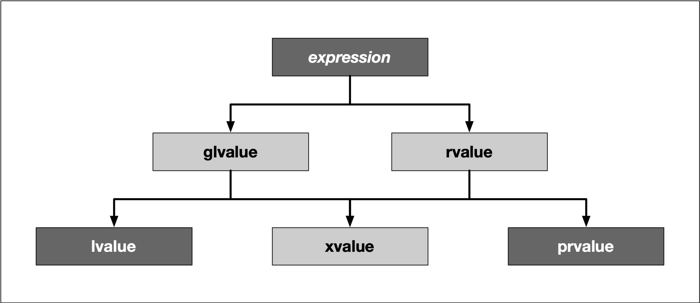

## What are lvalues and rvalues?
A good grasp of lvalues and rvalues in C++ is essential for understanding the more advanced concepts of rvalue references and motion semantics.

Let us start by stating that every expression in C++ has a type and belongs to a value category. When objects are created, copied or moved during the evaluation of an expression, the compiler uses these value expressions to decide which method to call or which operator to use.

Prior to C++11, there were only two value categories, now there are as many as five of them:

To keep it short, we do not want to go into all categories, but limit ourselves to lvalues and prvalues:

- **Lvalues** have an address that can be accessed. They are expressions whose evaluation by the compiler determines the identity of objects or functions.

- **Prvalues** do not have an address that is accessible directly.  They are temporary expressions used to initialize objects or compute the value of the operand of an operator.

For the sake of simplicity and for compliance with many tutorials, videos and books about the topic, let us refer to *prvalues* as *rvalues* from here on.

The two characters `l` and `r` are originally derived from the perspective of the assignment operator `=`, which always expects a rvalue on the right, and which it assigns to a lvalue on the left. In this case, the `l` stands for left and `r` for right:

`int i = 42;  // lvalue = rvalue; `

With many other operators, however, this right-left view is not entirely correct. In more general terms, an lvalue is an entity that points to a specific memory location. An rvalue is usually a short-lived object, which is only needed in a narrow local scope. To simplify things a little, one could think of lvalues as *named containers* for rvalues.

In the example above, the value `42` is an rvalue. It does not have a specific memory address which we know about. The rvalue is assigned to a variable `i` with a specific memory location known to us, which is what makes it an lvalue in this example.

Using the address operator `&` we can generate an lvalue from an rvalue and assign it to another lvalue:

`int *j = &i;`

In this small example, the expression `&i` generates the address of `i` as an rvalue and assigns it to `j`, which is an lvalue now holding the memory location of `i`.

The code on the right illustrates several examples of lvalues and rvalues:

<!--
%%ulab_page_divider
-->

## Lvalue references

An lvalue reference can be considered as an alternative name for an object. It is a reference that binds to an lvalue and is  declared using an optional list of specifiers (which we will not further discuss here) followed by the reference declarator `&`. The  short code sample on the right declares an integer  `i` and a reference `j` which can be used as an alias for the existing object.

The output of the program is
`i = 3, j = 3`

We can see that the lvalue reference `j` can be used just as `i` can. A change to either `i` or `j` will affect the same memory location on the stack.

<!--
%%ulab_page_divider
-->

One of the primary use-cases for lvalue references is the pass-by-reference semantics in function calls as in the example on the right.

The function `myFunction` has an lvalue reference as a parameter, which establishes an alias to the integer `i` which is passed to it in `main`.

<!--
%%ulab_page_divider
-->

## Rvalue references

You already know that an rvalue is a temporary expression which is - among other use-cases,  a means of initializing objects. In the call  `int i = 42`, 42 is the rvalue.

Let us consider an example similar to the last one, shown on the right.

As before, the function `myFunction` takes an lvalue reference as its argument. In `main`, the call `myFunction(j)` works just fine while `myFunction(42)`  as well as `myFunction(j+k)` produces the following compiler error on Mac:

`candidate function not viable: expects an l-value for 1st argument`

and the following error in the workspace with g++:

`error: cannot bind non-const lvalue reference of type ‘int&’ to an rvalue of type ‘int’`

While the number `42` is obviously an rvalue, with `j+k` things might not be so obvious, as `j` and `k` are variables and thus lvalues. To compute the result of the addition, the compiler has to create a temporary object to place it in - and this object is an rvalue.

<!--
%%ulab_page_divider
-->

Since C++11, there is a new type available called *rvalue reference*, which can be identified from the double ampersand `&&` after a type name. With this operator, it is possible to store and even modify an rvalue, i.e. a temporary object which would otherwise be lost quickly.

But what do we need this for? Before we look into the answer to this question, let us consider the example on the right.

<!--
%%ulab_page_divider
-->

After creating the integers `i` and `j` on the stack, the sum of both is added to a third integer `k`. Let us examine this simple example a little more closely. In the first and second assignment, `i` and `j` are created as lvalues, while `1` and `2` are rvalues, whose value is copied into the memory location of `i` and `j`. Then, a third lvalue, `k`, is created. The sum `i+j` is created as an rvalue, which holds the result of the addition before being copied into the memory location of `k`. This is quite a lot of copying and holding of temporary values in memory. With an rvalue reference, this can be done more efficiently.

The expression `int &&l` creates an rvalue reference, to which the address of the temporary object is assigned, that holds the result of the addition. So instead of first creating the rvalue `i+j` , then copying it and finally deleting it, we can now hold the temporary object in memory. This is much more efficient than the first approach, even though saving a few bytes of storage in the example might not seem like much at first glance. One of the most important aspects of rvalue references is that they pave the way for *move semantics*, which is a mighty technique in modern C++ to optimize memory usage and processing speed. Move semantics and rvalue references make it possible to write code that transfers resources such as dynamically allocated memory from one object to another in a very efficient manner and also supports the concept of exclusive ownership, as we will shortly see when discussing smart pointers. In the next section we will take a close look at move semantics and its benefits for memory management.
