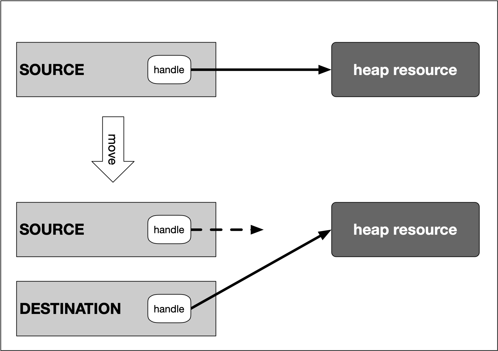

## Rvalue references and std::move
In order to fully understand the concept of smart pointers in the next lesson, we first need to take a look at a powerful concept introduced with C++11 called *move semantics*.

The last section on lvalues, rvalues and especially rvalue references is an important prerequisite for understanding the concept of moving data structures.

Let us consider the function on the right which takes an rvalue reference as its parameter.

The important message of the function argument of `myFunction` to the programmer is : The object that binds to the rvalue reference `&&val` is yours, it is not needed anymore within the scope of the caller (which is `main`). As discussed in the previous section on rvalue references, this is interesting from two perspectives:
1. Passing values like this **improves performance** as no temporary copy needs to be made anymore and
2. **ownership changes**, since the object the reference binds to has been abandoned by the caller and now binds to a handle which is available only to the receiver.  This could not have been achieved with lvalue references as any change to the object that binds to the lvalue reference would also be visible on the caller side.

<!--
%%ulab_page_divider
--><hr/>

There is one more important aspect we need to consider: *rvalue references are themselves lvalues.*  While this might seem confusing at first glance, it really is the mechanism that enables move semantics: A reference is always defined in a certain context (such as in the above example the variable `val`) .  Even though the object it refers to (the number `42`) may be disposable in the context it has been created (the `main` function),  it is not disposable in the context of the reference . So within the scope of  `myFunction`, `val` is an lvalue as it gives access to the memory location where the number 42 is stored.

Note however that in the above code example we cannot pass an lvalue to `myFunction`, because an rvalue reference cannot bind to an lvalue. The code

```cpp
int i = 23;
myFunction(i)
```

would result in a compiler error. There is a solution to this problem though: The function `std::move`  converts an lvalue into an rvalue (actually, to be exact, into an *xvalue*, which we will not discuss here for the sake of clarity), which makes it possible to use the lvalue as an argument for the function:

```cpp
int i = 23;
myFunction(std::move(i));
```

In doing this, we state that in the scope of `main` we will not use i anymore, which now exists only in the scope of `myFunction`. Using `std::move` in this way is one of the components of move semantics, which we will look into shortly. But first let us consider an example of the **Rule of Three**.

<!--
%%ulab_page_divider
--><hr/>

## The Rule of Three in action

#### Part 1
[Video](https://video.udacity-data.com/topher/2019/September/5d855b0c_nd213-c03-l04-03.2-move-semantics-sc/nd213-c03-l04-03.2-move-semantics-sc_720p.mp4)


#### Part 2
[Video](https://video.udacity-data.com/topher/2019/September/5d855aed_nd213-c03-l04-03.3-move-semantics-sc/nd213-c03-l04-03.3-move-semantics-sc_720p.mp4)


<!--
%%ulab_page_divider
--><hr/>

Let us consider the example to the right of a class which manages a block of dynamic memory and incrementally add new functionality to it. You will add the main function shown above later on in this notebook.

In this class, a block of heap memory is allocated in the constructor and deallocated in the destructor. As we have discussed before, when either destructor, copy constructor or copy assignment operator are defined, it is good practice to also define the other two (known as the **Rule of Three**). While the compiler would generate default versions of the missing components, these would not properly reflect the memory management strategy of our class, so leaving out the manual implementation is usually not advised.

<!--
%%ulab_page_divider
--><hr/>

So let us start with the copy constructor of `MyMovableClass`, which could look like the following:

```cpp
    MyMovableClass(const MyMovableClass &source) // 2 : copy constructor
    {
        _size = source._size;
        _data = new int[_size];
        *_data = *source._data;
        std::cout << "COPYING content of instance " << &source << " to instance " << this << std::endl;
    }
```

Similar to an example in the section on copy semantics, the copy constructor takes an lvalue reference to the source instance, allocates a block of memory of the same size as in the source and then copies the data into its members (as a deep copy).

You can add this code to the `rule_of_three.cpp` file on the right.

<!--
%%ulab_page_divider
--><hr/>

Next, let us take a look at the copy assignment operator:

```cpp
    MyMovableClass &operator=(const MyMovableClass &source) // 3 : copy assignment operator
    {
        std::cout << "ASSIGNING content of instance " << &source << " to instance " << this << std::endl;
        if (this == &source)
            return *this;
        delete[] _data;
        _data = new int[source._size];
        *_data = *source._data;
        _size = source._size;
        return *this;
    }
```

You can add the code above to the `rule_of_three.cpp` file on the right.

The if-statement at the top of the above implementation protects against self-assignment and is standard boilerplate code for the user-defined assignment operator. The remainder of the code is more or less identical to the copy constructor, apart from returning a reference to the own instance using `this`.

You might have noticed that both copy constructor and assignment operator take a `const` reference to the source object as an argument, by which they promise that they won’ (and can’t) modify the content of source.

<!--
%%ulab_page_divider
--><hr/>

We can now use our class to copy objects as shown in the following implementation of `main`:

```cpp
int main()
{
    MyMovableClass obj1(10); // regular constructor
    MyMovableClass obj2(obj1); // copy constructor
    obj2 = obj1; // copy assignment operator

    return 0;
}
```

Add this code to the `rule_of_three.cpp` file on the right.

In the `main` above, the object `obj1` is created using the regular constructor of `MyMovableClass`. Then, both the copy constructor as well as the assignment operator are used with the latter one not creating a new object but instead assigning the content of `obj1` to `obj2` as defined by our copying policy.

The output of this textbook implementation of the **Rule of Three** looks like this:
```
CREATING instance of MyMovableClass at 0x7ffeefbff618 allocated with size = 40 bytes

COPYING content of instance 0x7ffeefbff618 to instance 0x7ffeefbff608

ASSIGNING content of instance 0x7ffeefbff618 to instance 0x7ffeefbff608

DELETING instance of MyMovableClass at 0x7ffeefbff608

DELETING instance of MyMovableClass at 0x7ffeefbff618
```

<!--
%%ulab_page_divider
--><hr/>

The function `createObject` returns an instance of `MyMovableClass` by value. In such a case, the compiler creates a temporary copy of the object as an rvalue, which is passed to the copy constructor. According to our current class design, this means that data is dynamically allocated on the stack, which is them copied from the temporary object to its target destination. This means that two expensive memory operations are performed with the first occurring during the creation of the temporary rvalue and the second during the execution of the copy constructor. The same would happen with the assignment operator, which would first erase the memory, then reallocate it, then copy the data from the temporary object.

From a performance viewpoint, this code involves far too many copies, making it inefficient - especially with large data structures. Prior to C++11, the proper solution in such a case was to simply avoid returning large data structures by value to prevent the expensive and unnecessary copying process. With C++11 however, there is a way we can optimize this and return even large data structures by value. The solution is the move constructor and the **Rule of Five**.

<!--
%%ulab_page_divider
--><hr/>

## The move constructor

The basic idea to optimize the code from the last example is to "steal" the rvalue generated by the compiler during the return-by-value operation and move the expensive data in the source object to the target object - not by copying it but by redirecting the data handles. Moving data in such a way is always cheaper than making copies, which is why programmers are highly encouraged to make use of this powerful tool.

The following diagram illustrates the basic principle of moving a resource from a source object to a destination object:



In order to achieve this, we will be using a construct called *move constructor*, which is similar to the copy constructor with the key difference being the re-use of existing data without unnecessarily copying it. In addition to the move constructor, there is also a move assignment operator, which we need to look at.


<!--
%%ulab_page_divider
--><hr/>

Just like the copy constructor, the move constructor builds an instance of a class using a source instance. The key difference between the two is that with the move constructor, the source instance will no longer be usable afterwards. Let us take a look at an implementation of the move constructor for our `MyMovableClass`:

```cpp
    MyMovableClass(MyMovableClass &&source) // 4 : move constructor
    {
        std::cout << "MOVING (c’tor) instance " << &source << " to instance " << this << std::endl;
        _data = source._data;
        _size = source._size;
        source._data = nullptr;
        source._size = 0;
    }
```

If you haven't already added it, you can add this code to the `rule_of_five.cpp` file to the right.

In this code, the move constructor takes as its input an rvalue reference to a `source` object of the same class. In doing so, we are able to use the object within the scope of the move constructor. As can be seen, the implementation copies the data handle from `source` to target and immediately invalidates `source` after copying is complete. Now, `this` is responsible for the data and must also release memory on destruction - the ownership has been successfully changed (or moved) without the need to copy the data on the heap.

<!--
%%ulab_page_divider
--><hr/>

The move assignment operator works in a similar way:

```cpp
    MyMovableClass &operator=(MyMovableClass &&source) // 5 : move assignment operator
    {
        std::cout << "MOVING (assign) instance " << &source << " to instance " << this << std::endl;
        if (this == &source)
            return *this;

        delete[] _data;

        _data = source._data;
        _size = source._size;

        source._data = nullptr;
        source._size = 0;

        return *this;
    }
```

As with the move constructor, the data handle is copied from `source` to target which is coming in  as an rvalue reference again. Afterwards, the data members of `source`  are invalidated. The rest of the code is identical with the copy constructor we have already implemented.

<!--
%%ulab_page_divider
--><hr/>

## The Rule of Five

By adding both the move constructor and the move assignment operator to our `MyMovableClass`, we have adhered to the **Rule of Five**.  This rule is an extension of the Rule of Three which we have already seen and exists since the introduction of the C++11 standard. The Rule of Five is especially important in resource management, where unnecessary copying needs to be avoided due to limited resources and performance reasons. Also, all the STL container classes such as `std::vector` implement the Rule of Five and use move semantics for increased efficiency.

The Rule of Five states that if you have to write one of the functions listed below then you should consider implementing all of them with a proper resource management policy in place. If you forget to implement one or more, the compiler will usually generate the missing ones (without a warning) but the default versions might not be suitable for the purpose you have in mind. The five functions are:

1. The **destructor**: Responsible for freeing the resource once the object it belongs to goes out of scope.

2. The **assignment operator**: The default assignment operation performs a member-wise shallow copy, which does not copy the content behind the resource handle. If a deep copy is needed, it has be implemented by the programmer.

3. The **copy constructor**: As with the assignment operator, the default copy constructor performs a shallow copy of the data members. If something else is needed, the programmer has to implement it accordingly.

4. The **move constructor**: Because copying objects can be an expensive operation which involves creating, copying and destroying temporary objects, rvalue references are used to bind to an rvalue. Using this mechanism, the move constructor transfers the ownership of a resource from a (temporary) rvalue object to a permanent lvalue object.

5. The **move assignment operator**: With this operator, ownership of a resource can be transferred from one object to another. The internal behavior is very similar to the move constructor.

<!--
%%ulab_page_divider
--><hr/>

## When are move semantics used?
Now that we have seen how move semantics work, let us take a look at situations where they actually apply.

One of the primary areas of application are cases, where heavy-weight objects need to be passed around in a program. Copying these without move semantics can cause series performance issues. The idea in this scenario is to create the object a single time and then "simply" move it around using rvalue references and move semantics.

A second area of application are cases where ownership needs to be transferred (such as with unique pointers, as we will soon see). The primary difference to shared references is that with move semantics we are not sharing anything but instead we are ensuring through a smart policy that only a single object at a time has access to and thus owns the resource.

<!--
%%ulab_page_divider
--><hr/>

Let us look at some code examples:

```cpp
int main()
{
    MyMovableClass obj1(100), obj2(200); // constructor

    MyMovableClass obj3(obj1); // copy constructor

    MyMovableClass obj4 = obj1; // copy constructor

    obj4 = obj2; // copy assignment operator

    return 0;
}
```

If you compile and run this code, be sure to use the `-std=c++11` flag. The reasons for this will be explained below.

In the code above, in total, four instances of `MyMovableClass` are constructed here. While `obj1` and `obj2` are created using the conventional constructor, `obj3` is created using the copy constructor instead according to our implementation. Interestingly, even though the creation of `obj4` looks like an assignment, the compiler calls the copy constructor int this case. Finally, the last line calls the copy assignment operator. The output of the above main function looks like the following:

```
CREATING instance of MyMovableClass at 0x7ffeefbff718 allocated with size = 400 bytes

CREATING instance of MyMovableClass at 0x7ffeefbff708 allocated with size = 800 bytes

COPYING content of instance 0x7ffeefbff718 to instance 0x7ffeefbff6e8

COPYING content of instance 0x7ffeefbff718 to instance 0x7ffeefbff6d8

ASSIGNING content of instance 0x7ffeefbff708 to instance 0x7ffeefbff6d8

DELETING instance of MyMovableClass at 0x7ffeefbff6d8
DELETING instance of MyMovableClass at 0x7ffeefbff6e8
DELETING instance of MyMovableClass at 0x7ffeefbff708
DELETING instance of MyMovableClass at 0x7ffeefbff718
```

Note that the compiler has been called with the option `-fno-elide-constructors` to turn off an optimization techniques called *copy elision*,  which would make it harder to understand the various calls and the operations they entail. This technique is guaranteed to be used as of C++17, which is why we are also reverting to the C++11 standard for the remainder of this chapter using `-std=c++11`. Until now, no move operation has been performed yet as all of the above calls were involving lvalues.

<!--
%%ulab_page_divider
--><hr/>

Now consider the following `main` function instead:
```cpp
int main()
{
    MyMovableClass obj1(100); // constructor

    obj1 = MyMovableClass(200); // move assignment operator

    MyMovableClass obj2 = MyMovableClass(300); // move constructor

    return 0;
}

```

In this version, we also have an instance of `MyMovableClass`, `obj1`. Then, a second instance of `MyMovableClass` is created as an rvalue, which is assigned to `obj1`. Finally, we have a second lvalue `obj2`, which is created by assigning it an rvalue object. Let us take a look at the output of the program:  

```
CREATING instance of MyMovableClass at 0x7ffeefbff718 allocated with size = 400 bytes

CREATING instance of MyMovableClass at 0x7ffeefbff708 allocated with size = 800 bytes

MOVING (assign) instance 0x7ffeefbff708 to instance 0x7ffeefbff718

DELETING instance of MyMovableClass at 0x7ffeefbff708

CREATING instance of MyMovableClass at 0x7ffeefbff6d8 allocated with size = 1200 bytes

MOVING (c'tor) instance 0x7ffeefbff6d8 to instance 0x7ffeefbff6e8

DELETING instance of MyMovableClass at 0x7ffeefbff6d8
DELETING instance of MyMovableClass at 0x7ffeefbff6e8
DELETING instance of MyMovableClass at 0x7ffeefbff718
```

By looking at the stack addresses of the objects, we can see that the temporary object at `0x7ffeefbff708` is moved to `0x7ffeefbff718` using the move assignment operator we wrote earlier, because the instance `obj1` is assigned an rvalue. As expected from an rvalue, its destructor is called immediately afterwards. But as we have made sure to null its data pointer in the move constructor, the actual data will not be deleted. The advantage from a performance perspective in this case is that no deep-copy of the rvalue object needs to be made, we are simply redirecting the internal resource handle thus making an efficient shallow copy.

Next, another temporary instance with a size of 1200 bytes is created as a temporary object and "assigned" to `obj3`.  Note that while the call looks like an assignment, the move constructor is called under the hood, making the call identical to `MyMovableClass obj2(MyMovableClass(300));`. By creating `obj3` in such a way, we are reusing the temporary rvalue and transferring ownership of its resources to the newly created `obj3`.

<!--
%%ulab_page_divider
--><hr/>

Let us now consider a final example:

```cpp
void useObject(MyMovableClass obj)
{
    std::cout << "using object " << &obj << std::endl;
}

int main()
{
    MyMovableClass obj1(100); // constructor

    useObject(obj1);

    return 0;
}
```

In this case, an instance of `MyMovableClass`, `obj1`, is passed to a function `useObject` by value, thus making a copy of it.

Let us take an immediate look at the output of the program, before going into details:
```
(1)
CREATING instance of MyMovableClass at 0x7ffeefbff718 allocated with size = 400 bytes

(2)
COPYING content of instance 0x7ffeefbff718 to instance 0x7ffeefbff708

using object 0x7ffeefbff708

(3)
DELETING instance of MyMovableClass at 0x7ffeefbff708

(4)
CREATING instance of MyMovableClass at 0x7ffeefbff6d8 allocated with size = 800 bytes

(5)
MOVING (c'tor) instance 0x7ffeefbff6d8 to instance 0x7ffeefbff6e8

using object 0x7ffeefbff6e8

DELETING instance of MyMovableClass at 0x7ffeefbff6e8
DELETING instance of MyMovableClass at 0x7ffeefbff6d8
DELETING instance of MyMovableClass at 0x7ffeefbff718
```

First, we are creating an instance of MyMovableClass, `obj1`, by calling the constructor of the class (1).

Then, we are passing `obj1` by-value to a function `useObject`, which causes a temporary object `obj` to be instantiated, which is a copy of `obj1` (2)  and is deleted immediately after the function scope is left (3).

Then, the function is called with a temporary instance of `MyMovableClass` as its argument, which creates a temporary instance of `MyMovableClass` as an rvalue (4). But instead of making a copy of it as before, the move constructor is used (5) to transfer ownership of that temporary object to the function scope, which saves us one expensive deep-copy.

<!--
%%ulab_page_divider
--><hr/>

## Moving lvalues
There is one final aspect we need to look at: In some cases, it can make sense to treat lvalues like rvalues. At some point in your code, you might want to transfer ownership of a resource to another part of your program as it is not needed anymore in the current scope. But instead of copying it, you want to just move it as we have seen before. The "problem" with our implementation of MyMovableClass is that the call `useObject(obj1)` will trigger the copy constructor as we have seen in one of the last examples. But in order to move it, we would have to pretend to the compiler that `obj1` was an rvalue instead of an lvalue so that we can make an efficient move operation instead of an expensive copy.  

There is a solution to this problem in C++, which is `std::move`.  This function accepts an lvalue argument and returns it as an rvalue without triggering copy construction. So by passing an object to `std::move` we can force the compiler to use move semantics, either in the form of move constructor or the move assignment operator:

```cpp
int main()
{
    MyMovableClass obj1(100); // constructor

    useObject(std::move(obj1));

    return 0;
}
```

Nothing much has changed, apart from `obj1` being passed to the `std::move` function. The output would look like the following:

```
CREATING instance of MyMovableClass at 0x7ffeefbff718 allocated with size = 400 bytes

MOVING (c'tor) instance 0x7ffeefbff718 to instance 0x7ffeefbff708

using object 0x7ffeefbff708

DELETING instance of MyMovableClass at 0x7ffeefbff708
DELETING instance of MyMovableClass at 0x7ffeefbff718
```

By using std::move, we were able to pass the ownership of the resources within `obj1` to the function `useObject`. The local copy `obj1` in the argument list was created with the move constructor and thus accepted the ownership transfer from `obj1` to `obj` . Note that after the call to `useObject`, the instance `obj1` has been invalidated by setting its internal handle to null and thus may not be used anymore within the scope of `main` (even though you could theoretically try to access it, but this would be a really bad idea).
