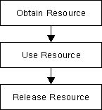

## Error-prone memory management with `new` and `delete`
In the previous chapters, we have seen that memory management on the heap using `malloc`/`free` or `new`/`delete` is extremely powerful, as they allow for a fine-grained control over the precious memory resource. However, the correct use of these concepts requires some degree of skill and experience (and concentration) from the programmer. If they are not handled correctly, bugs will quickly be introduced into the code. A major source of error is that the details around memory management with `new`/`delete` are completely left to the programer. In the remainder of this lesson, the pair `malloc`/`free` will be omitted for reasons of brevity. However, many of the aspects that hold for `new`/`delete` will also apply to  `malloc`/`free`.

Let us take a look at some of the worst problems with `new` and `delete`: 

1. **Proper pairing of new and delete** : Every dynamically allocated object that is created with new must be followed by a manual deallocation at a "proper" place in the program. If the programer forgets to call delete (which can happen very quickly) or if it is done at an "inappropriate" position, memory leaks will occur which might clog up a large portion of memory.

2. **Correct operator pairing** : C++ offers a variety of `new`/`delete` operators, especially when dealing with arrays on the heap. A dynamically allocated array initialized with `new[]` may only be deleted with the operator `delete[]`. If the wrong operator is used, program behavior will be undefined - which is to be avoided at all cost in C++.

3. **Memory ownership** : If a third-party function returns a pointer to a data structure, the only way of knowing who will be responsible for resource deallocation is by looking into either the code or the documentation. If both are not available (as is often the case), there is no way to infer the ownership from the return type. As an example, in the final project of this course, we will use the graphical library wxWidgets to create the user interface of a chatbot application. In wxWidgets, the programmer can create child windows and control elements on the heap using `new`, but the framework will take care of deletion altogether. If for some reason the programmer does not know this, he or she might call delete and thus interfere with the inner workings of the wxWidgets library.

<!--
%%ulab_page_divider
--><hr/>

## The benefits of smart pointers
To put it briefly: Smart pointers were introduced in C++ to solve the above mentioned problems by providing a degree of automatic memory management: When a smart pointer is no longer needed (which is the case as soon as it goes out of scope), the memory to which it points is automatically deallocated. When contrasted with smart pointers, the conventional pointers we have seen so far are often termed "raw pointers".  

In essence, smart pointers are classes that are wrapped around raw pointers. By overloading the `->` and `*` operators, smart pointer objects make sure that the memory to which their internal raw pointer refers to is properly deallocated. This makes it possible to use smart pointers with the same syntax as raw pointers. As soon as a smart pointer goes out of scope, its destructor is called and the block of memory to which the internal raw pointer refers is properly deallocated. This technique of wrapping a management class around a resource has been conceived by Bjarne Stroustroup and is called **Resource Acquisition Is Initialization (RAII)**. Before we continue with smart pointers and their usage let us take a close look at this powerful concept. 

<!--
%%ulab_page_divider
--><hr/>

## Resource Acquisition Is Initialization
The RAII is a widespread programming paradigm, that can be used to protect a resource such as a file stream, a network connection or a block of memory which need proper management. 

### Acquiring and releasing resources
In most programs of reasonable size, there will be many situations where a certain action at some point will necessitate a proper reaction at another point, such as: 

1. Allocating memory  with `new` or `malloc`, which must be matched with a call to `delete` or `free`.

2. Opening a file or network connection, which must be closed again after the content has been read or written.

3. Protecting synchronization primitives such as atomic operations, memory barriers, monitors or critical sections, which must be released to allow other threads to obtain them.

The following table gives a brief overview of some resources and their respective allocation and deallocation calls in C++:


<!--
%%ulab_page_divider
--><hr/>

### The problem of reliable resource release
A general usage pattern common to the above examples looks like the following: 



However, there are several problems with this seemingly simple pattern: 

1. The program might throw an exception during resource use and thus the point of release might never be reached. 

2. There might be several points where the resource could potentially be released, making it hard for a programmer to keep track of all eventualities. 

3. We might simply forget to release the resource again. 

<!--
%%ulab_page_divider
--><hr/>

### RAII to the rescue

The major idea of RAII revolves around object ownership and information hiding: Allocation and deallocation are hidden within the management class, so a programmer using the class does not have to worry about memory management responsibilities. If he has not directly allocated a resource, he will not need to directly deallocate it - whoever owns a resource deals with it. In the case of RAII this is the management class around the protected resource. The overall goal is to have allocation and deallocation (e.g. with `new` and `delete`) disappear from the surface level of the code you write. 

RAII can be used to leverage - among others - the following advantages:
- Use class destructors to perform resource clean-up tasks such as proper memory deallocation when the RAII object gets out of scope
- Manage ownership and lifetime of dynamically allocated objects
- Implement encapsulation and information hiding due to resource acquisition and release being performed within the same object.

In the following, let us look at RAII from the perspective of memory management. There are three major parts to an RAII class: 
1. A resource is allocated in the constructor of the RAII class
2. The resource is deallocated in the destructor
3. All instances of the RAII class are allocated on the stack to reliably control the lifetime via the object scope

<!--
%%ulab_page_divider
--><hr/>

Let us now take a look at the code example on the right.

At the beginning of the program, an array of double values  `den` is allocated on the stack. Within the loop, a new double is created on the heap using `new`. Then, the result of a division is printed to the console. At the end of the loop, `delete` is called to properly deallocate the heap memory to which `en` is pointing. Even though this code is working as it is supposed to, it is very easy to forget to call `delete` at the end. Let us therefore use the principles of RAII to create a management class that calls delete automatically:

```cpp
class MyInt
{
    int *_p; // pointer to heap data
public:
    MyInt(int *p = NULL) { _p = p; }
    ~MyInt() 
    { 
        std::cout << "resource " << *_p << " deallocated" << std::endl;
        delete _p; 
    }
    int &operator*() { return *_p; } // // overload dereferencing operator
};
```

In this example, the constructor of class `MyInt` takes a pointer to a memory resource. When the destructor of a `MyInt` object is called, the resource is deleted from memory - which makes `MyInt` an RAII memory management class. Also, the `*` operator is overloaded which enables us to dereference `MyInt` objects in the same manner as with raw pointers. Let us therefore slightly alter our code example from above to see how we can properly use this new construct: 

```cpp
int main()
{
    double den[] = {1.0, 2.0, 3.0, 4.0, 5.0};
    for (size_t I = 0; I < 5; ++i)
    {
        // allocate the resource on the stack
        MyInt en(new int(i));

        // use the resource
        std::cout << *en << "/" << den[i] << " = " << *en / den[i] << std::endl;
    }

    return 0;
}
```

Update the code on the right with the snippets above before proceeding.

<!--
%%ulab_page_divider
--><hr/>

Let us break down the resource allocation part in two steps: 
1. The part `new int(i)` creates a new block of memory on the heap and initializes it with the value of `i`. The returned result is the address of the block of memory. 
2. The part `MyInt en(…)`calls the constructor of class `MyInt`, passing the address of a valid memory block as a parameter. 

After creating an object of class `MyInt` on the stack, which, internally, created an integer on the heap, we can use the dereference operator in the same manner as before to retrieve the value to which the internal raw pointer is pointing. Because the `MyInt` object `en` lives on the stack, it is automatically deallocated after each loop cycle - which automatically calls the destructor to release the heap memory. The following console output verifies this: 

```
0/1 = 0
resource 0 deallocated
1/2 = 0.5
resource 1 deallocated
2/3 = 0.666667
resource 2 deallocated
3/4 = 0.75
resource 3 deallocated
4/5 = 0.8
resource 4 deallocated
```

We have thus successfully used the RAII idiom to create a memory management class that spares us from thinking about calling delete. By creating the `MyInt` object on the stack, we ensure that the deallocation occurs as soon as the object goes out of scope. 

<!--
%%ulab_page_divider
--><hr/>

#### Quiz : What would be the major difference of the following program compared to the last example?

```cpp
int main()
{
    double den[] = {1.0, 2.0, 3.0, 4.0, 5.0};
    for (size_t I = 0; I < 5; ++i)
    {
        // allocate the resource on the heap
        MyInt *en = new MyInt(new int(i));

        // use the resource
        std::cout << **en << "/" << den[i] << " = " << **en / den[i] << std::endl;

    return 0;
}
```

ANSWER: The destructor of `MyInt` would never be called, hence causing a memory leak with each loop iteration.
