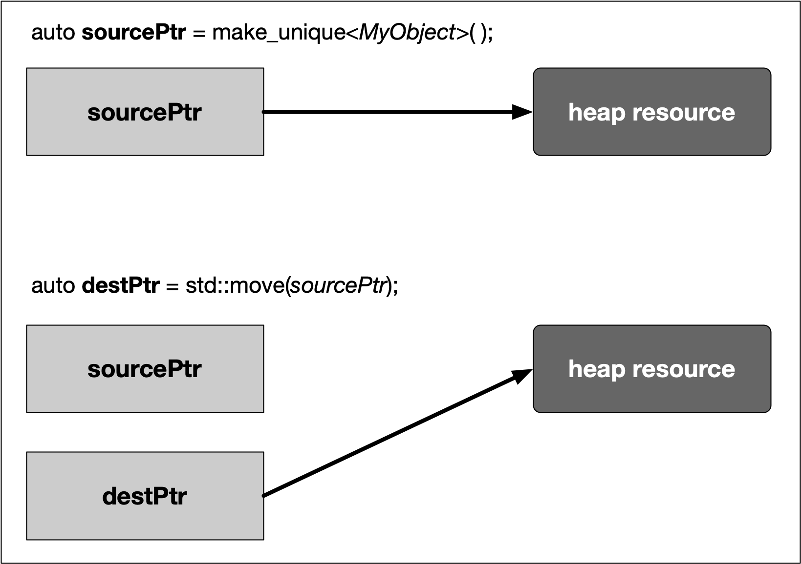
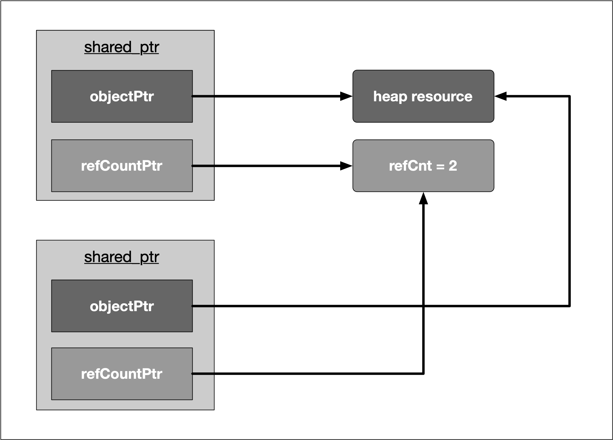

## RAII and smart pointers
In the last section, we have discussed the powerful RAII idiom, which reduces the risk of improperly managed resources. Applied to the concept of memory management, RAII enables us to encapsulate `new` and `delete` calls within a class and thus present the programmer with a clean interface to the resource he intends to use. Since C++11, there exists a language feature called *smart pointers*, which builds on the concept of RAII and - without exaggeration - revolutionizes the way we use resources on the heap. Let’s take a look.

<!--
%%ulab_page_divider
--><hr/>

## Smart pointer overview
Since C++11, the standard library includes *smart pointers*, which help to ensure that programs are free of memory leaks while also remaining exception-safe. With smart pointers, resource acquisition occurs at the same time that the object is initialized (when instantiated with `make_shared` or `make_unique`), so that all resources for the object are created and initialized in a single line of code.

In modern C++, raw pointers managed with `new` and `delete` should only be used in small blocks of code with limited scope, where performance is critical (such as with `placement new`) and ownership rights of the memory resource are clear. We will look at some guidelines on where to use which pointer later. 

C++11 has introduced three types of smart pointers, which are defined in the <memory> header of the standard library: 

1. The **unique pointer**  `std::unique_ptr`  is a smart pointer which exclusively owns a dynamically allocated resource on the heap. There must not be a second unique pointer to the same resource. 

2. The **shared pointer** `std::shared_ptr` points to a heap resource but does not explicitly own it. There may even be several shared pointers to the same resource, each of which will increase an internal reference count. As soon as this count reaches zero, the resource will automatically be deallocated. 

3. The **weak pointer** `std::weak_ptr` behaves similar to the shared pointer but does not increase the reference counter. 

Prior to C++11, there was a concept called `std::auto_ptr`, which tried to realize a similar idea. However, this concept can now be safely considered as deprecated and should not be used anymore. 

Let us now look at each of the three smart pointer types in detail. 

<!--
%%ulab_page_divider
--><hr/>

## The Unique pointer
A unique pointer is the exclusive owner of the memory resource it represents. There must not be a second unique pointer to the same memory resource, otherwise there will be a compiler error. As soon as the unique pointer goes out of scope, the memory resource is deallocated again. Unique pointers are useful when working with a temporary heap resource that is no longer needed once it goes out of scope. 

The following diagram illustrates the basic idea of a unique pointer: 



In the example, a resource in memory is referenced by a unique pointer instance `sourcePtr`. Then, the resource is reassigned to another unique pointer instance `destPtr` using `std::move`. The resource is now owned by `destPtr` while `sourcePtr` can still be used but does not manage a resource anymore. 

A unique pointer is constructed using the following syntax: 

`std::unique_ptr<Type> p(new Type);`


<!--
%%ulab_page_divider
--><hr/>

In the example on the right we will see how a unique pointer is constructed and how it compares to a raw pointer.

The function `RawPointer` contains the familiar steps of (1) allocating memory on the heap with new and storing the address in a pointer variable, (2) assigning a value to the memory block using the dereferencing operator  `*` and (3) finally deleting the resource on the heap. As we already know, forgetting to call delete will result in a memory leak. 

The function `UniquePointer` shows how to achieve the same goal using a smart pointer from the standard library. As can be seen, a smart pointer is a class template that is declared on the stack and then initialized by a raw pointer (returned by `new` ) to a heap-allocated object. The smart pointer is now responsible for deleting the memory that the raw pointer specifies - which happens as soon as the smart pointer goes out of scope. Note that smart pointers always need to be declared on the stack, otherwise the scoping mechanism would not work. 

The smart pointer destructor contains the call to delete, and because the smart pointer is declared on the stack, its destructor is invoked when the smart pointer goes out of scope, even if an exception is thrown.

<!--
%%ulab_page_divider
--><hr/>

[Video](https://video.udacity-data.com/topher/2019/September/5d865440_nd213-c03-l05-02.2-smart-pointers-sc/nd213-c03-l05-02.2-smart-pointers-sc_720p.mp4)

<!--
%%ulab_page_divider
--><hr/>

In the example now on the right, we will construct a unique pointer to a custom class. Also, we will see how the standard `->` and `*` operators can be used to access member functions of the managed object, just as we would with a raw pointer: 

Note that the custom class `MyClass` has two constructors, one without arguments and one with a string to be passed, which initializes a member variable `_text`  that lives on the stack. Also, once an object of this class gets destroyed, a message to the console is printed, along with the value of `_text`. In `main`, two unique pointers are created with the address of a `MyClass` object on the heap as arguments. With `myClass2`, we can see that constructor arguments can be passed just as we would with raw pointers.  After both pointers have been created, we can use the `->` operator to access members of the class, such as calling the function `setText`. From looking at the function call alone you would not be able to tell that `myClass1` is in fact a smart pointer. Also, we can use the dereference operator `*` to access the value of `myClass1` and `myClass2` and assign the one to the other. Finally, the `.` operator gives us access to proprietary functions of the smart pointer, such as retrieving the internal raw pointer with `get()`.

<!--
%%ulab_page_divider
--><hr/>

The console output of the program looks like the following: 
```
Objects have stack addresses 0x1004000e0 and 0x100400100
String 2 destroyed
String 2 destroyed
```

Obviously, both pointers have different addresses on the stack, even after copying the contents from `myClass2`  to  `myClass1`. As can be seen from the last two lines of the output, the destructor of both objects gets called automatically at the end of the program and - as expected - the value of the internal string is identical due to the copy operation. 

<!--
%%ulab_page_divider
--><hr/>

Summing up, the unique pointer allows a single owner of the underlying internal raw pointer. Unique pointers should be the default choice unless you know for certain that sharing is required at a later stage. We have already seen how to transfer ownership of a resource using the Rule of Five and move semantics. Internally, the unique pointer uses this very concept along with RAII to encapsulate a resource (the raw pointer) and transfer it between pointer objects when either the move assignment operator or the move constructor are called. Also, a key feature of a unique pointer, which makes it so well-suited as a return type for many functions, is the possibility to convert it to a shared pointer. We will have a deeper look into this in the section on ownership transfer. 

<!--
%%ulab_page_divider
--><hr/>

## The Shared Pointer
Just as the unique pointer, a shared pointer owns the resource it points to. The main difference between the two smart pointers is that shared pointers keep a reference counter on how many of them point to the same memory resource. Each time a shared pointer goes out of scope, the counter is decreased. When it reaches zero (i.e. when the last shared pointer to the resource is about to vanish). the memory is properly deallocated. This smart pointer type is useful for cases where you require access to a memory location on the heap in multiple parts of your program and you want to make sure that whoever owns a shared pointer to the memory can rely on the fact that it will be accessible throughout the lifetime of that pointer. 

The following diagram illustrates the basic idea of a shared pointer: 



Please take a look at the code on the right.

<!--
%%ulab_page_divider
--><hr/>

We can see that shared pointers are constructed just as unique pointers are. Also, we can access the internal reference count by using the method `use_count()`. In the inner block, a second shared pointer `shared2` is created and  `shared1` is assigned to it. In the copy constructor, the internal resource pointer is copied to `shared2` and the resource counter is incremented in both `shared1` and `shared2`.  Let us take a look at the output of the code: 
```
shared pointer count = 1
shared pointer count = 2
shared pointer count = 1
```

You may have noticed that the lifetime of `shared2` is limited to the scope denoted by the enclosing curly brackets. Thus, once this scope is left and `shared2`  is destroyed, the reference counter in `shared1` is decremented by one - which is reflected in the three console outputs given above. 

<!--
%%ulab_page_divider
--><hr/>

A shared pointer can also be redirected by using the `reset()` function. If the resource which a shared pointer manages is no longer needed in the current scope, the pointer can be reset to manage a difference resource as illustrated in the example on the right.

Note that in the example, the destructor of MyClass prints a string to the console when called. The output of the program looks like the following: 
```
shared pointer count = 1
Destructor of MyClass called
shared pointer count = 1
Destructor of MyClass called
```

After creation, the program prints `1` as the reference count of `shared`. Then, the `reset` function is called with a new instance of `MyClass` as an argument. This causes the destructor of the first `MyClass` instance to be called, hence the console output. As can be seen, the reference count of the shared pointer is still at `1`. Then, at the end of the program, the destructor of the second `MyClass` object is called once the path of execution leaves the scope of `main.` 

<!--
%%ulab_page_divider
--><hr/>

Despite all the advantages of shared pointers, it is still possible to have problems with memory management though. Consider the scenario on the right.

In main, two shared pointers `myClass1` and `myClass2` which are managing objects of type `MyClass` are allocated on the stack. As can be seen from the console output, both smart pointers are automatically deallocated when the scope of main ends: 
```
Destructor of MyClass called
Destructor of MyClass called
```

When the following two lines are added to main, the result is quite different: 
```
myClass1->_member = myClass2;
myClass2->_member = myClass1;
```

These two lines produce a *circular reference*. When `myClass1` goes out of scope at the end of main, its destructor can’t clean up memory as there is still a reference count of 1 in the smart pointer, which is caused by the shared pointer _member in `myClass2`. The same holds true for `myClass2`, which can not be properly deleted as there is still a shared pointer to it in `myClass1`. This deadlock situation prevents the destructors from being called and causes a memory leak. When we use *Valgrind* on this program, we get the following summary: 

```
==20360== LEAK SUMMARY:
==20360==    definitely lost: 16 bytes in 1 blocks
==20360==    indirectly lost: 80 bytes in 3 blocks
==20360==      possibly lost: 72 bytes in 3 blocks
==20360==    still reachable: 200 bytes in 6 blocks
==20360==         suppressed: 18,985 bytes in 160 blocks
```

As can be seen, the memory leak is clearly visible with 16 bytes being marked as "definitely lost". To prevent such circular references, there is a third smart pointer, which we will look at in the following. 

<!--
%%ulab_page_divider
--><hr/>

## The Weak Pointer
Similar to shared pointers, there can be multiple weak pointers to the same resource. The main difference though is that weak pointers do not increase the reference count. Weak pointers hold a non-owning reference to an object that is managed by another shared pointer. 

The following rule applies to weak pointers: You can only create weak pointers out of shared pointers or out of another weak pointer. The code on the right shows a few examples of how to use and how not to use weak pointers.

The output looks as follows: 
```
shared pointer count = 1
shared pointer count = 1
```

First, a shared pointer to an integer is created with a reference count of 1 after creation. Then, two weak pointers to the integer resource are created, the first directly from the shared pointer and the second indirectly from the first weak pointer. As can be seen from the output, neither of both weak pointers increased the reference count. At the end of main, the attempt to directly create a weak pointer to an integer resource would lead to a compile error. 

<!--
%%ulab_page_divider
--><hr/>

As we have seen with raw pointers, you can never be sure wether the memory resource to which the pointer refers is still valid. With a weak pointer, even though this type does not prevent an object from being deleted, the validity of its resource can be checked. The code on the right illustrates how to use the `expired()` function to do this.

Thus, with smart pointers, there will always be a managing instance which is responsible for the proper allocation and deallocation of a resource. In some cases it might be necessary to convert from one smart pointer type to another. Let us take a look at the set of possible conversions in the following. 

<!--
%%ulab_page_divider
--><hr/>

## Converting between smart pointers
The example on the right illustrates how to convert between the different pointer types.

In (1), a conversion from **unique pointer to shared pointer** is performed. You can see that this can be achieved by using `std::move`, which calls the move assignment operator on `sharedPtr1` and steals the resource from `uniquePtr` while at the same time invalidating its resource handle on the heap-allocated integer.

In (2), you can see how to convert **from weak to shared pointer**. Imagine that you have been passed a weak pointer to a memory object which you want to work on. To avoid invalid memory access, you want to make sure that the object will not be deallocated before your work on it has been finished. To do this, you can convert a weak pointer to a shared pointer by calling the `lock()` function on the weak pointer.

In (3), a **raw pointer is extracted** from a shared pointer. However, this operation does not decrease the reference count within `sharedPtr2`. This means that calling `delete` on `rawPtr` in the last line before main returns will generate a runtime error as a resource is trying to be deleted which is managed by `sharedPtr2` and has already been removed. The output of the program when compiled with `g++` thus is: `malloc: *** error for object 0x1003001f0: pointer being freed was not allocated`.

Note that there are **no options for converting away from a shared pointer**. Once you have created a shared pointer, you must stick to it (or a copy of it) for the remainder of your program. 

<!--
%%ulab_page_divider
--><hr/>

## When to use raw pointers and smart pointers?
As a general rule of thumb with modern C++, smart pointers should be used often. They will make your code safer as you no longer need to think (much) about the proper allocation and deallocation of memory. As a consequence, there will be much fewer memory leaks caused by dangling pointers or crashes from accessing invalidated memory blocks. 

When using raw pointers on the other hand, your code might be susceptible to the following bugs: 
1. Memory leaks
2. Freeing memory that shouldn’t be freed
3. Freeing memory incorrectly
4. Using memory that has not yet been allocated
5. Thinking that memory is still allocated after being freed

With all the advantages of smart pointers in modern C++, one could easily assume that it would be best to completely ban the use of new and delete from your code. However, while this is in many cases possible, it is not always advisable as well. Let us take a look at the [C++ core guidelines](http://isocpp.github.io/CppCoreGuidelines/CppCoreGuidelines#main), which has several [**rules for explicit memory allocation and deallocation**](http://isocpp.github.io/CppCoreGuidelines/CppCoreGuidelines#r-resource-management). In the scope of this course, we will briefly discuss three of them:  

1. **R. 10: Avoid malloc and free** 
While the calls `(MyClass*)malloc( sizeof(MyClass) )` and `new MyClass` both allocate a block of memory on the heap in a perfectly valid manner, only `new` will also call the constructor of the class and `free` the destructor. To reduce the risk of undefined behavior, `malloc` and `free` should thus be avoided.

2. **R. 11: Avoid calling new and delete explicitly**
Programmers have to make sure that every call of `new` is paired with the appropriate `delete` at the correct position so that no memory leak or invalid memory access occur. The emphasis here lies in the word "explicitly" as opposed to implicitly, such as with smart pointers or containers in the standard template library. 

3. **R. 12: Immediately give the result of an explicit resource allocation to a manager object**
It is recommended to make use of manager objects for controlling resources such as files, memory or network connections to mitigate the risk of memory leaks. This is the core idea of smart pointers as discussed at length in this section.

Summarizing, raw pointers created with `new` and `delete` allow for a high degree of flexibility and control over the managed memory as we have seen in earlier lessons of this course. To mitigate their proneness to errors, the following additional recommendations can be given: 

- A call to `new` should not be located too far away from the corresponding `delete`. It is bad style to stretch you `new` / `delete` pairs throughout your program with references criss-crossing your entire code. 

- Calls to  `new`  and  `delete` should always be hidden from third parties so that they must  not concern themselves with managing memory manually (which is similar to R. 12). 

<!--
%%ulab_page_divider
--><hr/>

In addition to the above recommendations, the C++ core guidelines also contain a total of 13 rules for the [**recommended use of smart pointers**](http://isocpp.github.io/CppCoreGuidelines/CppCoreGuidelines#rsmart-smart-pointers). In the following, we will discuss a selection of these: 

1. **R. 20 : Use unique_ptr or shared_ptr to represent ownership**

2. **R. 21 : Prefer unique_ptr over std::shared_ptr unless you need to share ownership**

Both pointer types express ownership and responsibilities (R. 20). A `unique_ptr` is an exclusive owner of the managed resource; therefore, it cannot be copied, only moved. In contrast, a `shared_ptr` shares the managed resource with others. As described above, this mechanism works by incrementing and decrementing a common reference counter. The resulting administration overhead makes `shared_ptr` more expensive than `unique_ptr`. For this reason `unique_ptr` should always be the first choice (R. 21). 

4. **R. 22 : Use make_shared() to make shared_ptr**

5. **R. 23 : Use make_unique() to make std::unique_ptr**

The increased management overhead compared to raw pointers becomes in particular true if a `shared_ptr` is used. Creating a `shared_ptr` requires (1) the allocation of the resource using new and (2) the allocation and management of the reference counter. Using the factory function `make_shared` is a one-step operation with lower overhead and should thus always be preferred. (R.22). This also holds for `unique_ptr` (R.23), although the performance gain in this case is minimal (if existent at all). 

But there is an additional reason for using the `make_...` factory functions: Creating a smart pointer in a single step removes the risk of a memory leak. Imagine a scenario where an exception happens in the constructor of the resource. In such a case, the object would not be handled properly and its destructor would never be called - even if the managing object goes out of scope. Therefore, `make_shared` and `make_unique` should always be preferred.  Note that `make_unique` is only available with compilers that support at least the C++14 standard.

3. **R. 24 : Use weak_ptr to break cycles of shared_ptr**

We have seen that weak pointers provide a way to break a deadlock caused by two owning references which are cyclicly referring to each other. With weak pointers, a resource can be safely deallocated as the reference counter is not increased. 

The remaining set of guideline rules referring to smart pointers are mostly concerning the question of how to pass a smart pointer to a function. We will discuss this question in the next concept.
