# C2.4 : Starting a Thread with a Function Object

## Functions and Callable Objects

In the previous section, we have created our first thread by passing it a function to execute. We did not discuss this concept in depth at the time, but in this section we will focus on the details of passing functions to other functions, which is one form of a _callable object_.

In C++, callable objects are object that can appear as the left-hand operand of the call operator. These can be pointers to functions, objects of a class that defines an overloaded function call operator and _lambdas_ (an anonymous inline function), with which function objects can be created in a very simple way. In the context of concurrency, we can use callable objects to attach a function to a thread.

In the last section, we constructed a thread object by passing a function to it without any arguments. If we were limited to this approach, the only way to make data available from within the thread function would be to use global variables - which is definitely not recommendable and also incredibly messy.

In this section, we will therefore look at several ways of passing data to a thread function.

<!--
%%ulab_page_divider
--><hr/>

## Starting Threads with Function Objects

The `std::thread` constructor can also be called with instances of classes that implement the function-call operator. In the following, we will thus define a class that has an overloaded `()`-operator. In preparation for the final project of this course, which will be a traffic simulation with vehicles moving through intersections in a street grid, we will define a (very) early version of the Vehicle class in this example:

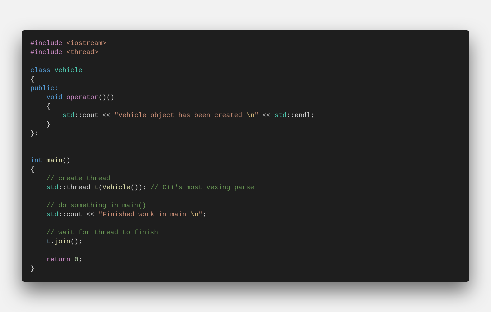</img>

When executing this code, the clang++ compiler generates a warning, which is followed by an error:

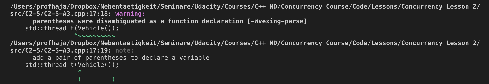</img>

A similar error is shown when compiling with g++:
```bash
error: request for member ‘join’ in ‘t’, which is of non-class type ‘std::thread(Vehicle (*)())’
     t.join();
```
So you will see an error when you compile `example_1.cpp`!

The extra parentheses suggested by the compiler avoid what is known as C++'s "most vexing parse", which is a specific form of syntactic ambiguity resolution in the C++ programming language.

The expression was coined by Scott Meyers in 2001, who talks about it in details in his book "Effective STL". The "most vexing parse" comes from a rule in C++ that says that anything that could be considered as a function declaration, the compiler should parse it as a function declaration - even if it could be interpreted as something else.

<!--
%%ulab_page_divider
--><hr/>

In the previous code example, the line

</img>

is seemingly ambiguous, since it could be interpreted either as

1.  a variable definition for variable `t` of class `std::thread`, initialized with an anonymous instance of class Vehicle or
2.  a function declaration for a function `t` that returns an object of type `std::thread` and has a single (unnamed) parameter that is a pointer to function returning an object of type `Vehicle`

Most programmers would presumable expect the first case to be true, but the C++ standard requires it to be interpreted as the second - hence the compiler warning.

There are three ways of forcing the compiler to consider the line as the first case, which would create the thread object we want:

*   Add an extra pair of parentheses
*   Use copy initialization
*   Use uniform initialization with braces

The following code shows all three variants:

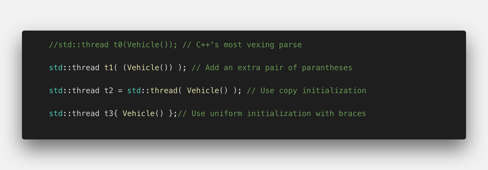</img>

The output of this code sample shows that all three threads are executed and the Vehicle object is properly initialized:

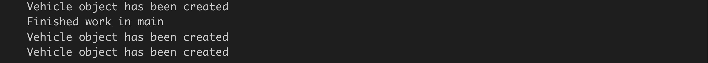</figure>


<!--
%%ulab_page_divider
--><hr/>

Whichever option we use, the idea is the same: the function object is copied into internal storage accessible to the new thread, and the new thread invokes the operator `()`. The `Vehicle` class can of course have data members and other member functions too, and this is one way of passing data to the thread function: pass it in as a constructor argument and store it as a data member:

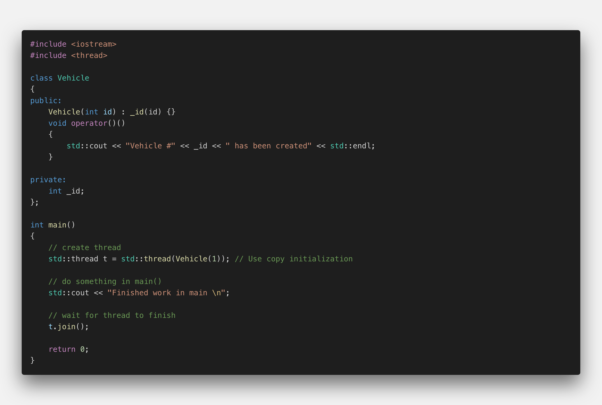</img>

In the above code example, the class `Vehicle` has a constructor that takes an integer and it will store it internally in a variable `_id`. In the overloaded function call operator, the vehicle id is printed to the console. In `main()`, we are creating the `Vehicle` object using copy initialization. The output of the program is given below:

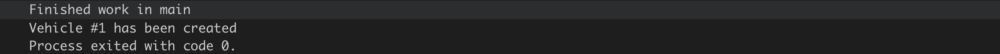</img>

As can easily be seen, the integer ID has been successfully passed into the thread function.

<!--
%%ulab_page_divider
--><hr/>

## Lambdas

Another very useful way of starting a thread and passing information to it is by using a lambda expression ("Lambda" for short). With a Lambda you can easily create simple function objects.

The name "Lambda" comes from Lambda Calculus , a mathematical formalism invented by Alonzo Church in the 1930s to investigate questions of logic and computability. Lambda calculus formed the basis of LISP, a functional programming language. Compared to Lambda Calculus and LISP, C ++ - Lambdas have the properties of being unnamed and capturing variables from the surrounding context, but lack the ability to execute and return functions.

A Lambda is often used as an argument for functions that can take a callable object. This can be easier than creating a named function that is used only when passed as an argument. In such cases, Lambdas are generally preferred because they allow the function objects to be defined inline. If Lambdas were not available, we would have to define an extra function somewhere else in our source file - which would work but at the expense of the clarity of the source code.

A Lambda is a function object (a "functor"), so it has a type and can be stored and passed around. Its result object is called a "closure", which can be called using the operator `()` as we will see shortly.

A lambda formally consists of three parts: a capture list `[]` , a parameter list `()` and a main part `{}`, which contains the code to be executed when the Lambda is called. Note that in principal all parts could be empty.

_The capture list `[]`_: By default, variables outside of the enclosing {} around the main part of the Lambda can not be accessed. By adding a variable to the capture list however, it becomes available within the Lambda either as a copy or as a reference. The captured variables become a part of the Lambda.

By default, variables in the capture block can not be modified within the Lambda. Using the keyword "mutable" allows to modify the parameters captured by copy, and to call their non-const member functions within the body of the Lambda. The following code examples show several ways of making the external variable "id" accessible within a Lambda.

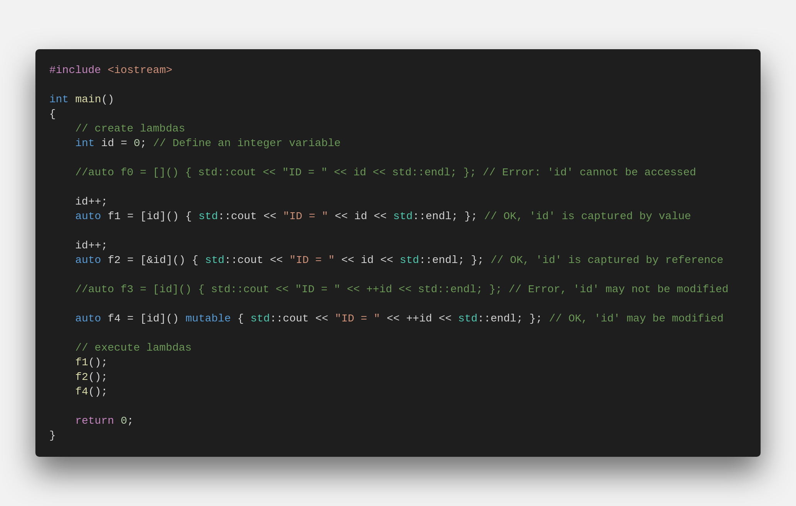</img>

Even though we have been using Lambdas in the above example in various ways, it is important to note that a Lambda does not exist at runtime. The runtime effect of a Lambda is the generation of an object, which is known as _closure_. The difference between a Lambda and the corresponding closure is similar to the distinction between a class and an instance of the class. A class exists only in the source code while the objects created from it exist at runtime.

We can use (a copy of) the closure (i.e. f0, f1, …) to execute the code within the Lambda at a position in our program different to the line where the function object was created.

_The parameter list `()`_ : The way parameters are passed to a Lambda is basically identical to calling a regular function. If the Lambda takes no arguments, these parentheses can be omitted (except when "mutable" is used).

<!--
%%ulab_page_divider
--><hr/>

The following example illustrates how the function object is first created and then used to pass the parameter id later in the code.

</img>

<!--
%%ulab_page_divider
--><hr/>

## Quiz

The code below shows how to capture variables by value and by reference, how to pass variables to a Lambda using the parameter list and how to use the closure to execute the Lambda.

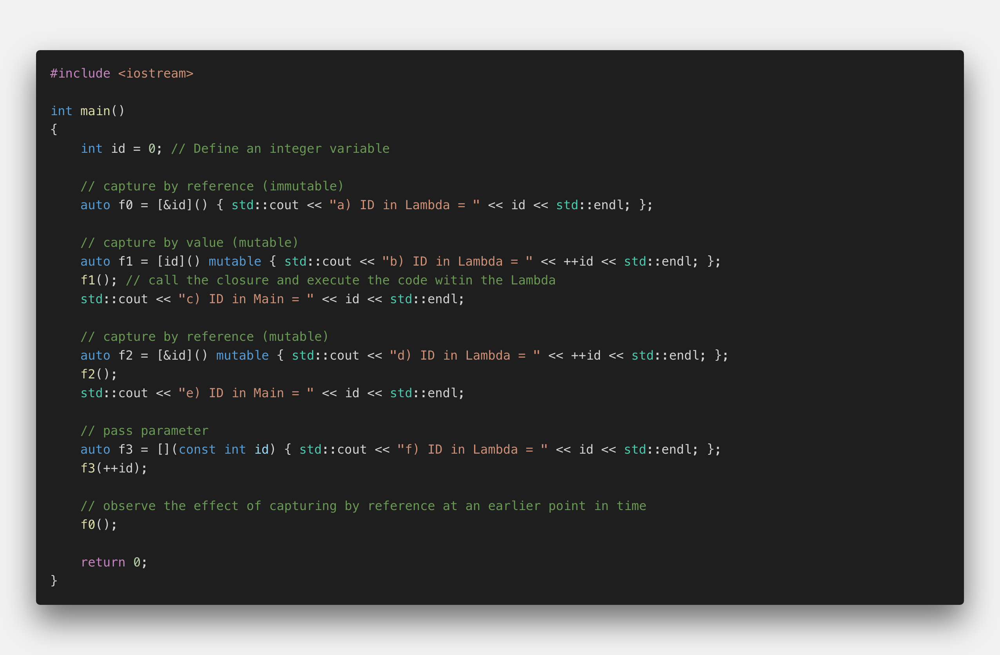</img>

Please think about the resulting output for a while. What would you say is the order in which the various strings are printed to the console? Also, what will be the value for ID for each output?

The following image shows the order of the printed strings, along with the ID for each output. For a complete explanation of the code and this output, see the solution video after this workspace.
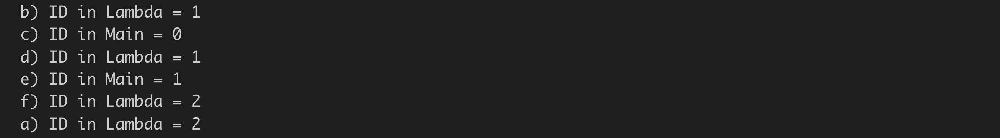</figure>

<!--
%%ulab_page_divider
--><hr/>

## Starting Threads with Lambdas

A Lambda is, as we’ve seen, just an object and, like other objects it may be copied, passed as a parameter, stored in a container, etc. The Lambda object has its own scope and lifetime which may, in some circumstances, be different to those objects it has ‘captured’. Programers need to take special care when capturing local objects by reference because a Lambda’s lifetime may exceed the lifetime of its capture list: It must be ensured that the object to which the reference points is still in scope when the Lambda is called. This is especially important in multi-threading programs.

So let us start a thread and pass it a Lambda object to execute:

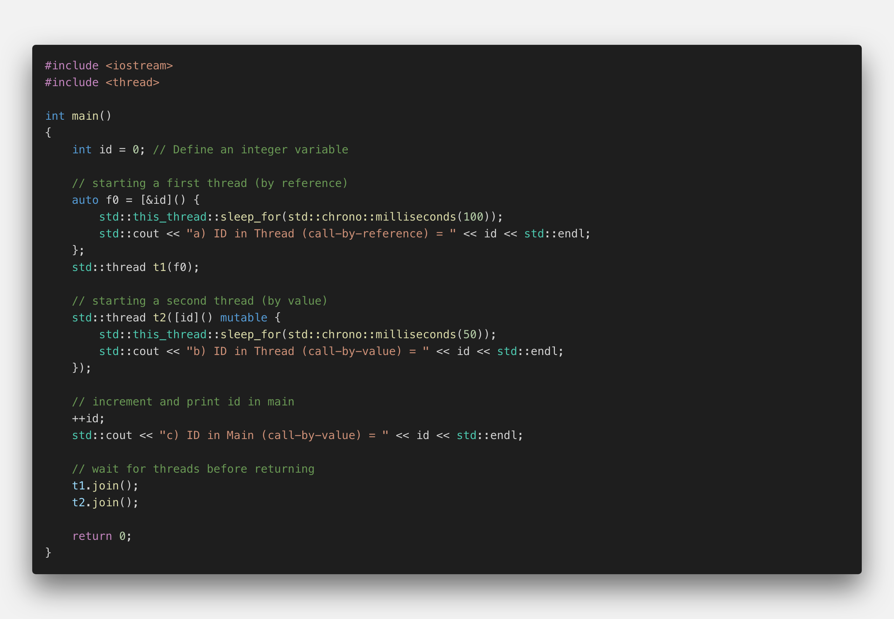</img>

The output of the program looks like this

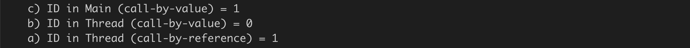</figure>

As you can see, the output in the main thread is generated first, at which point the variable ID has taken the value 1\. Then, the call-by-value thread is executed with ID at a value of 0\. Then, the call-by-reference thread is executed with ID at a value of 1\. This illustrates the effect of passing a value by reference : when the data to which the reference refers changes before the thread is executed, those changes will be visible to the thread. We will see other examples of such behavior later in the course, as this is a primary source of concurrency bugs.
