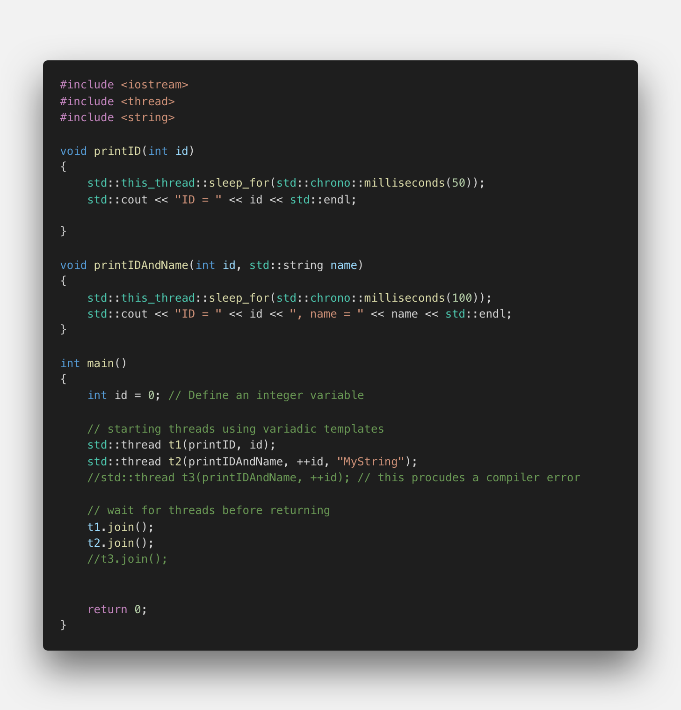
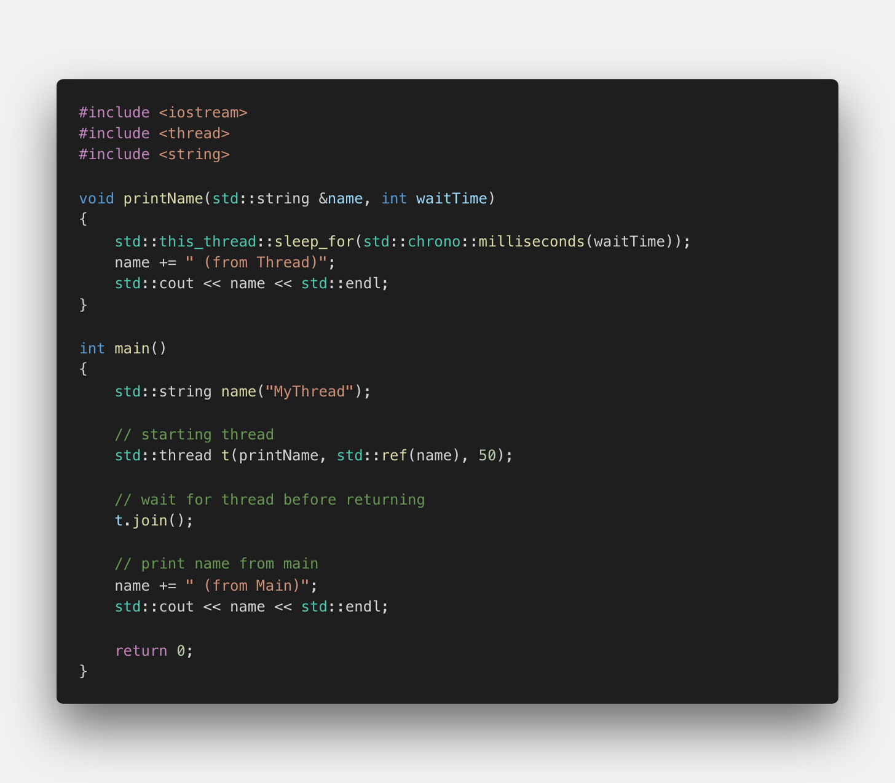
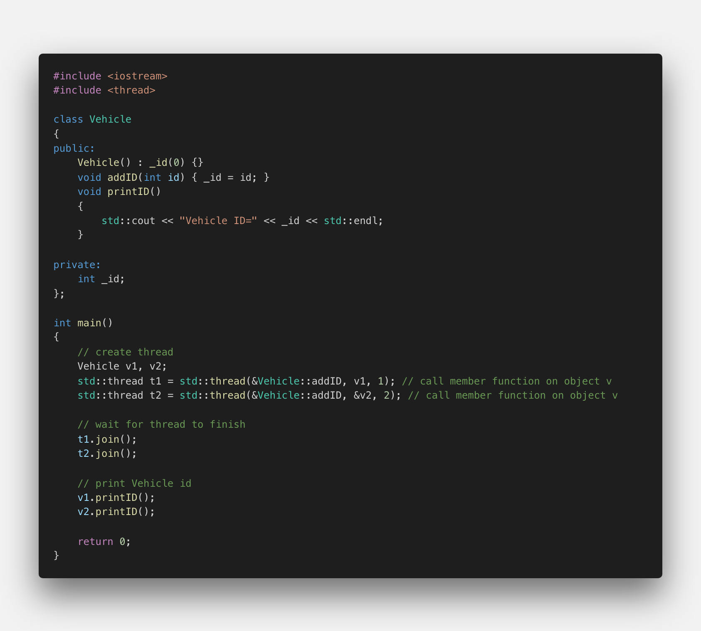
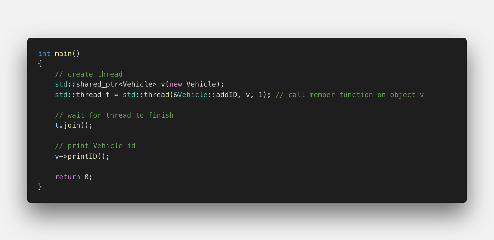

# Starting a Thread with Variadic Templates and Member Functions

## Passing Arguments using a Variadic Template

In the previous section, we have seen that one way to pass arguments in to the thread function is to package them in a class using the function call operator. Even though this worked well, it would be very cumbersome to write a special class every time we need to pass data to a thread. We can also use a Lambda that captures the arguments and then calls the function. But there is a simpler way: The thread constructor may be called with a function and all its arguments. That is possible because the thread constructor is a _variadic template_ that takes multiple arguments.

Before C++11, classes and functions could only accept a fixed number of arguments, which had to be specified during the first declaration. With variadic templates it is possible to include any number of arguments of any type.

</img>

As seen in the code example above, a first thread object is constructed by passing it the function `printID` and an integer argument. Then, a second thread object is constructed with a function `printIDAndName`, which requires an integer and a string parameter. If only a single argument was provided to the thread when calling `printIDAndName`, a compiler error would occur (see `std::thread t3` in the example) - which is the same type checking we would get when calling the function directly.

<!--
%%ulab_page_divider
--><hr/>

There is one more difference between calling a function directly and passing it to a thread: With the former, arguments may be passed by value, by reference or by using move semantics - depending on the signature of the function. When calling a function using a variadic template, the arguments are by default either moved or copied - depending on wether they are rvalues or lvalues. There are ways however which allow us to overwrite this behavior. If you want to move an lvalue for example, we can call `std::move`. In the following example, two threads are started, each with a different string as a parameter. With `t1`, the string name1 is copied by value, which allows us to print name1 even after `join` has been called. The second string `name2` is passed to the thread function using move semantics, which means that it is not available any more after `join` has been called on `t2`.

</img>

The console output shows how using copy-by-value and `std::move` affect the string parameters:

</img>

<!--
%%ulab_page_divider
--><hr/>

In the following example, the signature of the thread function is modified to take a non-const reference to the string instead.

</img>

When passing the string variable name to the thread function, we need to explicitly mark it as a reference, so the compiler will treat it as such. This can be done by using the `std::ref` function. In the console output it becomes clear that the string has been successfully modified within the thread function before being passed to `main`.

</img>

Even though the code works, we are now sharing mutable data between threads - which will be something we discuss in later sections of this course as a primary source for concurrency bugs.

<!--
%%ulab_page_divider
--><hr/>

## Starting Threads with Member Functions

In the previous sections, you have seen how to start threads with functions and function objects, with and without additional arguments. Also, you now know how to pass arguments to a thread function by reference. But what if we wish to run a member function other than the function call operator, such as a member function of an existing object? Luckily, the C++ library can handle this use-case: For calling member functions, the `std::thread` function requires an additional argument for the object on which to invoke the member function.

</img>

In the example above, the Vehicle object v1 is passed to the thread function by value, thus a copy is made which does not affect the „original“ living in the main thread. Changes to its member variable `_id` will thus not show when printing calling `printID()` later in main. The second `Vehicle` object `v2` is instead passed by reference. Therefore, changes to its `_id` variable will also be visible in the `main` thread - hence the following console output:

</img>

<!--
%%ulab_page_divider
--><hr/>

In the previous example, we have to ensure that the existence of `v2` outlives the completion of the thread `t2` - otherwise there will be an attempt to access an invalidated memory address. An alternative is to use a heap-allocated object and a reference-counted pointer such as `std::shared_ptr<Vehicle>` to ensure that the object lives as long as it takes the thread to finish its work. The following example shows how this can be implemented:

</img>

<!--
%%ulab_page_divider
--><hr/>

## Adding a Member Function

Change the code from the previous example in a way that a new member variable `_name` of type `std::string` is added to the `Vehicle` class. Then, define a function `setName` which takes a string as an argument and assigns this to `_name`. The function `setName` needs to be started as a thread from `main`. Also, add a function `printName` to the `Vehicle` class which is used at the end of `main` to print the name to the console.

```cpp
#include <iostream>
#include <thread>

class Vehicle
{
public:
    Vehicle() : _id(0) {}
    void addID(int id) { _id = id; }
    void setName(std::string name) { _name = name; }
    void printID()
    {
        std::cout << "Vehicle ID=" << _id << std::endl;
    }
    void printName()
    {
        std::cout << "Vehicle name=" << _name << std::endl;
    }

private:
    int _id;
    std::string _name;
};

int main()
{
    // create thread 1
    std::shared_ptr<Vehicle> v(new Vehicle);
    std::thread t1 = std::thread(&Vehicle::addID, v, 1); 

    // create thread 2
    std::thread t2 = std::thread(&Vehicle::setName, v, "MyVehicle"); 
    
    // wait for thread to finish
    t1.join();
    t2.join();
    
    // print Vehicle id
    v->printID();
    v->printName();
    
    return 0;
}
```
