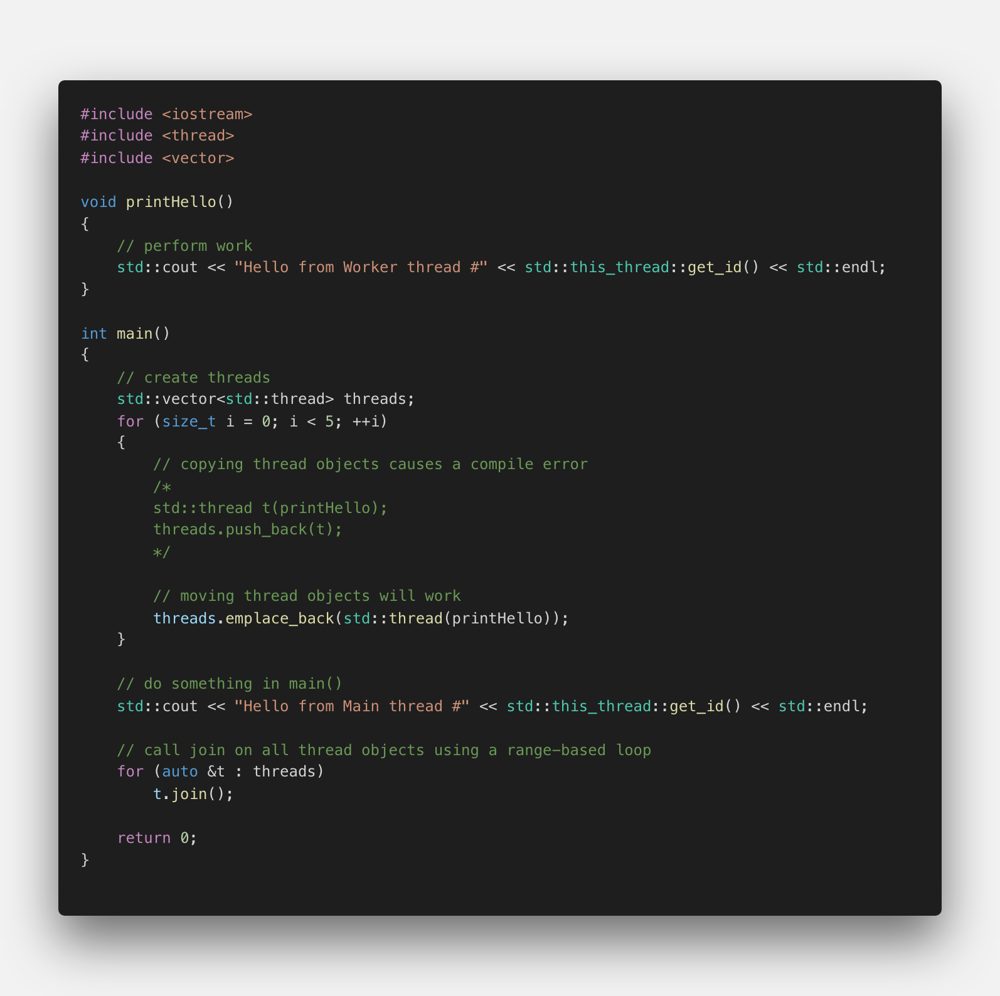
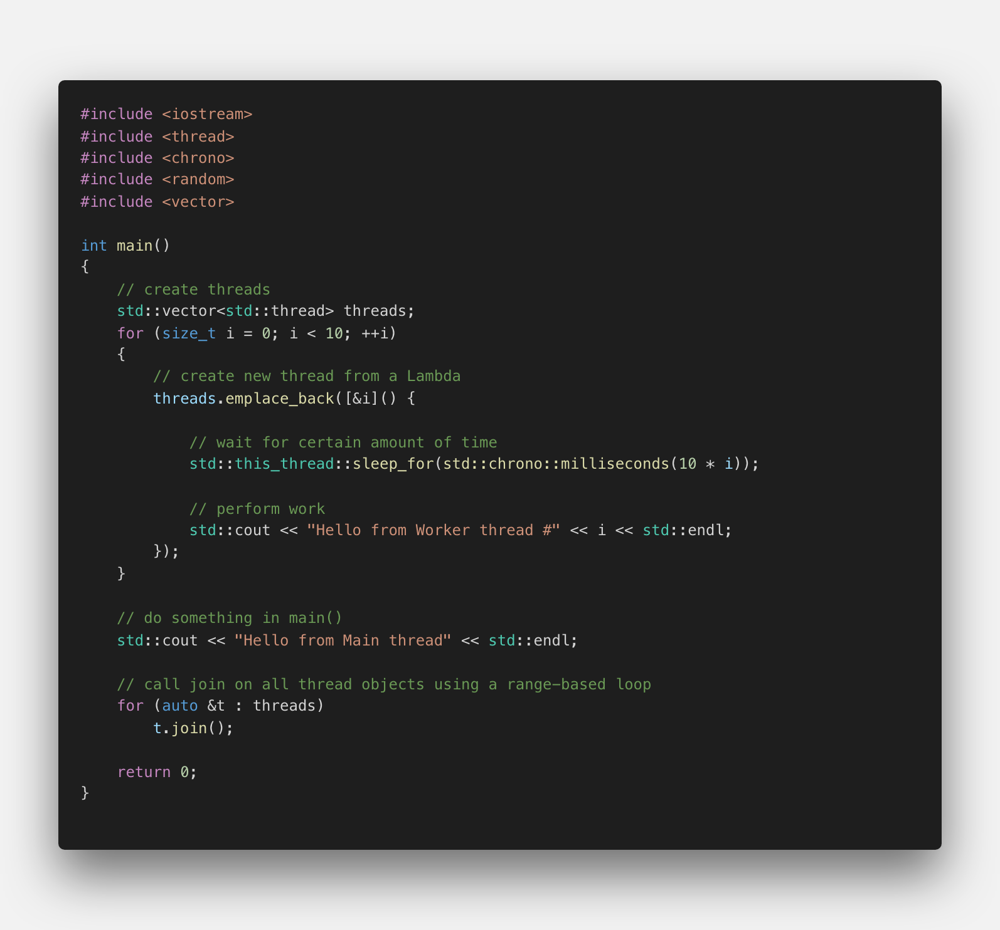
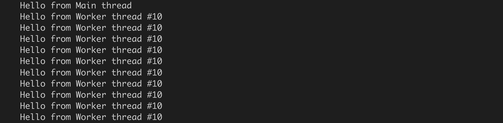

# Running Multiple Threads

## Fork-Join Parallelism

Using threads follows a basic concept called "fork-join-parallelism". The basic mechanism of this concept follows a simple three-step pattern:

1.  Split the flow of execution into a parallel thread ("fork")
2.  Perform some work in both the main thread and the parallel thread
3.  Wait for the parallel thread to finish and unite the split flow of execution again ("join")

The following diagram illustrates the basic idea of forking:

</img>

In the main thread, the program flow is forked into three parallel branches. In both worker branches, some work is performed - which is why threads are often referred to as "worker threads". Once the work is completed, the flow of execution is united again in the main function using the `join()` command. In this example, join acts as a barrier where all threads are united. The execution of main is in fact halted, until both worker threads have successfully completed their respective work.

<!--
%%ulab_page_divider
--><hr/>

In the following example, a number of threads is created and added to a vector. The basic idea is to loop over the vector at the end of the main function and call join on all the thread objects inside the vector.

</img>

When we try to compile the program using the `push_back()` function (which is the usual way in most cases), we get a compiler error. The problem with our code is that by pushing the thread object into the vector, we attempt to make a copy of it. However, thread objects do not have a copy constructor and thus can not be duplicated. If this were possible, we would create yet another branch in the flow of execution - which is not what we want. The solution to this problem is to use move semantics, which provide a convenient way for the contents of objects to be 'moved' between objects, rather than copied. It might be a good idea at this point to refresh your knowledge on move semantics, on rvalues and lvalues as well as on rvalue references, as we will make use of these concepts throughout the course.

To solve our problem, we can use the function `emplace_back()` instead of `push_back()`, which internally uses move semantics to move our thread object into the vector without making a copy. When executing the code, we get the following output:

```
Hello from Worker thread #Hello from Worker thread #140370329347840140370337740544
Hello from Worker thread #140370320955136
Hello from Worker thread #140370346133248

Hello from Main thread #140370363660096
Hello from Worker thread #140370312562432
```

This is surely not how we intended the console output to look like. When we take a close look at the call to std::cout in the thread function, we can see that it actually consists of three parts: the string "Hello from worker…", the respective thread id and finally the line break at the end. In the output, all three components are completely intermingled. Also, when the program is run several times, the output will look different with each execution. This shows us two important properties of concurrent programs:

1.  The order in which threads are executed is non-deterministic. Every time a program is executed, there is a chance for a completely different order of execution.
2.  Threads may get preempted in the middle of execution and another thread may be selected to run.

These two properties pose a major problem with concurrent applications: A program may run correctly for thousands of times and suddenly, due to a particular interleaving of threads, there might be a problem. From a debugging perspective, such errors are very hard to detect as they can not be reproduced easily.

<!--
%%ulab_page_divider
--><hr/>

## A First Concurrency Bug

Let us adjust the program code from the previous example and use a Lambda instead of the function `printHello()`. Also, we will pass the loop counter i into the Lambda to enforce an individual wait time for each thread. The idea is to prevent the interleaving of text on the command line which we saw in the previous example.

</img>

When executing the code however, the following output is generated on the console:

</img>

Clearly this is not what we expected. Can you find the bug and fix the code so that each thread gets the corresponding integer ranging from 0 to 9?

In order to ensure the correct view on the counter variable i, pass it to the Lambda function by value and not by reference.
