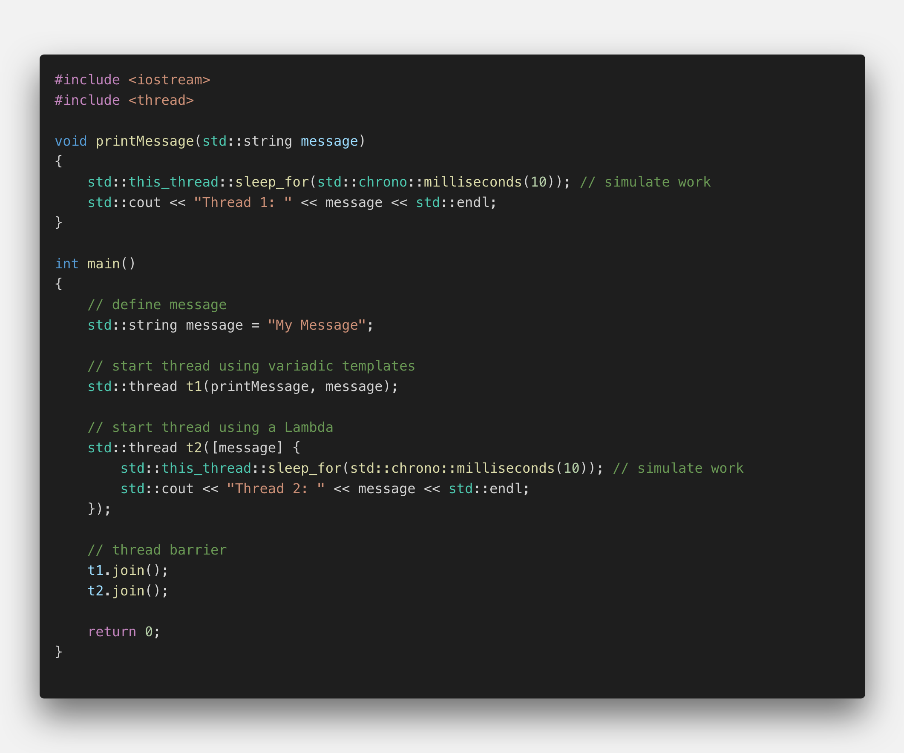
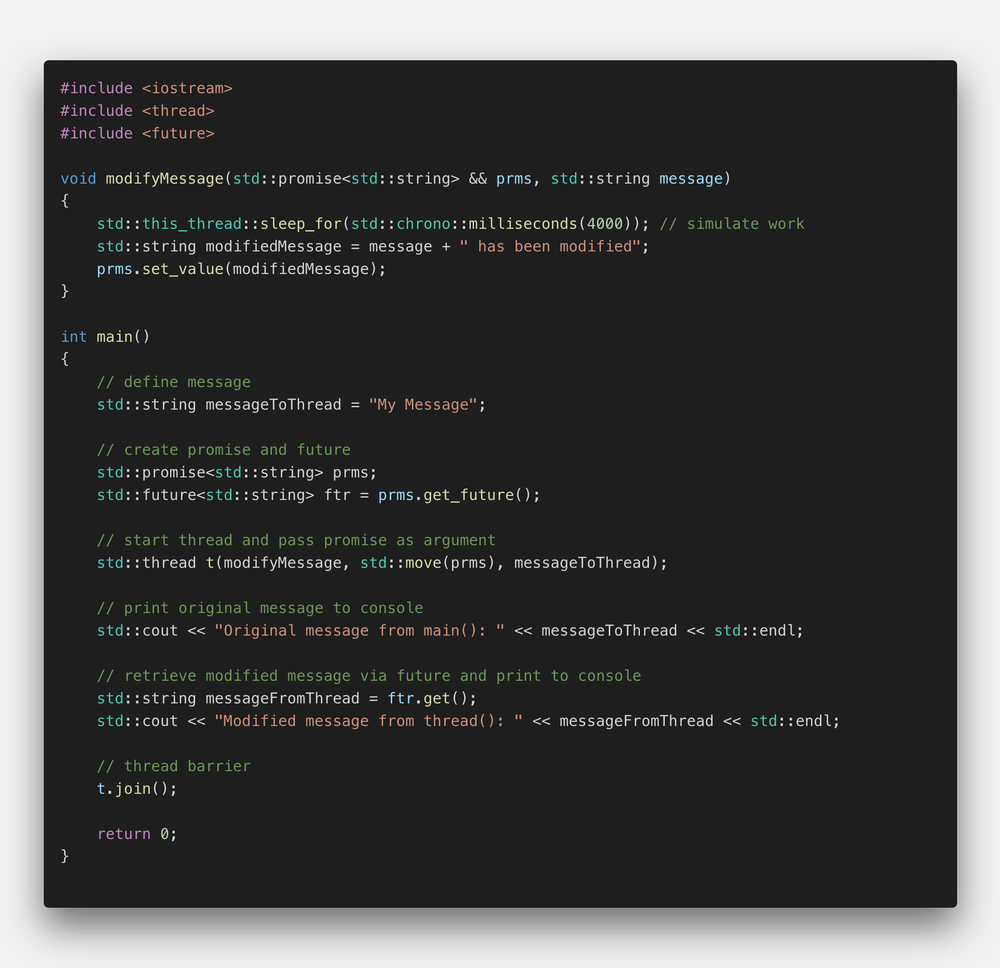
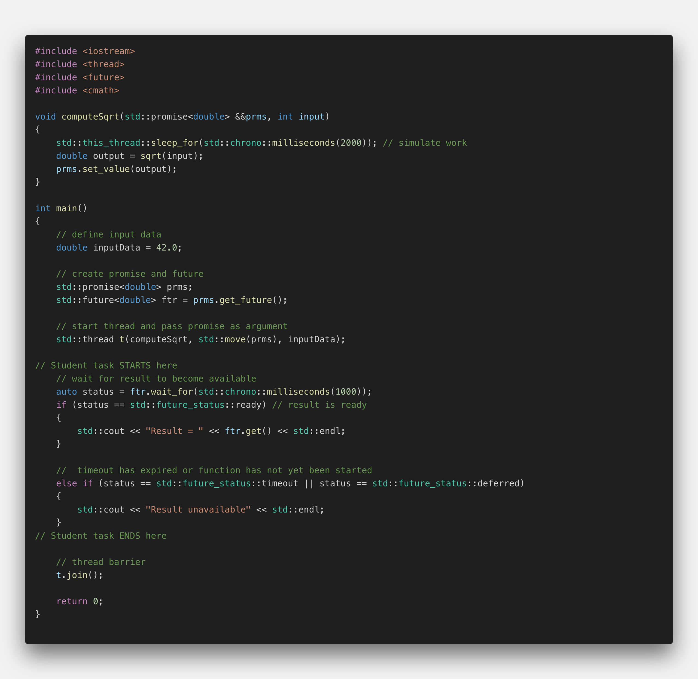
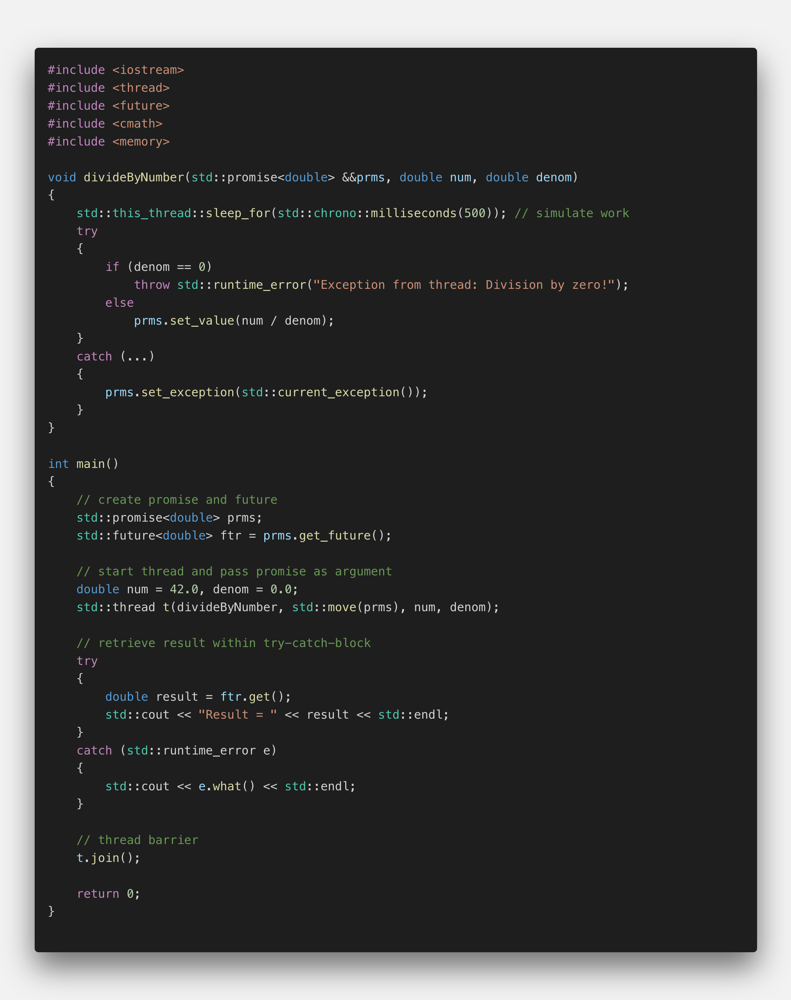

## C3.2 : Promises and Futures

## The promise - future communication channel

The methods for passing data to a thread we have discussed so far are both useful during thread construction: We can either pass arguments to the thread function using variadic templates or we can use a Lambda to capture arguments by value or by reference. The following example illustrates the use of these methods again:

</img>

A drawback of these two approaches is that the information flows from the parent thread (`main`) to the worker threads (`t1` and `t2`). In this section, we want to look at a way to pass data in the opposite direction - that is from the worker threads back to the parent thread.

In order to achieve this, the threads need to adhere to a strict synchronization protocol. There is a such a mechanism available in the C++ standard that we can use for this purpose. This mechanism acts as a single-use channel between the threads. The sending end of the channel is called "promise" while the receiving end is called "future".

In the C++ standard, the class template std::promise provides a convenient way to store a value or an exception that will acquired asynchronously at a later time via a `std::future` object. Each `std::promise` object is meant to be used only a single time.

<!--
%%ulab_page_divider
-->

In the following example, we want to declare a promise which allows for transmitting a string between two threads and modifying it in the process.

</img>

After defining a message, we have to create a suitable promise that can take a string object. To obtain the corresponding future, we need to call the method `get_future()` on the promise. Promise and future are the two types of the communication channel we want to use to pass a string between threads. The communication channel set up in this manner can only pass a string.

We can now create a thread that takes a function and we will pass it the promise as an argument as well as the message to be modified. Promises can not be copied, because the promise-future concept is a two-point communication channel for one-time use. Therefore, we must pass the promise to the thread function using `std::move`. The thread will then, during its execution, use the promise to pass back the modified message.

The thread function takes the promise as an rvalue reference in accordance with move semantics. After waiting for several seconds, the message is modified and the method `set_value()` is called on the promise.

Back in the main thread, after starting the thread, the original message is printed to the console. Then, we start listening on the other end of the communication channel by calling the function `get()` on the future. This method will block until data is available - which happens as soon as set_value has been called on the promise (from the thread). If the result is movable (which is the case for `std::string`), it will be moved - otherwise it will be copied instead. After the data has been received (with a considerable delay), the modified message is printed to the console.

</img>

It is also possible that the worker value calls set_value on the promise before `get()` is called on the future. In this case, `get()` returns immediately without any delay. After `get()` has been called once, the future is no longer usable. This makes sense as the normal mode of data exchange between promise and future works with `std::move` - and in this case, the data is no longer available in the channel after the first call to `get()`. If `get()` is called a second time, an exception is thrown.

<!--
%%ulab_page_divider
-->

## Quiz: get() vs. wait()

There are some situations where it might be interesting to separate the waiting for the content from the actual retrieving. Futures allow us to do that using the `wait()` function. This method will block until the future is ready. Once it returns, it is guaranteed that data is available and we can use `get()` to retrieve it without delay.

In addition to wait, the C++ standard also offers the method `wait_for`, which takes a time duration as an input and also waits for a result to become available. The method `wait_for()` will block either until the specified timeout duration has elapsed or the result becomes available - whichever comes first. The return value identifies the state of the result.

In the following example, please use the wait_for method to wait for the availability of a result for one second. After the time has passed (or the result is available) print the result to the console. Should the time be up without the result being available, print an error message to the console instead.

</img>

<!--
%%ulab_page_divider
-->

## Passing exceptions

The future-promise communication channel may also be used for passing exceptions. To do this, the worker thread simply sets an exception rather than a value in the promise. In the parent thread, the exception is then re-thrown once `get()` is called on the future.

Let us take a look at the following example to see how this mechanism works:

</img>

In the thread function, we need to implement a try-catch block which can be set to catch a particular exception or - as in our case - to catch all exceptions. Instead of setting a value, we now want to throw a `std::exception` along with a customized error message. In the catch-block, we catch this exception and throw it to the parent thread using the promise with set_exception. The function `std::current_exception` allows us to easily retrieve the exception which has been thrown.

On the parent side, we now need to catch this exception. In order to do this, we can use a try-block around the call to `get()`. We can set the catch-block to catch all exceptions or - as in this example - we could also catch a particular one such as the standard exception. Calling the method `what()` on the exception allows us to retrieve the message from the exception - which is the one defined on the promise side of the communication channel.

When we run the program, we can see that the exception is being thrown in the worker thread with the main thread printing the corresponding error message to the console.

So a promise future pair can be used to pass either values or exceptions between threads.
