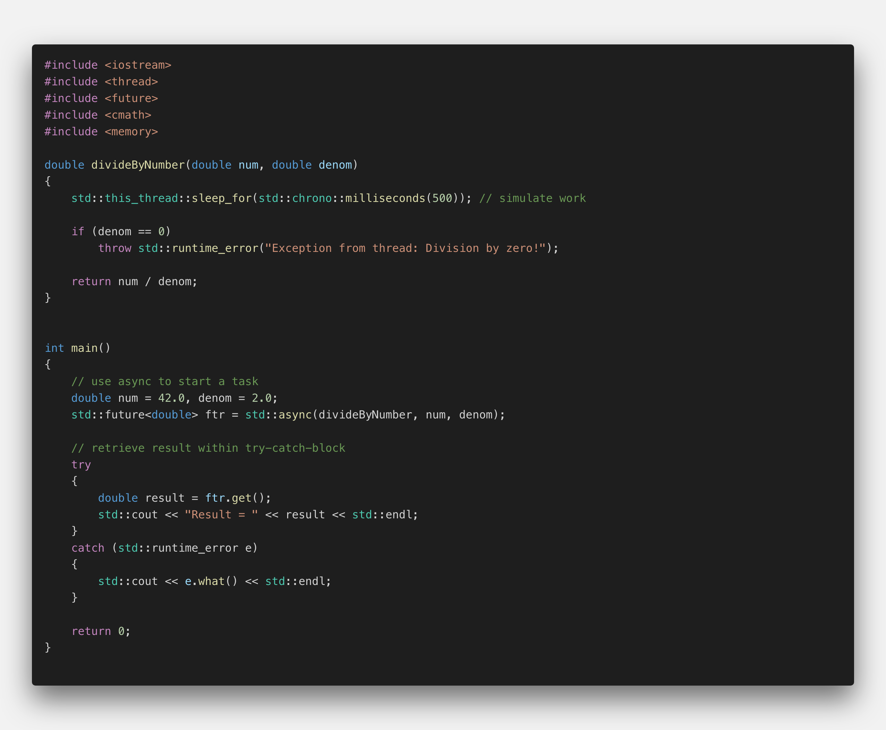
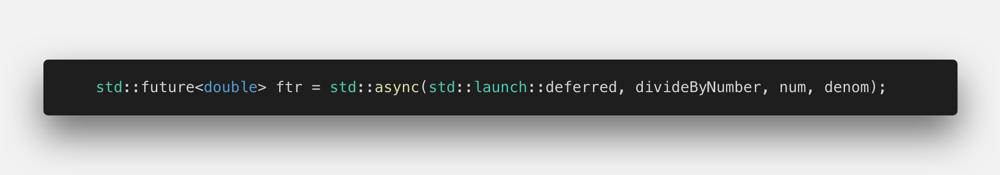
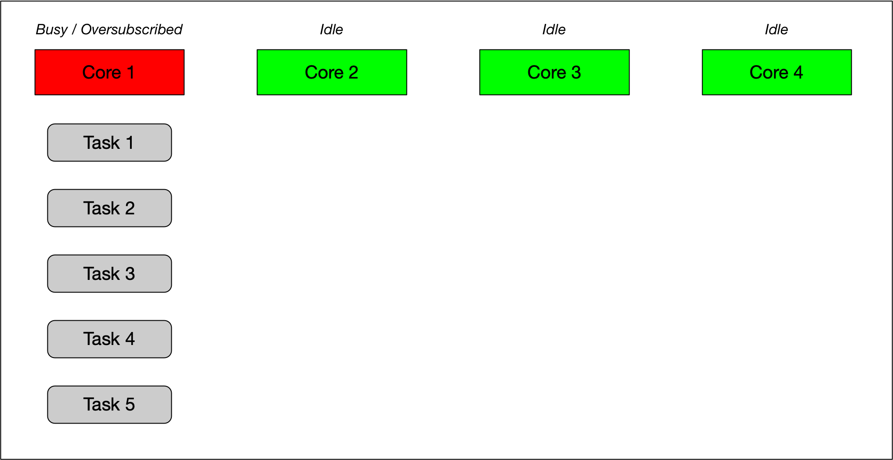
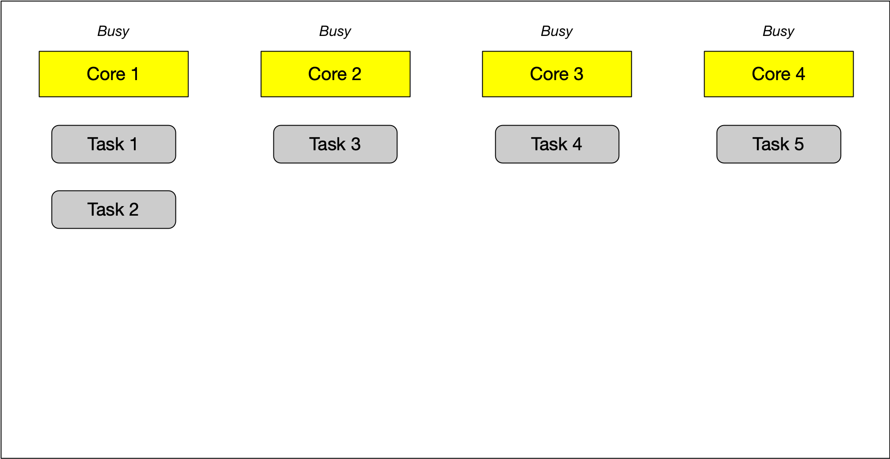
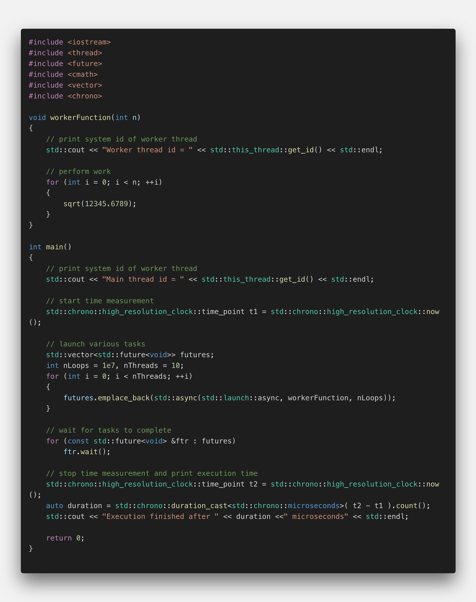
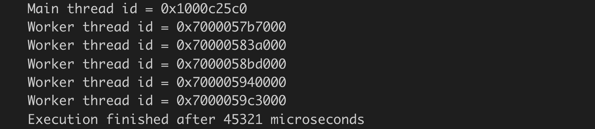
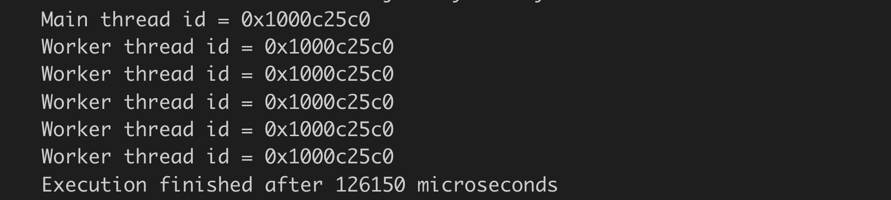
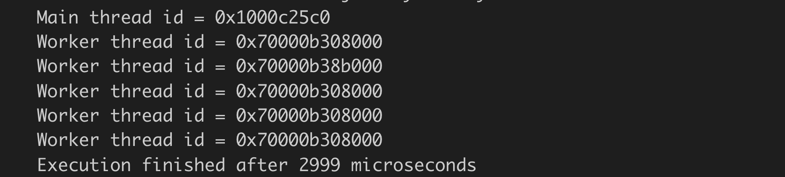
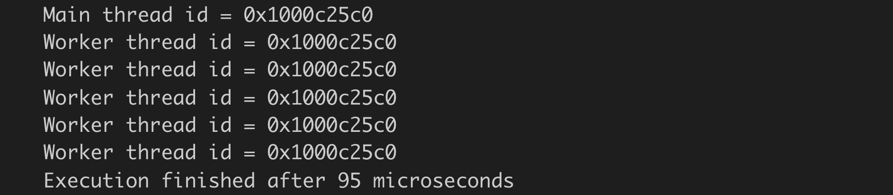
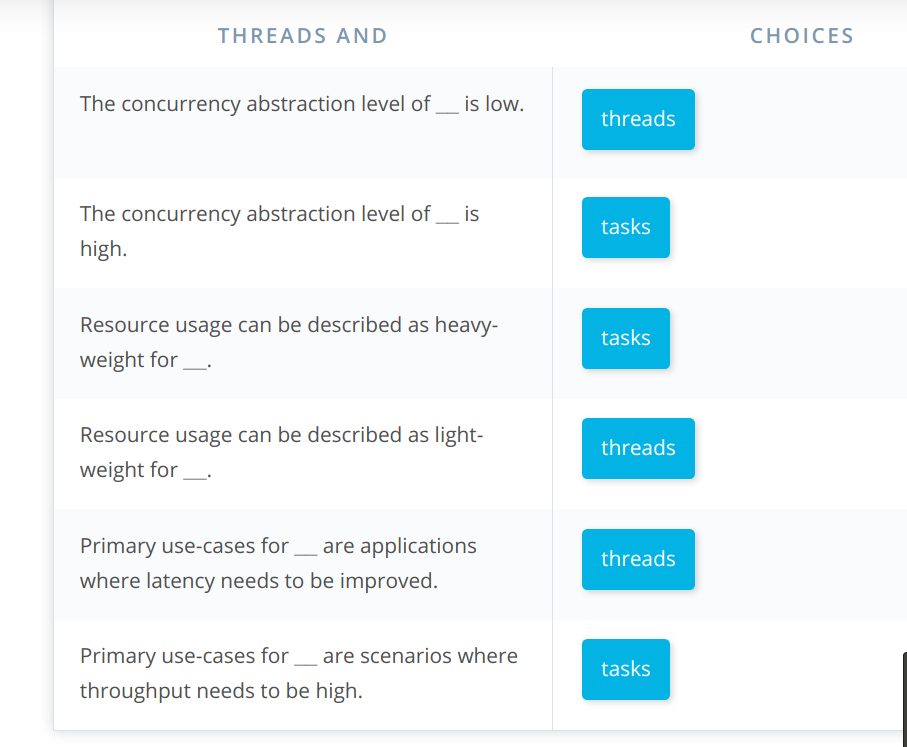

# Threads vs. Tasks

## Starting threads with async

In the last section we have seen how data can be passed from a worker thread to the parent thread using promises and futures. A disadvantage of the promise-future approach however is that it is very cumbersome (and involves a lot of boilerplate code) to pass the promise to the thread function using an rvalue reference and `std::move`. For the straight-forward task of returning data or exceptions from a worker thread to the parent thread however, there is a simpler and more convenient way using `std::async()` instead of `std::thread()`.

Let us adapt the code example from the last section to use `std::async`:

</img>

The first change we are making is in the thread function: We are removing the promise from the argument list as well as the try-catch block. Also, the return type of the function is changed from void to double as the result of the computation will be channeled back to the main thread using a simple return. After these changes, the function has no knowledge of threads, nor of futures or promises - it is a simple function that takes two doubles as arguments and returns a double as a result. Also, it will throw an exception when a division by zero is attempted.

In the main thread, we need to replace the call to `std::thread` with `std::async`. Note that async returns a future, which we will use later in the code to retrieve the value that is returned by the function. A promise, as with `std::thread`, is no longer needed, so the code becomes much shorter. In the try-catch block, nothing has changed - we are still calling `get()` on the future in the try-block and exception-handling happens unaltered in the catch-block. Also, we do not need to call `join()` any more. With `async`, the thread destructor will be called automatically - which reduces the risk of a concurrency bug.

Try executing this code in `example_1.cpp` on the right.

<!--
%%ulab_page_divider
-->

When we execute the code in the previous example, the output is identical to before, so we seemingly have the same functionality as before - or do we? When we use the `std::this_thread::get_id()` to print the system thread ids of the main and of the worker thread, we get the following command line output:

</img>

As expected, the ids between the two threads differ from each other - they are running in parallel. However, one of the major differences between `std::thread` and `std::async` is that with the latter, the system decides wether the associated function should be run asynchronously or synchronously. By adjusting the launch parameters of `std::async` manually, we can directly influence wether the associated thread function will be executed synchronously or asynchronously.

The line

</img>

enforces the synchronous execution of `divideByNumber`, which results in the following output, where the thread ids for main and worker thread are identical.

</img>

If we were to use the launch option "async" instead of "deferred", we would enforce an asynchronous execution whereas the option "any" would leave it to the system to decide - which is the default.

At this point, let us compare `std::thread` with `std::async`: Internally, `std::async` creates a promise, gets a future from it and runs a template function that takes the promise, calls our function and then either sets the value or the exception of that promise - depending on function behavior. The code used internally by `std::async` is more or less identical to the code we used in the previous example, except that this time it has been generated by the compiler and it is hidden from us - which means that the code we write appears much cleaner and leaner. Also, `std::async` makes it possible to control the amount of concurrency by passing an optional launch parameter, which enforces either synchronous or asynchronous behavior. This ability, especially when left to the system, allows us to prevent an overload of threads, which would eventually slow down the system as threads consume resources for both management and communication. If we were to use too many threads, the increased resource consumption would outweigh the advantages of parallelism and slow down the program. By leaving the decision to the system, we can ensure that the number of threads is chosen in a carefully balanced way that optimizes runtime performance by looking at the current workload of the system and the multi-core architecture of the system.

<!--
%%ulab_page_divider
-->

## Task-based concurrency

Determining the optimal number of threads to use is a hard problem. It usually depends on the number of available cores wether it makes sense to execute code as a thread or in a sequential manner. The use of `std::async` (and thus tasks) take the burden of this decision away from the user and let the system decide wether to execute the code sequentially or as a thread. With tasks, the programmer decides what CAN be run in parallel in principle and the system then decides at runtime what WILL be run in parallel.

Internally, this is achieved by using thread-pools wich represent the number of available threads based on the cores/processors as well as by using work-stealing queues, where tasks are re-distributed among the available processors dynamically. The following diagram shows the principal of task distribution on a multi-core system using work stealing queues.

</img>

As can be seen, the first core in the example is heavily oversubscribed with several tasks that are waiting to be executed. The other cores however are running idle. The idea of a work-stealing queue is to have a watchdog program running in the background that regularly monitors the amount of work performed by each processor and redistributes it as needed. For the above example this would mean that tasks waiting for execution on the first core would be shifted (or "stolen") from busy cores and added to available free cores such that idle time is reduced. After this rearranging procedire, the task distribution in our example could look as shown in the following diagram.

</img>

A work distribution in this manner can only work, when parallelism is explicitly described in the program by the programmer. If this is not the case, work-stealing will not perform effectively.

To conclude this section, a general comparison of task-based and thread-based programming is given in the following:

With tasks, the system takes care of many details (e.g. join). With threads, the programmer is responsible for many details. As far as resources go, threads are usually more heavy-weight as they are generated by the operating system (OS). It takes time for the OS to be called and to allocate memory / stack / kernel data structures for the thread. Also, destroying the thread is expensive. Tasks on the other hand are more light-weight as they will be using a pool of already created threads (the "thread pool").

Threads and tasks are used for different problems. Threads have more to do with latency. When you have functions that can block (e.g. file input, server connection), threads can avoid the program to be blocked, when e.g. the server is waiting for a response. Tasks on the other hand focus on throughput, where many operations are executed in parallel.

<!--
%%ulab_page_divider
-->

## Assessing the advantage of parallel execution

In this section, we want to explore the influence of the number of threads on the performance of a program with respect to its overall runtime. The example below has a thread function called "workerThread" which contains a loop with an adjustable number of cycles in which a mathematical operation is performed.

</img>

In `main()`, a for-loop starts a configurable number of tasks that can either be executed synchronously or asynchronously. As an experiment, we will now use a number of different parameter settings to execute the program and evaluate the time it takes to finish the computations. The idea is to gauge the effect of the number of threads on the overall runtime:

1.  int nLoops = 1e7 , nThreads = 4 , std::launch::async

  </img>  

  With this set of parameters, the high workload is computed in parallel, with an overall runtime of ~45 milliseconds.

2.  int nLoops = 1e7 , nThreads = 5 , std::launch::deferred

  </img>

  The difference to the first set of parameters is the synchronous execution of the tasks - all computations are performed sequentially - with an overall runtime of ~126 milliseconds. While impressive with regard to the achieved speed-up, the relative runtime advantage of setting 1 to this settings is at a factor of ~2.8 on a 4-core machine.

3.  int nLoops = 10 , nThreads = 5 , std::launch::async

  </img>

  In this parameter setting, the tasks are run in parallel again but with a significantly lower number of computations: The thread function now computes only 10 square roots where with settings 1 and 2 a total of 10.000.000 square roots were computed. The overall runtime of this example therefore is significantly lower with only ~3 milliseconds.

4.  int nLoops = 10 , nThreads = 5 , std::launch::deferred

  </img>

  In this last example, the same 10 square roots are computed sequentially. Surprising, the overall runtime is at only 0.01 milliseconds - an astounding difference to the asynchronous execution and a stark reminder that starting and managing threads takes a significant amount of time. It is therefore not a general advantage if computations are performed in parallel: It must be carefully weighed with regard to the computational effort whether parallelization makes sense.

# Quiz

[Additional Read](https://blog.slaks.net/2013-10-11/threads-vs-tasks/)