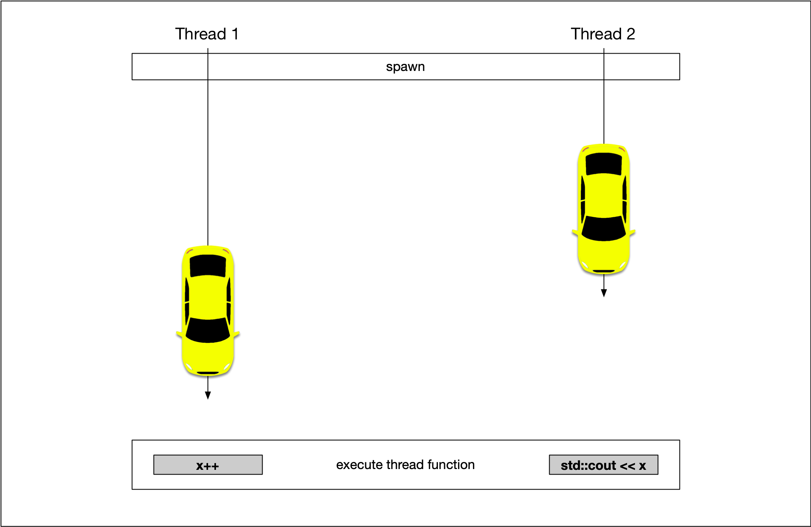
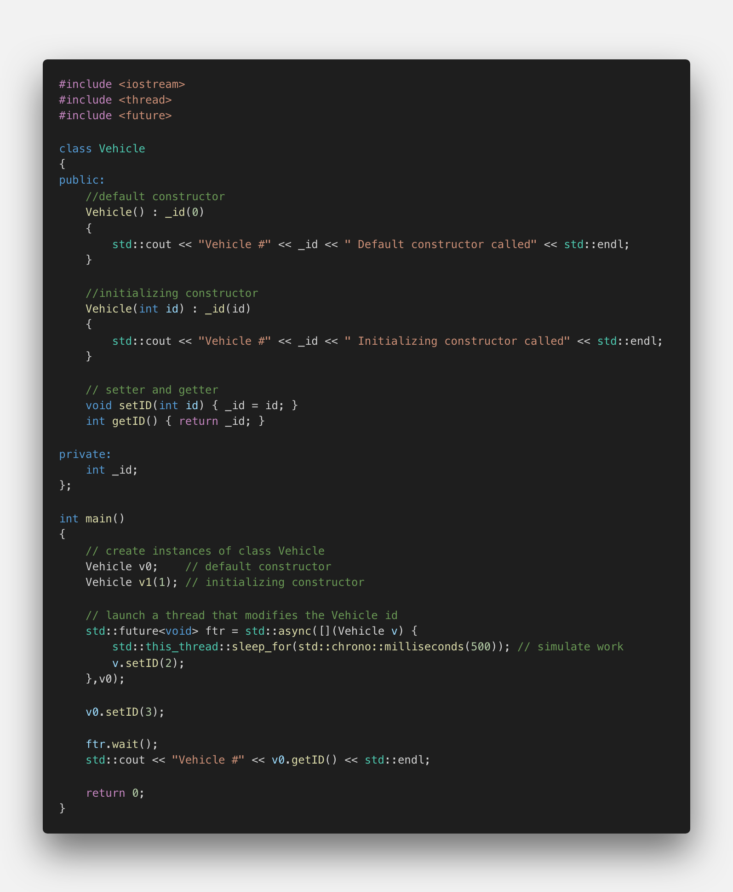
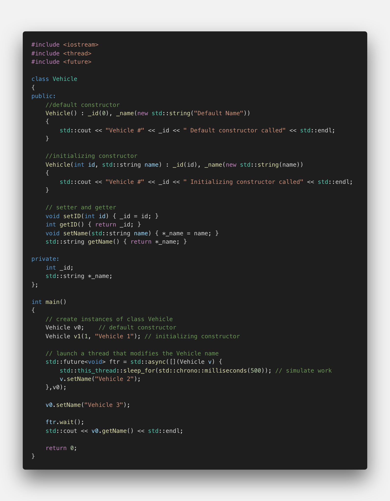
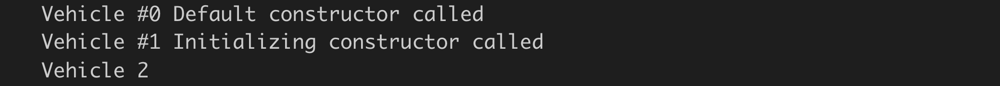
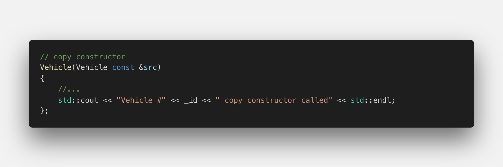
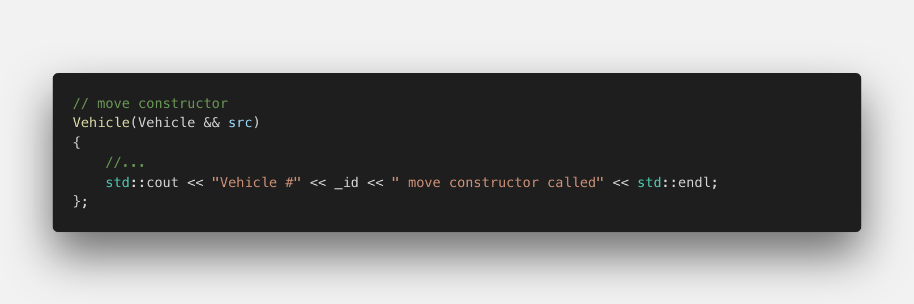
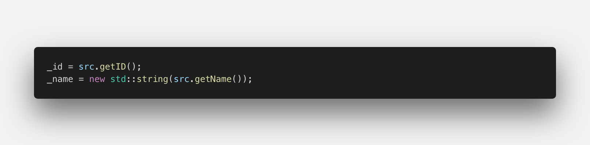
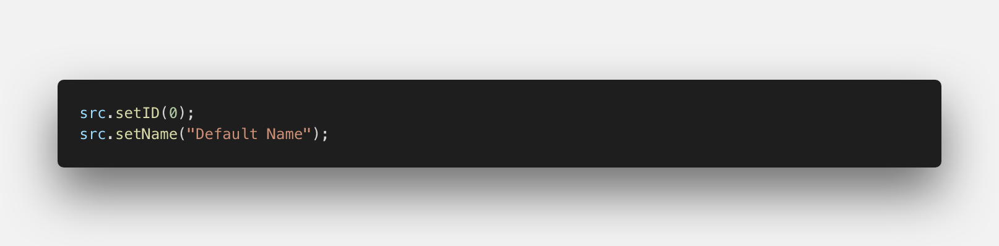
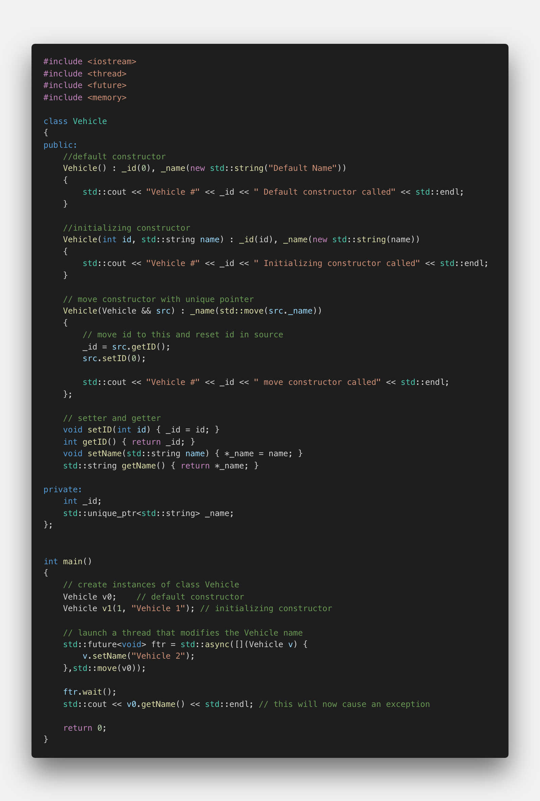

# Avoiding Data Races

## Understanding data races

One of the primary sources of error in concurrent programming are data races. They occur, when two concurrent threads are accessing the same memory location while at least one of them is modifying (the other thread might be reading or modifying). In this scenario, the value at the memory location is completely undefined. Depending on the system scheduler, the second thread will be executed at an unknown point in time and thus see different data at the memory location with each execution. Depending on the type of program, the result might be anything from a crash to a security breach when data is read by a thread that was not meant to be read, such as a user password or other sensitive information. Such an error is called a „data race“ because two threads are racing to get access to a memory location first, with the content at the memory location depending on the result of the race.

The following diagram illustrates the principle: One thread wants to increment a variable `x`, whereas the other thread wants to print the same variable. Depending on the timing of the program and thus the order of execution, the printed result might change each time the program is executed.

</img>

In this example, one safe way of passing data to a thread would be to carefully synchronize the two threads using either `join()` or the promise-future concept that can guarantee the availability of a result. Data races are always to be avoided. Even if nothing bad seems to happen, they are a bug and should always be treated as such. Another possible solution for the above example would be to make a copy of the original argument and pass the copy to the thread, thereby preventing the data race.

<!--
%%ulab_page_divider
-->

## Passing data to a thread by value

In the following example, an instance of the proprietary class `Vehicle` is created and passed to a thread by value, thus making a copy of it.

</img>

Note that the class Vehicle has a default constructor and an initializing constructor. In the main function, when the instances `v0` and `v1` are created, each constructor is called respectively. Note that `v0` is passed by value to a Lambda, which serves as the thread function for `std::async`. Within the Lambda, the id of the Vehicle object is changed from the default (which is 0) to a new value 2. Note that the thread execution is paused for 500 milliseconds to guarantee that the change is performed well after the main thread has proceeded with its execution.

In the `main` thread, immediately after starting up the worker thread, the id of `v0` is changed to 3. Then, after waiting for the completion of the thread, the vehicle id is printed to the console. In this program, the output will always be the following:

</img>

Passing data to a thread in this way is a clean and safe method as there is no danger of a data race - at least when atomic data types such as integers, doubles, chars or booleans are passed.

<!--
%%ulab_page_divider
-->

When passing a complex data structure however, there are sometimes pointer variables hidden within, that point to a (potentially) shared data buffer - which might cause a data race even though the programmer believes that the copied data will effectively preempt this. The next example illustrates this case by adding a new member variable to the `Vehicle` class, which is a pointer to a string object, as well as the corresponding getter and setter functions.

</img>

The output of the program looks like this:

</img>

The basic program structure is mostly identical to the previous example with the object `v0` being copied by value when passed to the thread function. This time however, even though a copy has been made, the original object `v0` is modified, when the thread function sets the new name. This happens because the member `_name` is a pointer to a string and after copying, even though the pointer variable has been duplicated, it still points to the same location as its value (i.e. the memory location) has not changed. Note that when the delay is removed in the thread function, the console output varies between "Vehicle 2" and "Vehicle 3", depending on the system scheduler. Such an error might go unnoticed for a long time. It could show itself well after a program has been shipped to the client - which is what makes this error type so treacherous.

Classes from the standard template library usually implement a deep copy behavior by default (such as `std::vector`). When dealing with proprietary data types, this is not guaranteed. The only safe way to tell whether a data structure can be safely passed is by looking at its implementation: Does it contain only atomic data types or are there pointers somewhere? If this is the case, does the data structure implement the copy constructor (and the assignment operator) correctly? Also, if the data structure under scrutiny contains sub-objects, their respective implementation has to be analyzed as well to ensure that deep copies are made everywhere.

Unfortunately, one of the primary concepts of object-oriented programming - information hiding - often prevents us from looking at the implementation details of a class - we can only see the interface, which does not tell us what we need to know to make sure that an object of the class may be safely passed by value.

<!--
%%ulab_page_divider
-->

## Overwriting the copy constructor

The problem with passing a proprietary class is that the standard copy constructor makes a 1:1 copy of all data members, including pointers to objects. This behavior is also referred to as "shallow copy". In the above example we would have liked (and maybe expected) a "deep copy" of the object though, i.e. a copy of the data to which the pointer refers. A solution to this problem is to create a proprietary copy constructor in the class `Vehicle`. The following piece of code overwrites the default copy constructor and can be modified to make a customized copy of the data members.

</img>

Expanding on the code example from above, please implement the code required for a deep copy so that the program always prints "Vehicle 3" to the console, regardless of the delay within the thread function.

<!--
%%ulab_page_divider
-->

## Passing data using move semantics

Even though a customized copy constructor can help us to avoid data races, it is also time (and memory) consuming. In the following, we will use move semantics to implement a more effective way of safely passing data to a thread.

A move constructor enables the resources owned by an rvalue object to be moved into an lvalue without physically copying it. Rvalue references support the implementation of move semantics, which enables the programmer to write code that transfers resources (such as dynamically allocated memory) from one object to another.

To make use of move semantics, we need to provide a move constructor (and optionally a move assignment operator). Copy and assignment operations whose sources are rvalues automatically take advantage of move semantics. Unlike the default copy constructor however, the compiler does not provide a default move constructor.

To define a move constructor for a C++ class, the following steps are required:

1.  Define an empty constructor method that takes an rvalue reference to the class type as its parameter

  </img>

2.  In the move constructor, assign the class data members from the source object to the object that is being constructed

  </img>

3.  Assign the data members of the source object to default values.

  </img>

When launching the thread, the Vehicle object `v0` can be passed using `std::move()` - which calls the move constructor and invalidates the original object `v0` in the main thread.

<!--
%%ulab_page_divider
-->

## Move semantics and uniqueness

As with the above-mentioned copy constructor, passing by value is usually safe - provided that a deep copy is made of all the data structures within the object that is to be passed. With move semantics , we can additionally use the notion of uniqueness to prevent data races by default. In the following example, a `unique_pointer` instead of a raw pointer is used for the string member in the Vehicle class.

</img>

As can be seen, the `std::string` has now been changed to a unique pointer, which means that only a single reference to the memory location it points to is allowed. Accordingly, the move constructor transfers the unique pointer to the worker by using `std::move` and thus invalidates the pointer in the `main` thread. When calling `v0.getName()`, an exception is thrown, making it clear to the programmer that accessing the data at this point is not permissible - which is the whole point of using a unique pointer here as a data race will now be effectively prevented.

The point of this example has been to illustrate that move semantics on its own is not enough to avoid data races. The key to thread safety is to use move semantics in conjunction with uniqueness. It is the responsibility of the programmer to ensure that pointers to objects that are moved between threads are unique.
