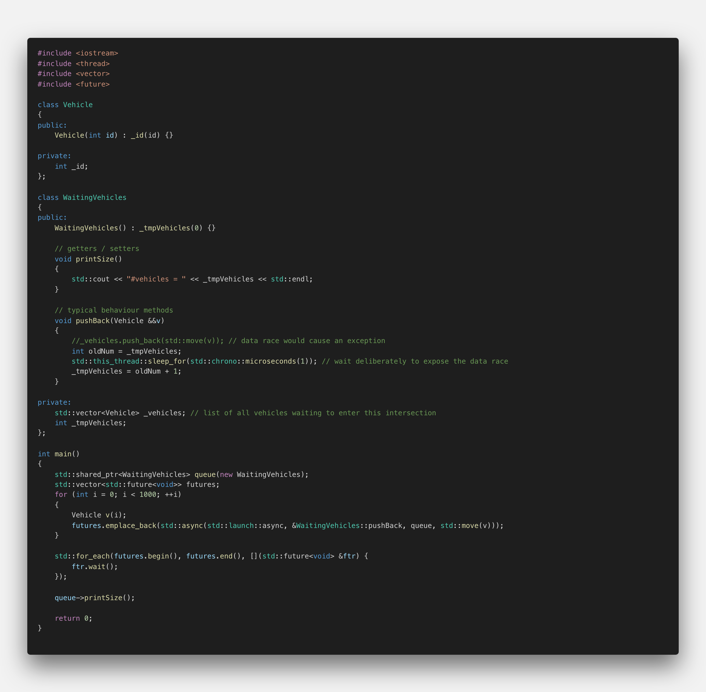
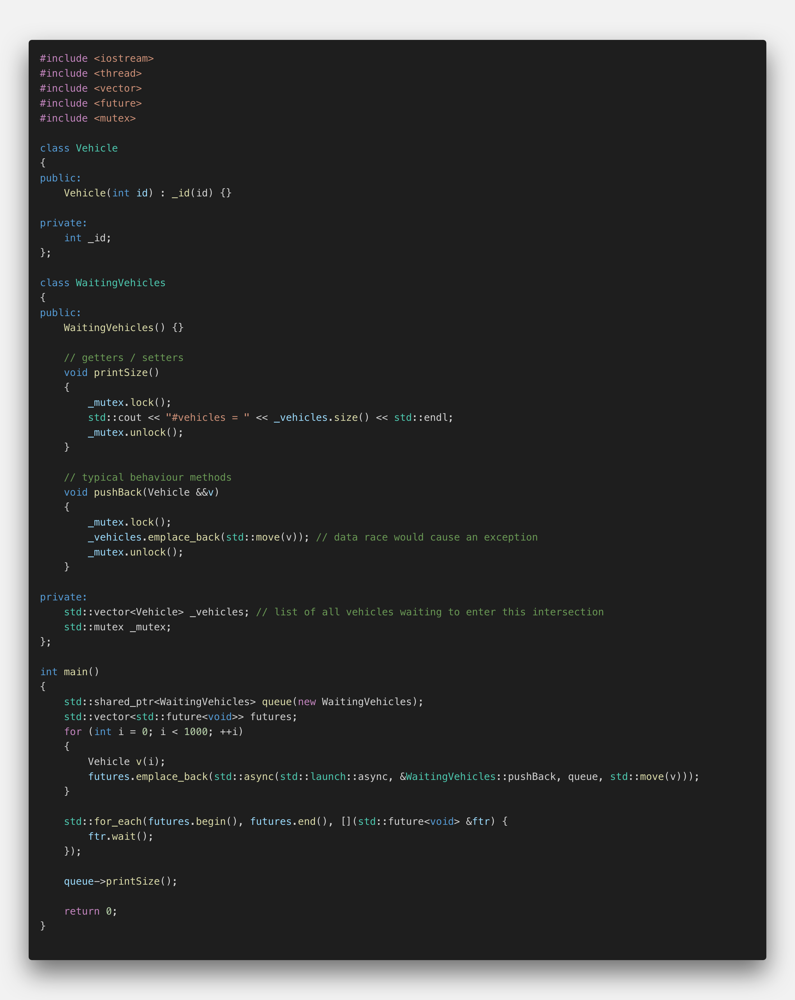
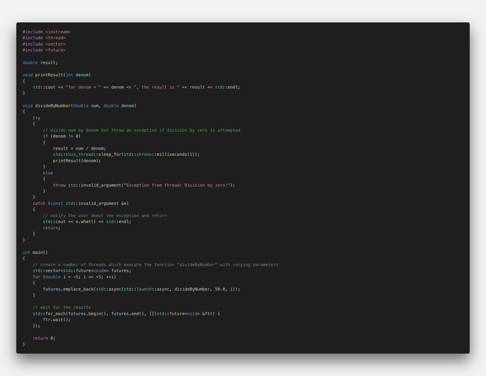
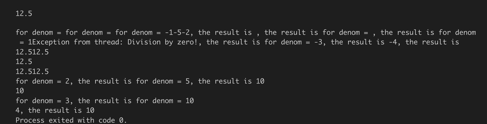
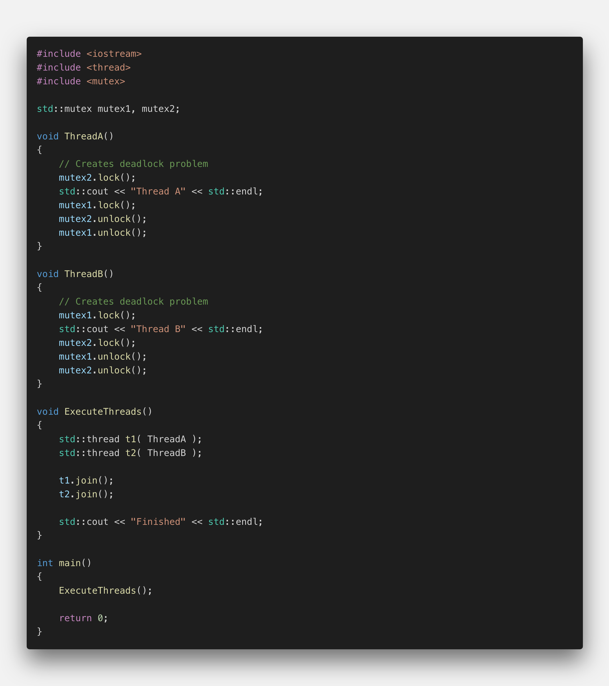
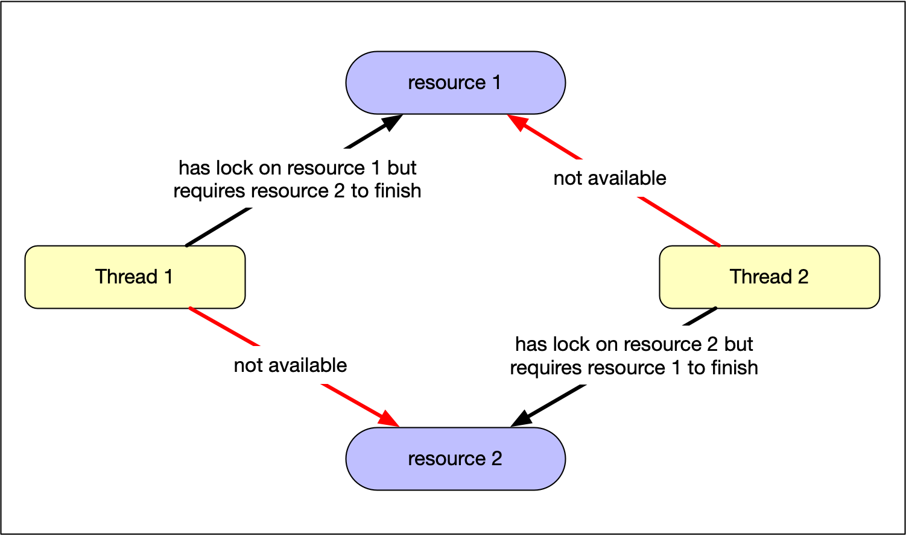
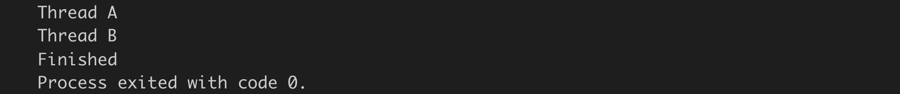

# Using a Mutex To Protect Shared Data

## The mutex entity

Until now, the methods we have used to pass data between threads were short-term and involved passing an argument (the promise) from a parent thread to a worker thread and then passing a result back to the parent thread (via the future) once it has become available. The promise-future construct is a non-permanent communication channel for one-time usage.

We have seen that in order to avoid data races, we need to either forego accessing shared data or use it in read-only access without mutating the data. In this chapter, we want to look at a way to establish a stable long-term communication channel that allows for both sharing and mutation. Ideally, we would like to have a communication protocol that corresponds to voice communication over a radio channel, where the transmitter uses the expression "over" to indicate the end of the transmission to the receiver. By using such a protocol, sender and receiver can take turns in transmitting their data. In C++, this concept of taking turns can be constructed by an entity called a "mutex" - which stands for MUtual EXclusion.

Recall that a data race requires simultaneous access from two threads. If we can guarantee that only a single thread at a time can access a particular memory location, data races would not occur. In order for this to work, we would need to establish a communication protocol. It is important to note that a mutex is not the solution to the data race problem per se but merely an enabler for a thread-safe communication protocol that has to be implemented and adhered to by the programmer.

</img>

Let us take a look at how this protocol works: Assuming we have a piece of memory (e.g. a shared variable) that we want to protect from simultaneous access, we can assign a mutex to be the guardian of this particular memory. It is important to understand that a mutex is bound to the memory it protects. A thread 1 who wants to access the protected memory must "lock" the mutex first. After thread 1 is "under the lock", a thread 2 is blocked from access to the shared variable, it can not acquire the lock on the mutex and is temporarily suspended by the system.

Once the reading or writing operation of thread 1 is complete, it must "unlock" the mutex so that thread 2 can access the memory location. Often, the code which is executed "under the lock" is referred to as a "critical section". It is important to note that also read-only access to the shared memory has to lock the mutex to prevent a data race - which would happen when another thread, who might be under the lock at that time, were to modify the data.

When several threads were to try to acquire and lock the mutex, only one of them would be successful. All other threads would automatically be put on hold - just as cars waiting at an intersection for a green light (see the final project of this course). Once the thread who has succeeded in acquiring the lock had finished its job and unlocked the mutex, a queued thread waiting for access would be woken up and allowed to lock the mutex to proceed with his read / write operation. If all threads were to follow this protocol, a data race would effectively be avoided. Before we take a closer look at such a protocol, let us analyze a code example next.

<!--
%%ulab_page_divider
--><hr/>

</img>

This code builds on some of the classes we have seen in the previous lesson project - the concurrent traffic simulation. There is a class Vehicle that has a single data member (`int _id`). Also, there is a class WaitingVehicles, which is supposed to store a number of vehicles in an internal vector. Note that contrary to the lesson project, a vehicle is moved into the vector using an rvalue reference. Also note that the push_back function is commented out here. The reason for this is that we are trying to provoke a data race - leaving push_back active would cause the program to crash (we will comment it in later). This is also the reason why there is an auxiliary member `_tmpVehicles`, which will be used to count the number of Vehicles added via calls to `pushBack()`. This temporary variable will help us expose the data race without crashing the program.

In `main()`, a for-loop is used to launch a large number of tasks who all try to add a newly created Vehicle to the queue. Running the program synchronously with launch option `std::launch::deferred` generates the following output on the console:

</img>

Just as one would have expected, each task inserted an element into the queue with the total number of vehicles amounting to 1000.

Now let us enforce a concurrent behavior and change the launch option to `std::launch::async`. This generates the following output (with different results each time):

</img>

It seems that not all the vehicles could be added to the queue. But why is that? Note that in the thread function "pushBack" there is a call to `sleep_for`, which pauses the thread execution for a short time. This is the position where the data race occurs: First, the current value of `_tmpVehicles` is stored in a temporary variable `oldNum`. While the thread is paused, there might (and will) be changes to `_tmpVehicles` performed by other threads. When the execution resumes, the former value of `_tmpVehicles` is written back, thus invalidating the contribution of all the threads who had write access in the mean time. Interestingly, when `sleep_for` is commented out, the output of the program is the same as with `std::launch::deferred` - at least that will be the case for most of the time when we run the program. But once in a while, there might be a scheduling constellation which causes the bug to expose itself. Apart from understanding the data race, you should take as an advice that introducing deliberate time delays in the testing / debugging phase of development can help expose many concurrency bugs.

<!--
%%ulab_page_divider
--><hr/>

## Using mutex to protect data

In its simplest form, using a mutex consists of four straight-forward steps:

1.  Include the `<mutex>` header
2.  Create an `std::mutex`
3.  Lock the mutex using `lock()` before read/write is called
4.  Unlock the mutex after the read/write operation is finished using `unlock()`

In order to protect the access to `_vehicles` from being manipulated by several threads at once, a mutex has been added to the class as a private data member. In the `pushBack` function, the mutex is locked before a new element is added to the vector and unlocked after the operation is complete.

Note that the mutex is also locked in the function printSize just before printing the size of the vector. The reason for this lock is two-fold: First, we want to prevent a data race that would occur when a read-access to the vector and a simultaneous write access (even when under the lock) would occur. And second, we want to exclusively reserve the standard output to the console for printing the vector size without other threads printing to it at the same time.

When this code is executed, 1000 elements will be in the vector. By using a mutex to our shared resource, a data race has been effectively avoided.

</img>

<!--
%%ulab_page_divider
--><hr/>

## Using timed_mutex

In the following, a short overview of the different available mutex types is given:

*   `mutex`: provides the core functions lock() and unlock() and the non-blocking try_lock() method that returns if the mutex is not available.
*   `recursive_mutex`: allows multiple acquisitions of the mutex from the same thread.
*   `timed_mutex`: similar to mutex, but it comes with two more methods try_lock_for() and try_lock_until() that try to acquire the mutex for a period of time or until a moment in time is reached.
*   `recursive_timed_mutex`: is a combination of timed_mutex and recursive_mutex.

## Exercise

Please adapt the code from the previous example (example_2.cpp) in a way that a `timed_mutex` is used. Also, in the function pushBack, please use the method `try_lock_for` instead of lock, which should be executed until a maximum number of attempts is reached (e.g. 3 times) or until it succeeds. When an attempt fails, you should print an error message to the console that also contains the respective vehicle id and then put the thread to sleep for an amount of time before the next attempt is trief. Also, to expose the timing issues in this example, please introduce a call to sleep_for with a delay of several milliseconds before releasing the lock on the mutex. When done, experiment with the timing parameters to see how many vehicles will be added to the vector in the end.

```cpp
#include <iostream>
#include <thread>
#include <vector>
#include <future>
#include <mutex>

class Vehicle
{
public:
    Vehicle(int id) : _id(id) {}
    int getID() { return _id; }

private:
    int _id;
};

class WaitingVehicles
{
public:
    WaitingVehicles() {}

    // getters / setters
    void printSize()
    {
        _mutex.lock();
        std::cout << "#vehicles = " << _vehicles.size() << std::endl;
        _mutex.unlock();
    }

    // typical behaviour methods
    void pushBack(Vehicle &&v)
    {
        for (size_t i = 0; i < 3; ++i)
        {
            if (_mutex.try_lock_for(std::chrono::milliseconds(100)))
            {
                _vehicles.emplace_back(std::move(v));
                //std::this_thread::sleep_for(std::chrono::milliseconds(10));
                _mutex.unlock();
                break;
            }
            else
            {
                std::cout << "Error! Vehicle #" << v.getID() << " could not be added to the vector" << std::endl;
                std::this_thread::sleep_for(std::chrono::milliseconds(100));
            }
        }
    }

private:
    std::vector<Vehicle> _vehicles; // list of all vehicles waiting to enter this intersection
    std::timed_mutex _mutex;
};

int main()
{
    std::shared_ptr<WaitingVehicles> queue(new WaitingVehicles);
    std::vector<std::future<void>> futures;
    for (int i = 0; i < 1000; ++i)
    {
        Vehicle v(i);
        futures.emplace_back(std::async(std::launch::async, &WaitingVehicles::pushBack, queue, std::move(v)));
    }

    std::for_each(futures.begin(), futures.end(), [](std::future<void> &ftr) {
        ftr.wait();
    });

    queue->printSize();

    return 0;
}
```

<!--
%%ulab_page_divider
--><hr/>

## Deadlock 1

Using mutexes can significantly reduce the risk of data races as seen in the example above. But imagine what would happen if an exception was thrown while executing code in the critical section, i.e. between lock and unlock. In such a case, the mutex would remain locked indefinitely and no other thread could unlock it - the program would most likely freeze.

Let us take a look at the following code example, which performs a division of numbers:

</img>

In this example, a number of tasks is started up in `main()` with the method `divideByNumber` as the thread function. Each task is given a different denominator and within divideByNumber a check is performed to avoid a division by zero. If denom should be zero, an exception is thrown. In the catch-block, the exception is caught, printed to the console and then the function returns immediately. The output of the program changes with each execution and might look like this:

</img>

As can easily be seen, the console output is totally mixed up and some results appear multiple times. There are several issues with this program, so let us look at them in turn:

1.  First, the thread function writes its result to a global variable which is passed to it by reference. This will cause a data race as illustrated in the last section. The `sleep_for` function exposes the data race clearly.
2.  Second, the result is printed to the console by several threads at the same time, causing the chaotic output.

## Exercise

As we have seen already, using a mutex can protect shared resources. So please modify the code in a way that both the console as well as the shared global variable `result` are properly protected.

The problem you have just seen is one type of deadlock, which causes a program to freeze because one thread does not release the lock on the mutex while all other threads are waiting for access indefinitely. Let us now look at another type.

For a discussion of this solution, see the solution video after the workspace.

```cpp
#include <iostream>
#include <thread>
#include <vector>
#include <future>
#include <mutex>

std::mutex mtx;
double result;

void printResult(int denom)
{
    std::cout << "for denom = " << denom << ", the result is " << result << std::endl;
}

void divideByNumber(double num, double denom)
{
    mtx.lock();
    try
    {
        // divide num by denom but throw an exception if division by zero is attempted
        if (denom != 0) 
        {
            result = num / denom;
            std::this_thread::sleep_for(std::chrono::milliseconds(1)); 
            printResult(denom);
        }
        else
        {
            throw std::invalid_argument("Exception from thread: Division by zero!");
        }
    }
    catch (const std::invalid_argument &e)
    {
        // notify the user about the exception and return
        std::cout << e.what() << std::endl;
        return; 
    }
    mtx.unlock();
}

int main()
{
    // create a number of threads which execute the function "divideByNumber" with varying parameters
    std::vector<std::future<void>> futures;
    for (double i = -5; i <= +5; ++i)
    {
        futures.emplace_back(std::async(std::launch::async, divideByNumber, 50.0, i));
    }

    // wait for the results
    std::for_each(futures.begin(), futures.end(), [](std::future<void> &ftr) {
        ftr.wait();
    });

    return 0;
}
```

<!--
%%ulab_page_divider
--><hr/>

## Deadlock 2

A second type of deadlock is a state in which two or more threads are blocked because each thread waits for the resource of the other thread to be released before releasing its resource. The result of the deadlock is a complete standstill. The thread and therefore usually the whole program is blocked forever. The following code illustrates the problem:

</img>

When the program is executed, it produces the following output:

</img>

Notice that it does not print the "Finished" statement nor does it return - the program is in a deadlock, which it can never leave.

Let us take a closer look at this problem:

`ThreadA` and `ThreadB` both require access to the console. Unfortunately, they request this resource which is protected by two mutexes in different order. If the two threads work interlocked so that first `ThreadA` locks mutex 1, then `ThreadB` locks mutex 2, the program is in a deadlock: Each thread tries to lock the other mutex and needs to wait for its release, which never comes. The following figure illustrates the problem graphically.

</img>

## Exercise

One way to avoid such a deadlock would be to number all resources and require that processes request resources only in strictly increasing (or decreasing) order. Please try to manually rearrange the locks and unlocks in a way that the deadlock does not occur and the following text is printed to the console:

</img>

```cpp
#include <iostream>
#include <thread>
#include <mutex>
 
std::mutex mutex1, mutex2;
 
void ThreadA()
{
    // Solves deadlock problem
    mutex1.lock();
    std::cout << "Thread A" << std::endl;
    mutex2.lock();
    mutex2.unlock();
    mutex1.unlock();
}
 
void ThreadB()
{
    // Solves deadlock problem
    mutex1.lock();
    std::cout << "Thread B" << std::endl;
    mutex2.lock();
    mutex1.unlock();
    mutex2.unlock();
}
 
void ExecuteThreads()
{
    std::thread t1( ThreadA );
    std::thread t2( ThreadB );
 
    t1.join();
    t2.join();
 
    std::cout << "Finished" << std::endl;
}
 
int main()
{
    ExecuteThreads();
 
    return 0;
}
```

As you have seen, avoiding such a deadlock is possible but requires time and a great deal of experience. In the next section, we will look at ways to avoid deadlocks - both of this type as well as the previous type, where a call to unlock the mutex had not been issued.
