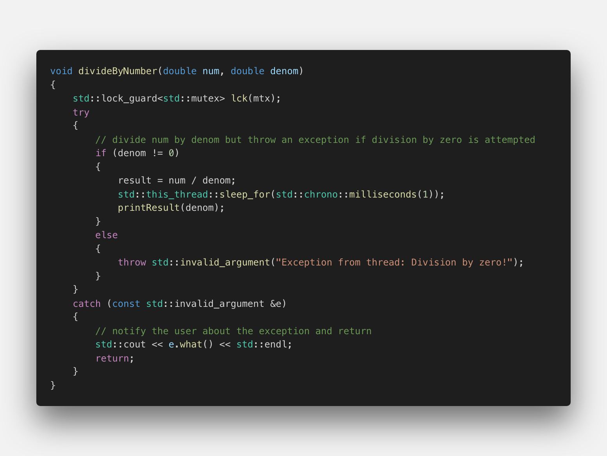
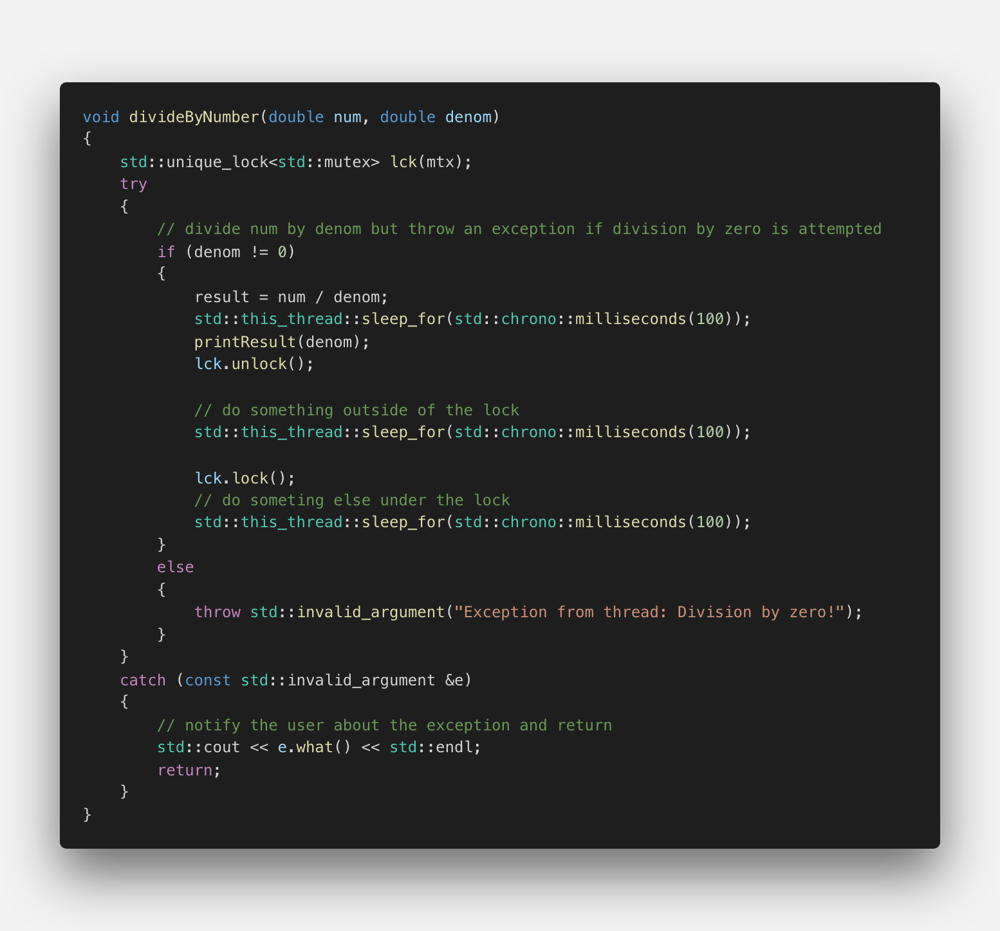
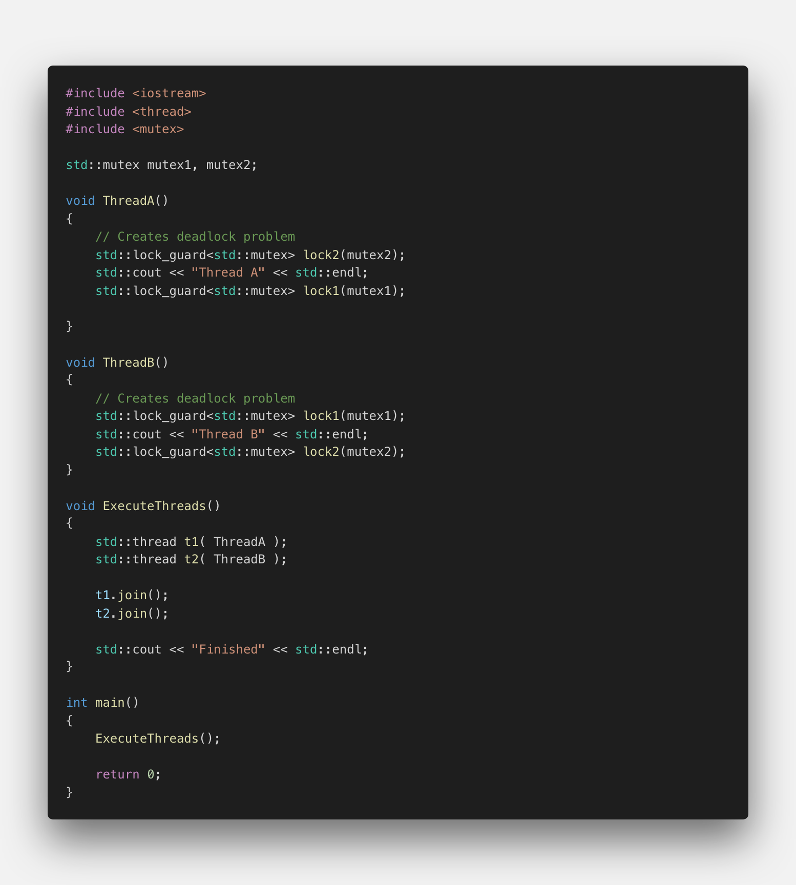
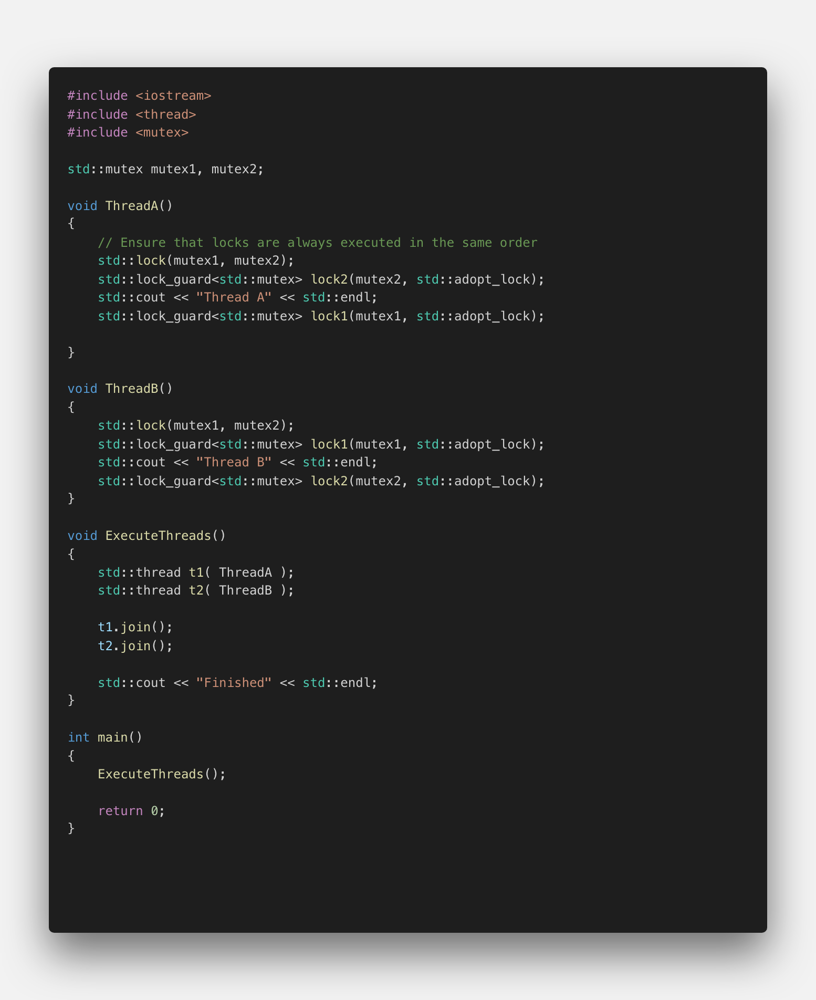

# Using Locks to Avoid Deadlocks

## Lock Guard

In the previous example, we have directly called the `lock()` and `unlock()` functions of a mutex. The idea of "working under the lock" is to block unwanted access by other threads to the same resource. Only the thread which acquired the lock can unlock the mutex and give all remaining threads the chance to acquire the lock. In practice however, direct calls to `lock()` should be avoided at all cost! Imagine that while working under the lock, a thread would throw an exception and exit the critical section without calling the unlock function on the mutex. In such a situation, the program would most likely freeze as no other thread could acquire the mutex any more. This is exactly what we have seen in the function `divideByNumber` from the previous example.

We can avoid this problem by creating a `std::lock_guard` object, which keeps an associated mutex locked during the entire object life time. The lock is acquired on construction and released automatically on destruction. This makes it impossible to forget unlocking a critical section. Also, `std::lock_guard` guarantees exception safety because any critical section is automatically unlocked when an exception is thrown. In our previous example, we can simply replace `_mutex.lock()` and `_mutex.unlock()` with the following code:

</img>

Note that there is no direct call to lock or unlock the mutex anymore. We now have a std::lock_guard object that takes the mutex as an argument and locks it at creation. When the method divideByNumber exits, the mutex is automatically unlocked by the std::lock_guard object as soon as it is destroyed - which happens, when the local variable gets out of scope.

## Exercise
We can improve even further on this code by limiting the scope of the mutex to the section which accesses the critical resource. Please change the code in a way that the mutex is only locked for the time when result is modified and the result is printed.

```cpp
#include <iostream>
#include <thread>
#include <vector>
#include <future>
#include <mutex>

std::mutex mtx;
double result;

void printResult(int denom)
{
    std::cout << "for denom = " << denom << ", the result is " << result << std::endl;
}

void divideByNumber(double num, double denom)
{
    try
    {
        // divide num by denom but throw an exception if division by zero is attempted
        if (denom != 0) 
        {
            std::lock_guard<std::mutex> lck(mtx);
            
            result = num / denom;
            std::this_thread::sleep_for(std::chrono::milliseconds(1)); 
            printResult(denom);
        }
        else
        {
            throw std::invalid_argument("Exception from thread: Division by zero!");
        }
    }
    catch (const std::invalid_argument &e)
    {
        // notify the user about the exception and return
        std::cout << e.what() << std::endl;
        return; 
    }
}

int main()
{
    // create a number of threads which execute the function "divideByNumber" with varying parameters
    std::vector<std::future<void>> futures;
    for (double i = -5; i <= +5; ++i)
    {
        futures.emplace_back(std::async(std::launch::async, divideByNumber, 50.0, i));
    }

    // wait for the results
    std::for_each(futures.begin(), futures.end(), [](std::future<void> &ftr) {
        ftr.wait();
    });

    return 0;
}
```

<!--
%%ulab_page_divider
--><hr/>

## Unique Lock

The problem with the previous example is that we can only lock the mutex once and the only way to control lock and unlock is by invalidating the scope of the std::lock_guard object. But what if we wanted (or needed) a finer control of the locking mechanism?

A more flexible alternative to std::lock_guard is _unique_lock_, that also provides support for more advanced mechanisms, such as deferred locking, time locking, recursive locking, transfer of lock ownership and use of condition variables (which we will discuss later). It behaves similar to lock_guard but provides much more flexibility, especially with regard to the timing behavior of the locking mechanism.

Let us take a look at an adapted version of the code from the previous section above:

</img>

In this version of the code, `std::lock_guard` has been replaced with `std::unique_lock`. As before, the lock object `lck` will unlock the mutex in its destructor, i.e. when the function `divideByNumber` returns and `lck` gets out of scope. In addition to this automatic unlocking, `std::unique_lock` offers the additional flexibility to engage and disengage the lock as needed by manually calling the methods `lock()` and `unlock()`. This ability can greatly improve the performance of a concurrent program, especially when many threads are waiting for access to a locked resource. In the example, the lock is released before some non-critical work is performed (simulated by `sleep_for`) and re-engaged before some other work is performed in the critical section and thus under the lock again at the end of the function. This is particularly useful for optimizing performance and responsiveness when a significant amount of time passes between two accesses to a critical resource.

The main advantages of using `std::unique_lock<>` over `std::lock_guard` are briefly summarized in the following. Using `std::unique_lock` allows you to…

1.  …construct an instance without an associated mutex using the default constructor
2.  …construct an instance with an associated mutex while leaving the mutex unlocked at first using the deferred-locking constructor
3.  …construct an instance that tries to lock a mutex, but leaves it unlocked if the lock failed using the try-lock constructor
4.  …construct an instance that tries to acquire a lock for either a specified time period or until a specified point in time

Despite the advantages of `std::unique_lock<>` and `std::lock_guard` over accessing the mutex directly, however, the deadlock situation where two mutexes are accessed simultaneously (see the last section) will still occur.

<!--
%%ulab_page_divider
--><hr/>

## Avoiding deadlocks with `std::lock()`

In most cases, your code should only hold one lock on a mutex at a time. Occasionally you can nest your locks, for example by calling a subsystem that protects its internal data with a mutex while holding a lock on another mutex, but it is generally better to avoid locks on multiple mutexes at the same time, if possible. Sometimes, however, it is necessary to hold a lock on more than one mutex because you need to perform an operation on two different data elements, each protected by its own mutex.

In the last section, we have seen that using several mutexes at once can lead to a deadlock, if the order of locking them is not carefully managed. To avoid this problem, the system must be told that both mutexes should be locked at the same time, so that one of the threads takes over both locks and blocking is avoided. That's what the `std::lock()` function is for - you provide a set of `lock_guard` or `unique_lock` objects and the system ensures that they are all locked when the function returns.

In the following example, which is a version of the code we saw in the last section were `std::mutex` has been replaced with `std::lock_guard`.

</img>

Note that when executing this code, it still produces a deadlock, despite the use of std::lock_guard.

<!--
%%ulab_page_divider
--><hr/>

In the following deadlock-free code, `std::lock` is used to ensure that the mutexes are always locked in the same order, regardless of the order of the arguments. Note that `std::adopt_lock` option allows us to use `std::lock_guard` on an already locked mutex.

</img>

As a rule of thumb, programmers should try to avoid using several mutexes at once. Practice shows that this can be achieved in the majority of cases. For the remaining cases though, using `std::lock` is a safe way to avoid a deadlock situation.
