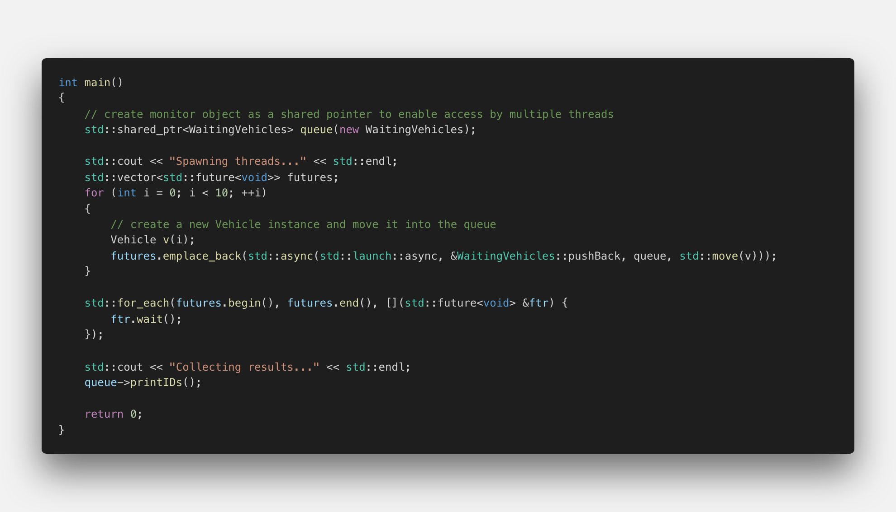
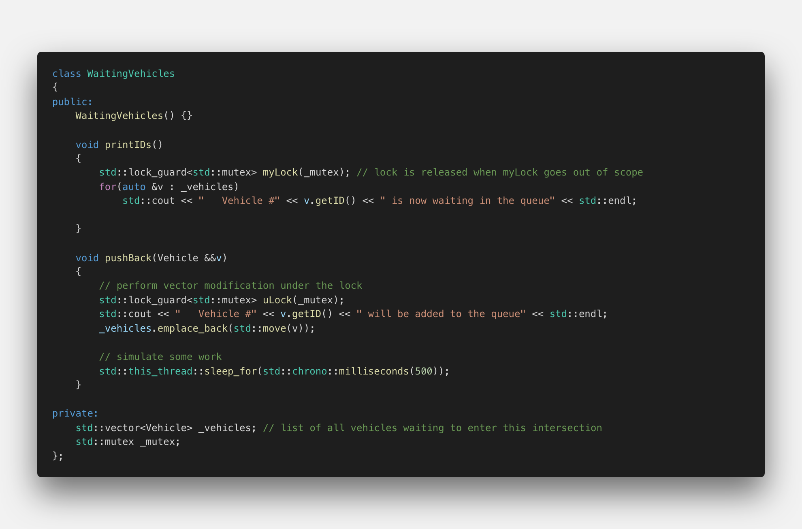
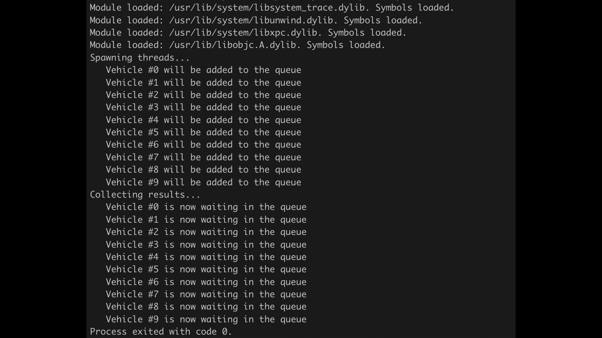
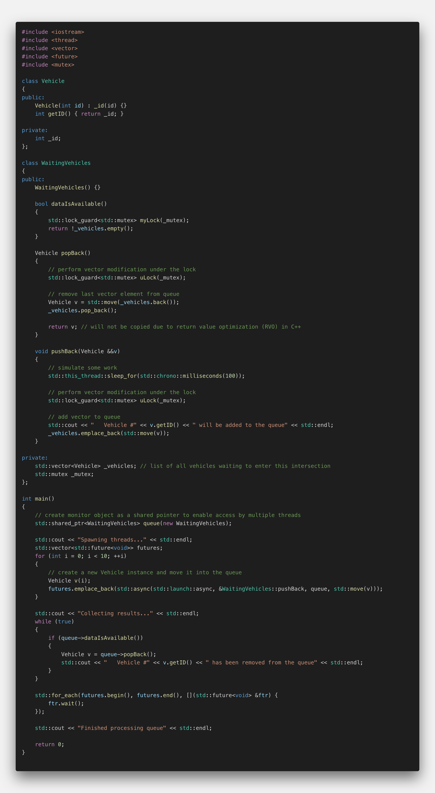
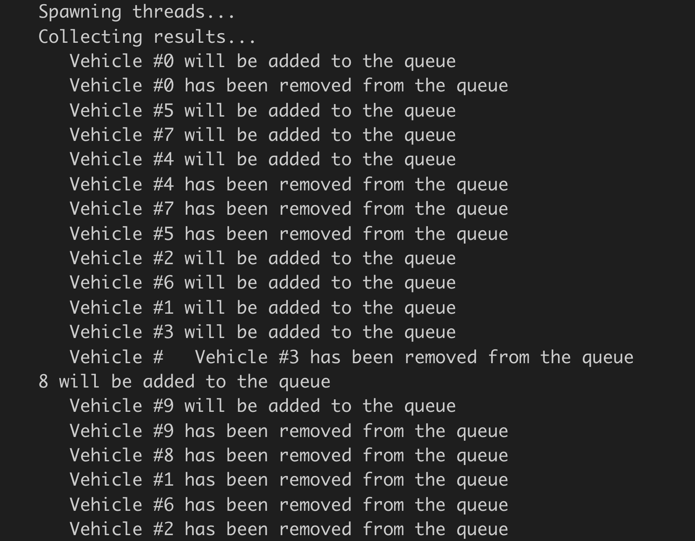

# The Monitor Object Pattern

## The monitor object pattern

In the previous sections we have learned that data protection is a critical element in concurrent programming. After looking at several ways to achieve this, we now want to build on these concepts to devise a method for a controlled and finely-grained data exchange between threads - a concurrent message queue. One important step towards such a construct is to implement a monitor object, which is a design pattern that synchronizes concurrent method execution to ensure that only one method at a time runs within an object. It also allows an object's methods to cooperatively schedule their execution sequences. The problem solved by this pattern is based on the observation that many applications contain objects whose methods are invoked concurrently by multiple client threads. These methods often modify the state of their objects, for example by adding data to an internal vector. For such concurrent programs to execute correctly, it is necessary to synchronize and schedule access to the objects very carefully. The idea of a monitor object is to synchronize the access to an object's methods so that only one method can execute at any one time.

<!--
%%ulab_page_divider
--><hr/>

In a previous section, we have looked at a code example which came pretty close to the functionality of a monitor object : the class `WaitingVehicles`.

Let us modify and partially reimplement this class, which we want to use as a shared place where concurrent threads may store data, in our case instances of the class `Vehicle`. As we will be using the same `WaitingVehicles` object for all the threads, we have to pass it to them by reference - and as all threads will be writing to this object at the same time (which is a mutating operation) we will pass it as a shared pointer. Keep in mind that there will be many threads that will try to pass data to the `WaitingVehicles` object simultaneously and thus there is the danger of a data race.

Before we take a look at the implementation of `WaitingVehicles`, let us look at the main function first where all the threads are spawned. We need a vector to store the futures as there is no data to be returned from the threads. Also, we need to call `wait()` on the futures at the end of `main()` so the program will not prematurely exit before the thread executions are complete.

</img>

Instead of using `push_back` we will again be using `emplace_back` to construct the futures in place rather than moving them into the vector. After constructing a new `Vehicle` object within the for-loop, we start a new task by passing it a reference to the `pushBack` function, a shared pointer to our `WaitingVehicles` object and the newly created vehicle. Note that the latter is passed using move semantics.

<!--
%%ulab_page_divider
--><hr/>

Now let us take a look at the implementation of the `WaitingVehicle` object.

</img>

We need to enable it to process write requests from several threads at the same time. Every time a request comes in from a thread, the object needs to add the new data to its internal storage. Our storage container will be an `std::vector`. As we need to protect the vector from simultaneous access later, we also need to integrate a mutex into the class. As we already know, a mutex has the methods lock and unlock. In order to avoid data races, the mutex needs to be locked every time a thread wants to access the vector and it needs to be unlocked one the write operation is complete. In order to avoid a program freeze due to a missing unlock operation, we will be using a lock guard object, which automatically unlocks once the lock object gets out of scope.

In our modified `pushBack` function, we will first create a lock guard object and pass it the mutex member variable. Now we can freely move the Vehicle object into our vector without the danger of a data race. At the end of the function, there is a call to `std::sleep_for`, which simulates some work and helps us to better expose potential concurrency problems. With each new Vehicle object that is passed into the queue, we will see an output to the console.

Another function within the `WaitingVehicle` class is `printIDs()`, which loops over all the elements of the vector and prints their respective IDs to the console. One major difference between `pushBack()` and `printIDs()` is that the latter function accesses all `Vehicle` objects by looping through the vector while `pushBack` only accesses a single object - which is the newest addition to the `Vehicle` vector.

<!--
%%ulab_page_divider
--><hr/>

When the program is executed, the following output is printed to the console:

</img>

As can be seen, the `Vehicle` objects are added one at a time, with all threads duly waiting for their turn. Then, once all `Vehicle` objects have been stored, the call to `printIDs` prints the entire content of the vector all at once.

While the functionality of the monitor object we have constructed is an improvement over many other methods that allow passing data to threads, it has one significant disadvantage: The main thread has to wait until all worker threads have completed their jobs and only then can it access the added data in bulk. A system which is truly interactive however has to react to events as they arrive - it should not wait until all threads have completed their jobs but instead act immediately as soon as new data arrives. In the following, we want to add this functionality to our monitor object.

<!--
%%ulab_page_divider
--><hr/>

## Creating an infinite polling loop

While the `pushBack` method is used by the threads to add data to the monitor incrementally, the main thread uses `printSize` at the end to display all the results at once. Our goal is to change the code in a way that the main thread gets notified every time new data becomes available. But how can the main thread know whether new data has become available? The solution is to write a new method that regularly checks for the arrival of new data.

In the code listed below, a new method `dataIsAvailable()` has been added while `printIDs()` has been removed. This method returns true if data is available in the vector and false otherwise. Once the `main` thread has found out via `dataIsAvailable()` that new data is in the vector, it can call the method `popBack()` to retrieve the data from the monitor object. Note that instead of copying the data, it is moved from the vector to the `main` method.

</img>

In the `main` thread, we will use an infinite while-loop to frequently poll the monitor object and check whether new data has become available. Contrary to before, we will now perform the read operation before the workers are done - so we have to integrate our loop before `wait()` is called on the futures at the end of `main()`. Once a new `Vehicle` object becomes available, we want to print it within the loop.

When we execute the code, we get a console output similar to the one listed below:

</img>

From the output it can easily be seen, that adding and removing to and from the monitor object is now interleaved. When executed repeatedly, the order of the vehicles will most probably differ between executions.

<!--
%%ulab_page_divider
--><hr/>

## Writing a vehicle counter

Note that the program in the example above did not terminate - even though no new Vehicles are added to the queue, the infinite while-loop will not exit.

One possible solution to this problem would be to integrate a vehicle counter into the `WaitingVehicles` class, that is incremented each time a Vehicle object is added and decremented when it is removed. The while-loop could then be terminated as soon as the counter reaches zero. Please go ahead and implement this functionality - but remember to protect the counter as it will also be accessed by several threads at once. Also, it will be a good idea to introduce a small delay between spawning threads and collecting results. Otherwise, the queue will be empty by default and the program will terminate prematurely. At the end of `main()`, please also print the number of remaining Vehicle objects in the vector.

```cpp
#include <iostream>
#include <thread>
#include <vector>
#include <future>
#include <mutex>

class Vehicle
{
public:
    Vehicle(int id) : _id(id) {}
    int getID() { return _id; }

private:
    int _id;
};

class WaitingVehicles
{
public:
    WaitingVehicles() : _numVehicles(0) {}

    int getNumVehicles() 
    { 
        std::lock_guard<std::mutex> uLock(_mutex);
        return _numVehicles; 
    }

    bool dataIsAvailable()
    {
        std::lock_guard<std::mutex> myLock(_mutex);
        return !_vehicles.empty();
    }

    Vehicle popBack()
    {
        // perform vector modification under the lock
        std::lock_guard<std::mutex> uLock(_mutex);

        // remove last vector element from queue
        Vehicle v = std::move(_vehicles.back());
        _vehicles.pop_back();
        --_numVehicles;

        return v; // will not be copied due to return value optimization (RVO) in C++
    }

    void pushBack(Vehicle &&v)
    {
        // simulate some work
        std::this_thread::sleep_for(std::chrono::milliseconds(100));

        // perform vector modification under the lock
        std::lock_guard<std::mutex> uLock(_mutex);

        // add vector to queue
        std::cout << "   Vehicle #" << v.getID() << " will be added to the queue" << std::endl;
        _vehicles.emplace_back(std::move(v));
        ++_numVehicles;
    }

private:
    std::vector<Vehicle> _vehicles; // list of all vehicles waiting to enter this intersection
    std::mutex _mutex;
    int _numVehicles;
};

int main()
{
    // create monitor object as a shared pointer to enable access by multiple threads
    std::shared_ptr<WaitingVehicles> queue(new WaitingVehicles);

    std::cout << "Spawning threads..." << std::endl;
    std::vector<std::future<void>> futures;
    for (int i = 0; i < 10; ++i)
    {
        // create a new Vehicle instance and move it into the queue
        Vehicle v(i);
        futures.emplace_back(std::async(std::launch::async, &WaitingVehicles::pushBack, queue, std::move(v)));
    }

    std::cout << "Collecting results..." << std::endl;
    while (true)
    {
        if (queue->dataIsAvailable())
        {
            Vehicle v = queue->popBack();
            std::cout << "   Vehicle #" << v.getID() << " has been removed from the queue" << std::endl;

            if(queue->getNumVehicles()<=0)
            {
                std::this_thread::sleep_for(std::chrono::milliseconds(200));
                break;
            }
        }
    }

    std::for_each(futures.begin(), futures.end(), [](std::future<void> &ftr) {
        ftr.wait();
    });

    std::cout << "Finished : " << queue->getNumVehicles() << " vehicle(s) left in the queue" << std::endl;

    return 0;
}
```
