# Building a Concurrent Message Queue

## Condition variables

The polling loop we have used in the previous example has not been programmed optimally: As long as the program is running, the while-loop will keep the processor busy, constantly asking wether new data is available. In the following, we will look at a better way to solve this problem without putting too much load on the processor.

The alternative to a polling loop is for the main thread to block and wait for a signal that new data is available. This would prevent the infinite loop from keeping the processor busy. We have already discussed a mechanism that would fulfill this purpose - the promise-future construct. The problem with futures is that they can only be used a single time. Once a future is ready and `get()` has been called, it can not be used any more. For our purpose, we need a signaling mechanism that can be re-used. The C++ standard offers such a construct in the form of "condition variables".

A `std::condition_variable` has a method `wait()`, which blocks, when it is called by a thread. The condition variable is kept blocked until it is released by another thread. The release works via the method `notify_one()` or the `notify_all` method. The key difference between the two methods is that notify_one will only wake up a single waiting thread while `notify_all` will wake up all the waiting threads at once.

A condition variable is a low-level building block for more advanced communication protocols. It neither has a memory of its own nor does it remember notifications. Imagine that one thread calls `wait()` before another thread calls `notify()`, the condition variable works as expected and the first thread will wake up. Imagine the case however where the call order is reversed such that `notify()` is called before `wait()`, the notification will be lost and the thread will block indefinitely. So in more sophisticated communication protocols a condition variable should always be used in conjunction with another shared state that can be checked independently. Notifying a condition variable in this case would then only mean to proceed and check this other shared state.

Let us pretend our shared variable was a boolean called `dataIsAvailable`. Now let’s discuss two scenarios for the protocol depending on who acts first, the producer or the consumer thread.

### Scenario 1:

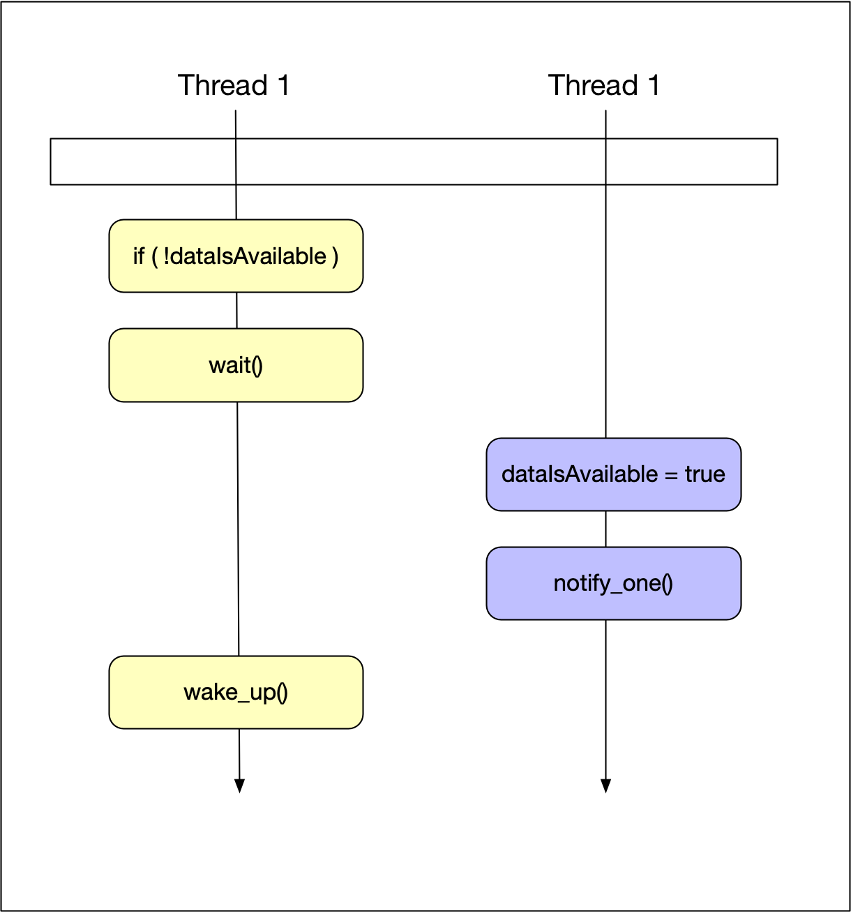</img>

The consumer thread checks `dataIsAvailable()` and since it is false, the consumer thread blocks and waits on the condition variable. Later in time, the producer thread sets dataIsAvailable to true and calls `notify_one` on the condition variable. At this point, the consumer wakes up and proceeds with its work.

### Scenario 2:

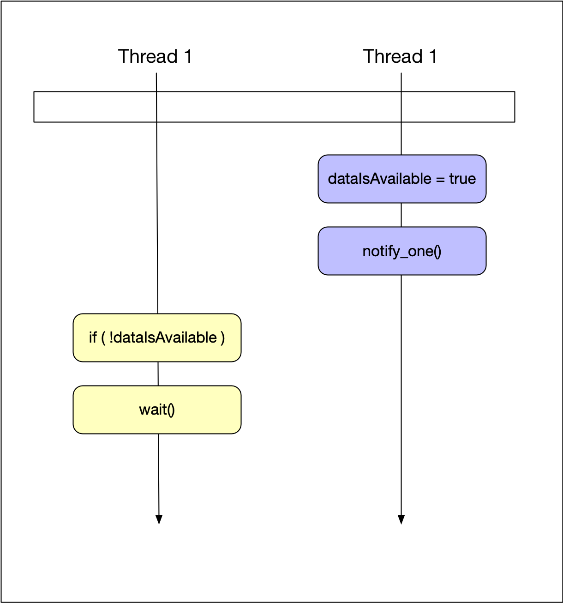</img>

Here, the producer thread comes first, sets `dataIsAvailable()` to true and calls `notify_one`. Then, the consumer thread comes and checks `dataIsAvailable()` and finds it to be true - so it does not call wait and proceeds directly with its work. Even though the notification is lost, it does not cause a problem in this construct - the message has been passed successfully through dataIsAvailable and the wait-lock has been avoided.

In an ideal (non-concurrent) world, these two scenarios would most probably be sufficient to describe to possible combinations. But in concurrent programming, things are not so easy. As seen in the diagrams, there are four atomic operations, two for each thread. So when executed often enough, all possible interleavings will show themselves - and we have to find the ones that still cause a problem.

Here is one combination that will cause the program to lock:

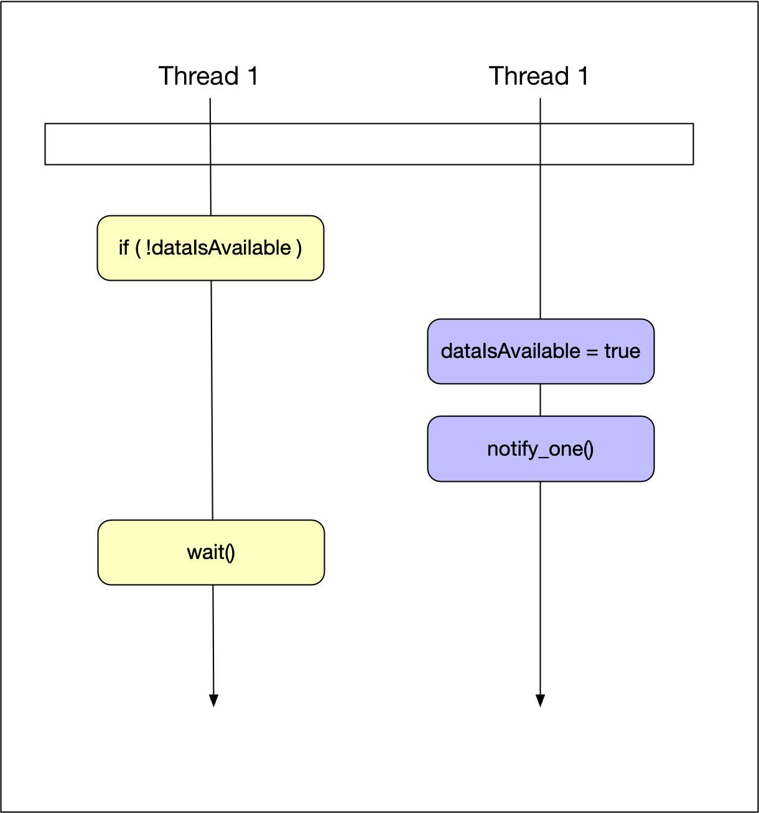</img>

The consumer thread reads `dataIsAvailable()`, which is false in the example. Then, the producer sets `dataIsAvailable()` to true and calls notify. Due to this unlucky interleaving of actions, the consumer thread calls wait because it has seen `dataIsAvailable()` as false. This is possible because the consumer thread tasks are not a joint atomic operation but may be separated by the scheduler and interleaved with some other tasks - in this case the two actions performed by the producer thread. The problem here is that after calling wait, the consumer thread will never wake up again. Also, as you may have noticed, the shared variable dataReady is not protected by a mutex here - which makes it even more likely that something will go wrong.

One quick idea for a solution which might come to mind would be to perform the two operations dataIsAvailable and wait under a locked mutex. While this would effectively prevent the interleaving of tasks between different threads, it would also prevent another thread from ever modifying dataIsAvailable again.

One reason for discussing these failed scenarios in such depth is to make you aware of the complexity of concurrent behavior - even with a simple protocol like the one we are discussing right now.

So let us now look at the final solution to the above problems and thus a working version of our communication protocol.

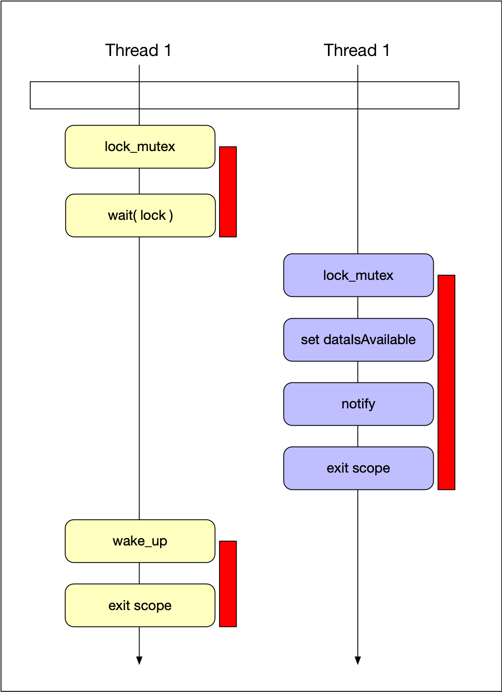</img>

As seen above, we are closing the gap between reading the state and entering the wait. We are reading the state under the lock (red bar) and we call wait still under the lock. Then, we let wait release the lock and enter the wait state in one atomic step. This is only possible because the `wait()` method is able to take a lock as an argument. The lock that we can pass to wait however is not the `lock_guard` we have been using so often until now but instead it has to be a lock that can be temporarily unlocked inside wait - a suitable lock for this purpose would be the `unique_lock` type which we have discussed in the previous section.

<!--
%%ulab_page_divider
--><hr/>

## Implementing the WaitingVehicles queue

Now that we have all the ingredients to implement the concurrent queue to store waiting Vehicle objects, let us start with the implementation according to the diagram above.

1.  The first step is to add a condition variable to `WaitingVehicles` class as a private member - just as the mutex.

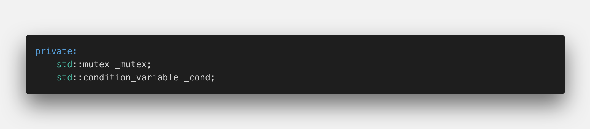</img>

2.  The next step is to notify the client after pushing a new Vehicle into the vector.

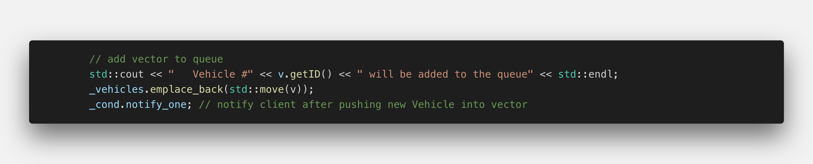</img>

3.  In the method `popBack`, we need to create the lock first - it can not be a `lock_guard` any more as we need to pass it to the condition variable - to its method wait. Thus it must be a `unique_lock`. Now we can enter the wait state while at same time releasing the lock. It is only inside wait, that the mutex is temporarily unlocked - which is a very important point to remember: We are holding the lock before AND after our call to wait - which means that we are free to access whatever data is protected by the mutex. In our example, this will be `dataIsAvailable()`.

    Before we continue, we need to discuss the problem of "spurious wake-ups": Once in a while, the system will - for no obvious reason - wake up a thread. If such a spurious wake-up happened with taking proper precautions, we would issue wait without new data being available (because the wake-up has not been caused by the condition variable but by the system in this case). To prevent the call to wait in this case, we have to modify the code slightly:

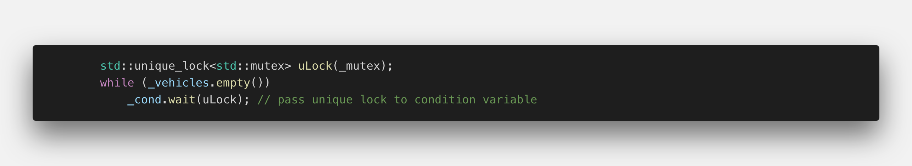</img>

3. (continued) In this code, even after a spurious wake-up, we are now checking wether data really is available. If so, we would be issuing the call to wait on the condition variable. And only if we are inside wait, may other threads modify and access `dataIsAvailable`.

   If the vector is empty, `wait` is called. When the thread wakes up again, the condition is immediately re-checked and - in case it has not been a spurious wake-up we can continue with our job and retrieve the vector.

   We can further simplify this code by letting the `wait()` function do the testing as well as the looping for us. Instead of the while loop, we can just pass a Lambda to `wait()`, which repeatedly checks wether the vector contains elements (thus the inverted logical expression):

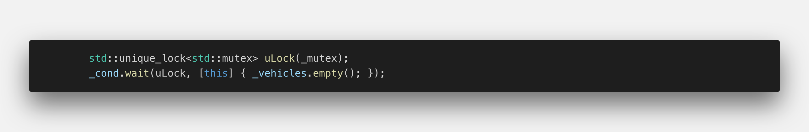</img>

3. (continued) When `wait()` finishes, we are guaranteed to find a new element in the vector this time. Also, we are still holding the lock and thus no other thread is able to access the vector - so there is no danger of a data race in this situation. As soon as we are out of scope, the lock will be automatically released.

4.  In the main() function, there is still the polling loop that infinitely queries the availability of new Vehicle objects. But contrary to the example before, a call to popBack now puts the main() thread into a wait state and only resumes when new data is available - thus significantly reducing the load to the processor.

Let us now take a look at the complete code…

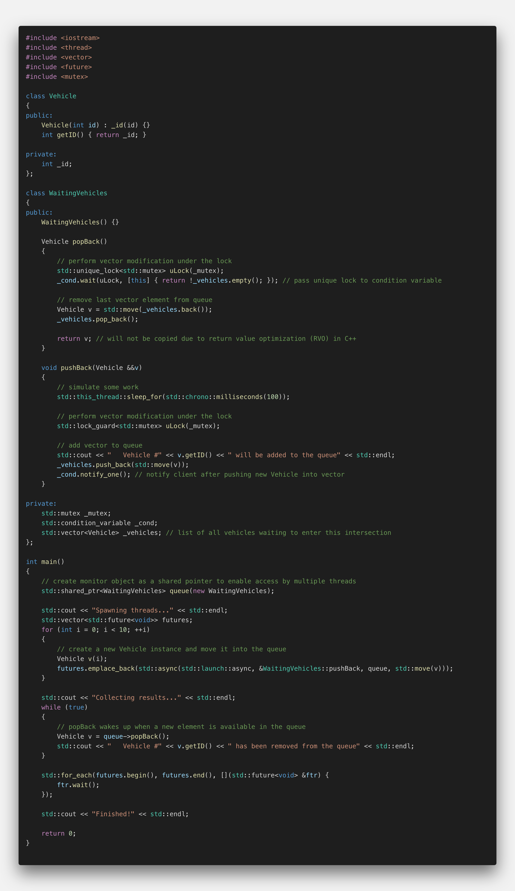</img>

… and at the console output it produces:

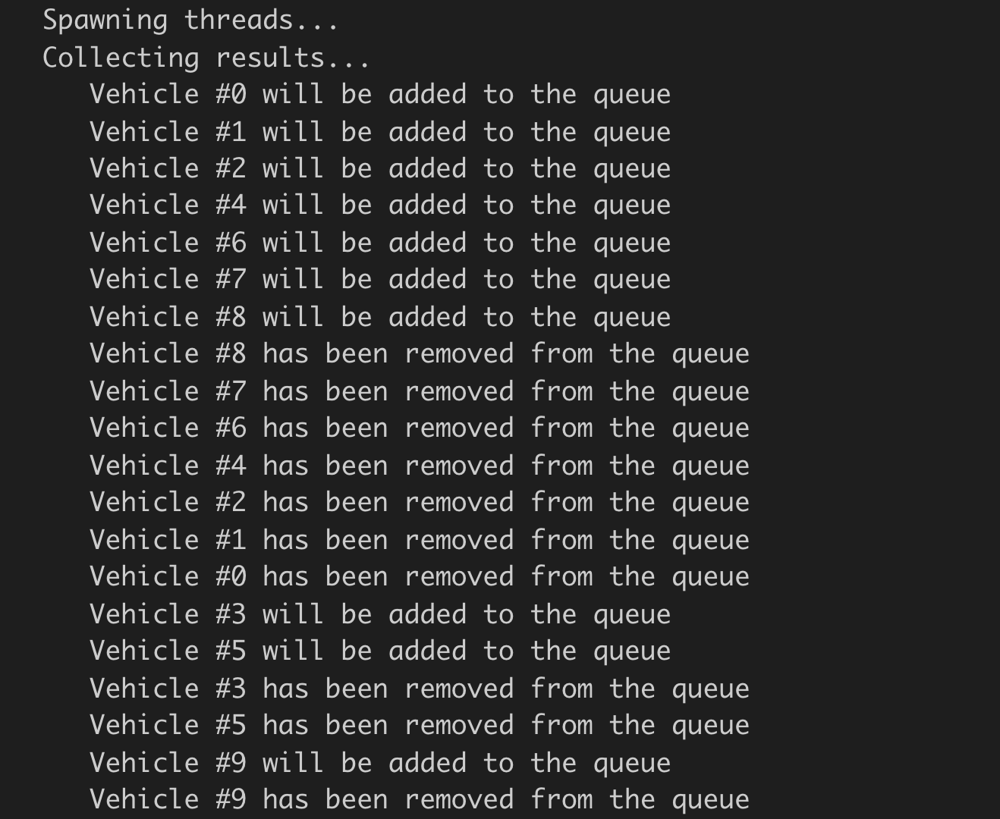</img>

<!--
%%ulab_page_divider
--><hr/>

## Exercise: Building a generic message queue

The code we have produced to manage waiting vehicles in our traffic simulation is in fact a very generic piece of code. Instead of passing Vehicle objects, it could very easily be modified to pass almost any kind of object or data type between two vector. So what we have created could be easily described as a generic message queue.

The following changes are required to turn the `WaitingVehicles` queue into a generic message queue:

1.  Enable the class for templates by prepending `template<class T>` and change the name of the class to `MessageQueue`
2.  Replace the `std::vector` by a `std::deque` as it makes more sense to retrieve the objects in the order "first-in, first-out (FIFO)". Also, rename it to `_messages`.
3.  Adapt the method `pushBack` for use with templates and rename it `send`. Do the same with `popBack` and rename it to `receive`.
4.  Test the queue by executing the following code in main:

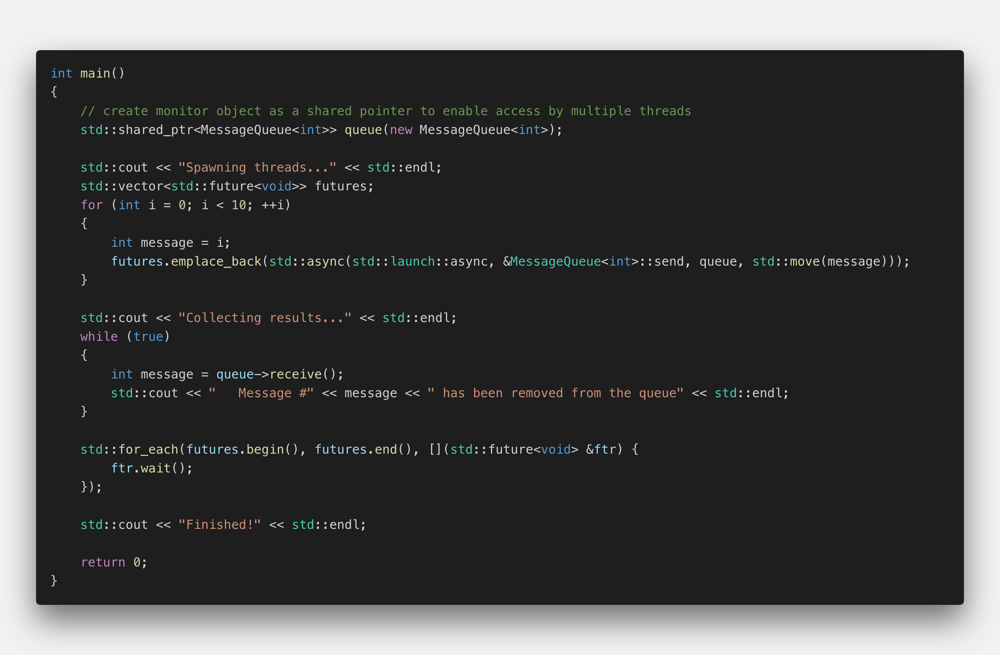</img>

```cpp
#include <iostream>
#include <thread>
#include <queue>
#include <future>
#include <mutex>

template <class T>
class MessageQueue
{
public:
    T receive()
    {
        // perform queue modification under the lock
        std::unique_lock<std::mutex> uLock(_mutex);
        _cond.wait(uLock, [this] { return !_messages.empty(); }); // pass unique lock to condition variable

        // remove last vector element from queue
        T msg = std::move(_messages.back());
        _messages.pop_back();

        return msg; // will not be copied due to return value optimization (RVO) in C++
    }

    void send(T &&msg)
    {
        // simulate some work
        std::this_thread::sleep_for(std::chrono::milliseconds(100));

        // perform vector modification under the lock
        std::lock_guard<std::mutex> uLock(_mutex);

        // add vector to queue
        std::cout << "   Message " << msg << " has been sent to the queue" << std::endl;
        _messages.push_back(std::move(msg));
        _cond.notify_one(); // notify client after pushing new Vehicle into vector
    }

private:
    std::mutex _mutex;
    std::condition_variable _cond;
    std::deque<T> _messages;
};

int main()
{
    // create monitor object as a shared pointer to enable access by multiple threads
    std::shared_ptr<MessageQueue<int>> queue(new MessageQueue<int>);

    std::cout << "Spawning threads..." << std::endl;
    std::vector<std::future<void>> futures;
    for (int i = 0; i < 10; ++i)
    {
        int message = i;
        futures.emplace_back(std::async(std::launch::async, &MessageQueue<int>::send, queue, std::move(message)));
    }

    std::cout << "Collecting results..." << std::endl;
    while (true)
    {
        int message = queue->receive();
        std::cout << "   Message #" << message << " has been removed from the queue" << std::endl;
    }

    std::for_each(futures.begin(), futures.end(), [](std::future<void> &ftr) {
        ftr.wait();
    });

    std::cout << "Finished!" << std::endl;

    return 0;
}
```

A message queue is an effective and very useful mechanism to enable a safe and reusable communication channel between threads. In the final project, we will use shorty use this construct to integrate another component into our simulation - traffic lights at intersections.
